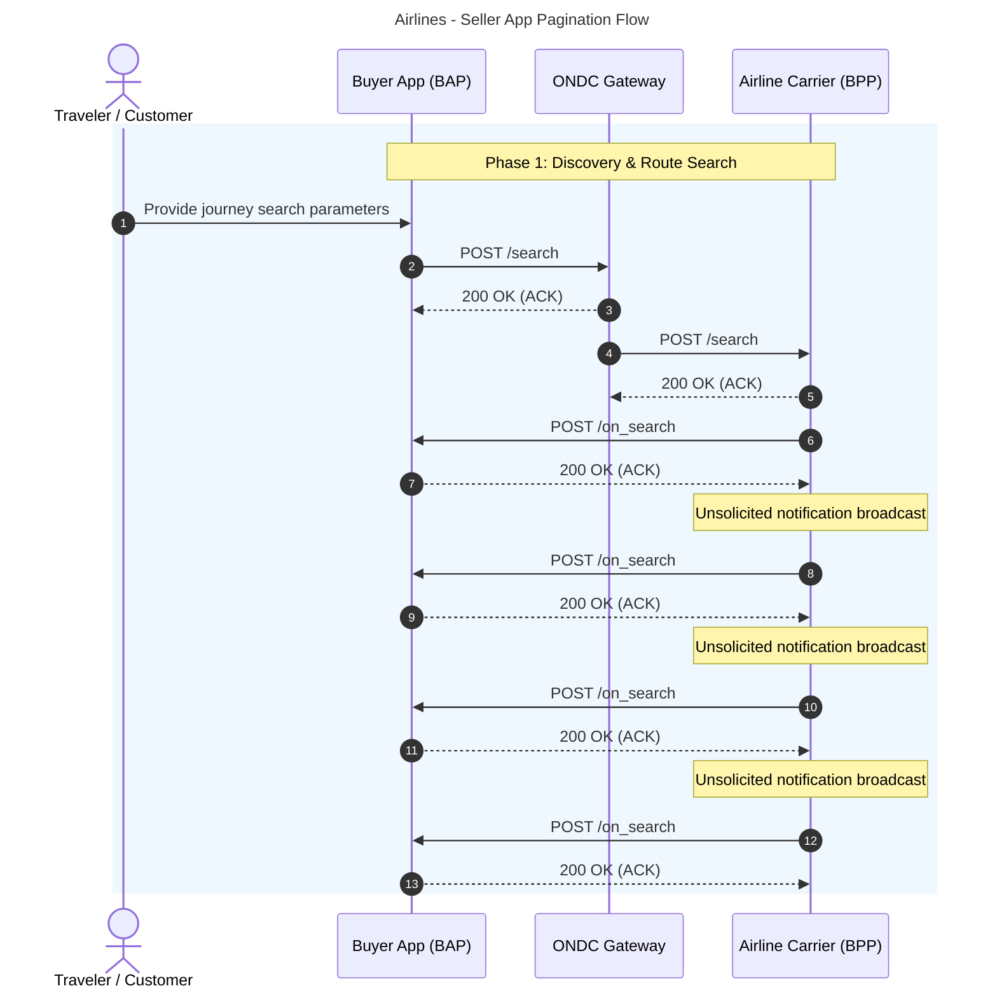

```mermaid
sequenceDiagram
    title Airlines - Seller App Pagination Flow
    autonumber
    actor User as Traveler / Customer
    participant BAP as Buyer App (BAP)
    participant BG as ONDC Gateway
    participant BPP as Airline Carrier (BPP)

    rect rgb(240, 248, 255)
    Note over BAP,BPP: Phase 1: Discovery & Route Search
    User->>BAP: Provide journey search parameters
    BAP->>BG: POST /search
    BG-->>BAP: 200 OK (ACK)
    BG->>BPP: POST /search
    BPP-->>BG: 200 OK (ACK)
    BPP->>BAP: POST /on_search
    BAP-->>BPP: 200 OK (ACK)
    Note over BPP: Unsolicited notification broadcast
    BPP->>BAP: POST /on_search
    BAP-->>BPP: 200 OK (ACK)
    Note over BPP: Unsolicited notification broadcast
    BPP->>BAP: POST /on_search
    BAP-->>BPP: 200 OK (ACK)
    Note over BPP: Unsolicited notification broadcast
    BPP->>BAP: POST /on_search
    BAP-->>BPP: 200 OK (ACK)
    end
```
