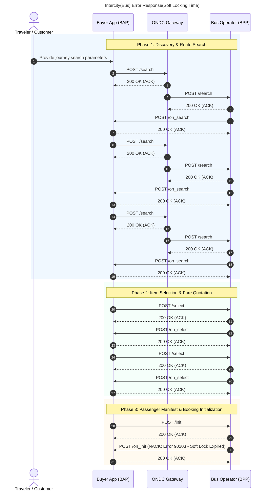

```mermaid
sequenceDiagram
    title Intercity(Bus) Error Response(Soft Locking Time)
    autonumber
    actor User as Traveler / Customer
    participant BAP as Buyer App (BAP)
    participant BG as ONDC Gateway
    participant BPP as Bus Operator (BPP)

    rect rgb(240, 248, 255)
    Note over BAP,BPP: Phase 1: Discovery & Route Search
    User->>BAP: Provide journey search parameters
    BAP->>BG: POST /search
    BG-->>BAP: 200 OK (ACK)
    BG->>BPP: POST /search
    BPP-->>BG: 200 OK (ACK)
    BPP->>BAP: POST /on_search
    BAP-->>BPP: 200 OK (ACK)
    BAP->>BG: POST /search
    BG-->>BAP: 200 OK (ACK)
    BG->>BPP: POST /search
    BPP-->>BG: 200 OK (ACK)
    BPP->>BAP: POST /on_search
    BAP-->>BPP: 200 OK (ACK)
    BAP->>BG: POST /search
    BG-->>BAP: 200 OK (ACK)
    BG->>BPP: POST /search
    BPP-->>BG: 200 OK (ACK)
    BPP->>BAP: POST /on_search
    BAP-->>BPP: 200 OK (ACK)
    end

    rect rgb(245, 255, 250)
    Note over BAP,BPP: Phase 2: Item Selection & Fare Quotation
    BAP->>BPP: POST /select
    BPP-->>BAP: 200 OK (ACK)
    BPP->>BAP: POST /on_select
    BAP-->>BPP: 200 OK (ACK)
    BAP->>BPP: POST /select
    BPP-->>BAP: 200 OK (ACK)
    BPP->>BAP: POST /on_select
    BAP-->>BPP: 200 OK (ACK)
    end

    rect rgb(255, 250, 240)
    Note over BAP,BPP: Phase 3: Passenger Manifest & Booking Initialization
    BAP->>BPP: POST /init
    BPP-->>BAP: 200 OK (ACK)
    BPP->>BAP: POST /on_init (NACK: Error 90203 - Soft Lock Expired)
    BAP-->>BPP: 200 OK (ACK)
    end
```
