# OnDemand_Update_Stop — Sequence Diagrams

Internal data file consumed by the Developer Guide's "Sequence Diagram" tab (API Walkthrough).
Not meant to be shown as its own docs page — the frontend filters this slug out of the Use Case
Brief / Additional Resources / Changelog tab lists and instead looks up the section matching the
selected API call's `action_id` (the `##` heading below) to render that step's diagram.

One `## <action_id>` heading per step of `OnDemand_Update_Stop.yaml` (Ride-hailing), in that flow's own step order, each followed by its Mermaid `sequenceDiagram`: the whole flow, with that call's own message(s) highlighted — same convention as the other domains' per-step sequence-diagram docs.

## search

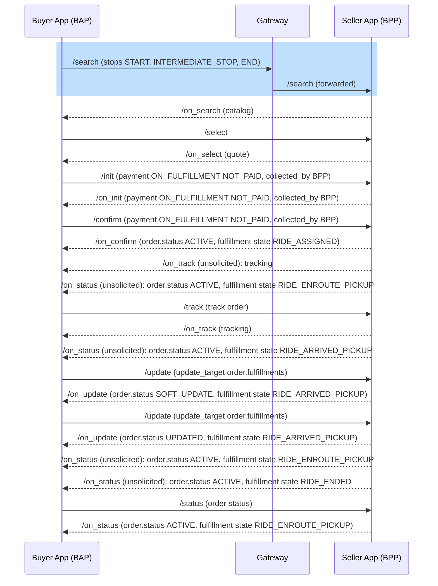
```mermaid
sequenceDiagram
  participant Buyer App (BAP)
  participant Gateway
  participant Seller App (BPP)
  rect rgb(191, 223, 255)
  Buyer App (BAP)->>Gateway: /search (stops START, INTERMEDIATE_STOP, END)
  Gateway->>Seller App (BPP): /search (forwarded)
  end
  Seller App (BPP)-->>Buyer App (BAP): /on_search (catalog)
  Buyer App (BAP)->>Seller App (BPP): /select
  Seller App (BPP)-->>Buyer App (BAP): /on_select (quote)
  Buyer App (BAP)->>Seller App (BPP): /init (payment ON_FULFILLMENT NOT_PAID, collected_by BPP)
  Seller App (BPP)-->>Buyer App (BAP): /on_init (payment ON_FULFILLMENT NOT_PAID, collected_by BPP)
  Buyer App (BAP)->>Seller App (BPP): /confirm (payment ON_FULFILLMENT NOT_PAID, collected_by BPP)
  Seller App (BPP)-->>Buyer App (BAP): /on_confirm (order.status ACTIVE, fulfillment state RIDE_ASSIGNED)
  Seller App (BPP)-->>Buyer App (BAP): /on_track (unsolicited): tracking
  Seller App (BPP)-->>Buyer App (BAP): /on_status (unsolicited): order.status ACTIVE, fulfillment state RIDE_ENROUTE_PICKUP
  Buyer App (BAP)->>Seller App (BPP): /track (track order)
  Seller App (BPP)-->>Buyer App (BAP): /on_track (tracking)
  Seller App (BPP)-->>Buyer App (BAP): /on_status (unsolicited): order.status ACTIVE, fulfillment state RIDE_ARRIVED_PICKUP
  Buyer App (BAP)->>Seller App (BPP): /update (update_target order.fulfillments)
  Seller App (BPP)-->>Buyer App (BAP): /on_update (order.status SOFT_UPDATE, fulfillment state RIDE_ARRIVED_PICKUP)
  Buyer App (BAP)->>Seller App (BPP): /update (update_target order.fulfillments)
  Seller App (BPP)-->>Buyer App (BAP): /on_update (order.status UPDATED, fulfillment state RIDE_ARRIVED_PICKUP)
  Seller App (BPP)-->>Buyer App (BAP): /on_status (unsolicited): order.status ACTIVE, fulfillment state RIDE_ENROUTE_PICKUP
  Seller App (BPP)-->>Buyer App (BAP): /on_status (unsolicited): order.status ACTIVE, fulfillment state RIDE_ENDED
  Buyer App (BAP)->>Seller App (BPP): /status (order status)
  Seller App (BPP)-->>Buyer App (BAP): /on_status (order.status ACTIVE, fulfillment state RIDE_ENROUTE_PICKUP)
```

## on_search

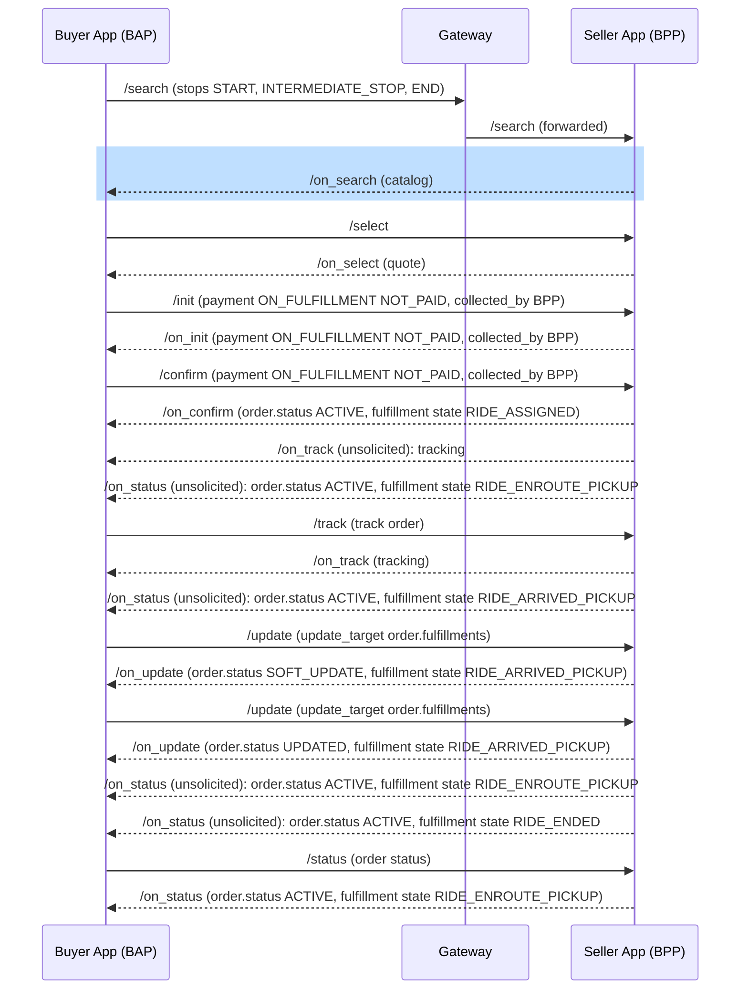
```mermaid
sequenceDiagram
  participant Buyer App (BAP)
  participant Gateway
  participant Seller App (BPP)
  Buyer App (BAP)->>Gateway: /search (stops START, INTERMEDIATE_STOP, END)
  Gateway->>Seller App (BPP): /search (forwarded)
  rect rgb(191, 223, 255)
  Seller App (BPP)-->>Buyer App (BAP): /on_search (catalog)
  end
  Buyer App (BAP)->>Seller App (BPP): /select
  Seller App (BPP)-->>Buyer App (BAP): /on_select (quote)
  Buyer App (BAP)->>Seller App (BPP): /init (payment ON_FULFILLMENT NOT_PAID, collected_by BPP)
  Seller App (BPP)-->>Buyer App (BAP): /on_init (payment ON_FULFILLMENT NOT_PAID, collected_by BPP)
  Buyer App (BAP)->>Seller App (BPP): /confirm (payment ON_FULFILLMENT NOT_PAID, collected_by BPP)
  Seller App (BPP)-->>Buyer App (BAP): /on_confirm (order.status ACTIVE, fulfillment state RIDE_ASSIGNED)
  Seller App (BPP)-->>Buyer App (BAP): /on_track (unsolicited): tracking
  Seller App (BPP)-->>Buyer App (BAP): /on_status (unsolicited): order.status ACTIVE, fulfillment state RIDE_ENROUTE_PICKUP
  Buyer App (BAP)->>Seller App (BPP): /track (track order)
  Seller App (BPP)-->>Buyer App (BAP): /on_track (tracking)
  Seller App (BPP)-->>Buyer App (BAP): /on_status (unsolicited): order.status ACTIVE, fulfillment state RIDE_ARRIVED_PICKUP
  Buyer App (BAP)->>Seller App (BPP): /update (update_target order.fulfillments)
  Seller App (BPP)-->>Buyer App (BAP): /on_update (order.status SOFT_UPDATE, fulfillment state RIDE_ARRIVED_PICKUP)
  Buyer App (BAP)->>Seller App (BPP): /update (update_target order.fulfillments)
  Seller App (BPP)-->>Buyer App (BAP): /on_update (order.status UPDATED, fulfillment state RIDE_ARRIVED_PICKUP)
  Seller App (BPP)-->>Buyer App (BAP): /on_status (unsolicited): order.status ACTIVE, fulfillment state RIDE_ENROUTE_PICKUP
  Seller App (BPP)-->>Buyer App (BAP): /on_status (unsolicited): order.status ACTIVE, fulfillment state RIDE_ENDED
  Buyer App (BAP)->>Seller App (BPP): /status (order status)
  Seller App (BPP)-->>Buyer App (BAP): /on_status (order.status ACTIVE, fulfillment state RIDE_ENROUTE_PICKUP)
```

## select

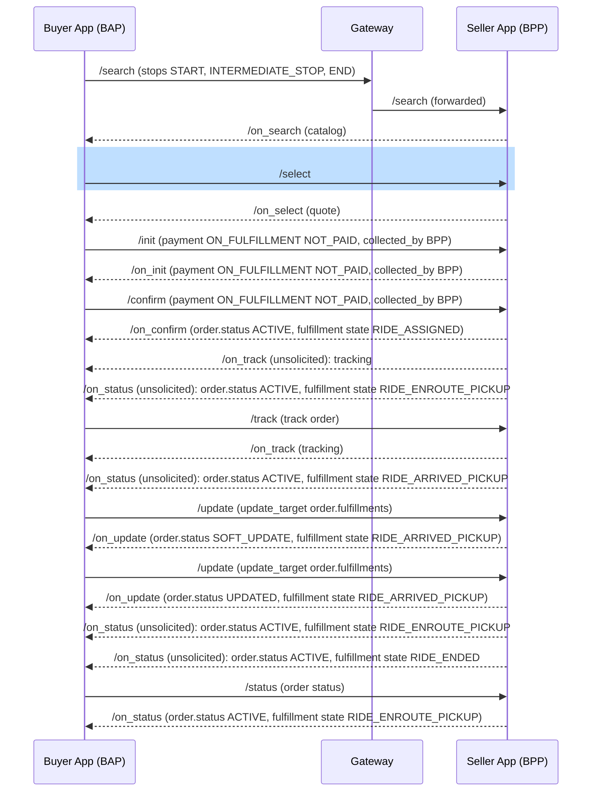
```mermaid
sequenceDiagram
  participant Buyer App (BAP)
  participant Gateway
  participant Seller App (BPP)
  Buyer App (BAP)->>Gateway: /search (stops START, INTERMEDIATE_STOP, END)
  Gateway->>Seller App (BPP): /search (forwarded)
  Seller App (BPP)-->>Buyer App (BAP): /on_search (catalog)
  rect rgb(191, 223, 255)
  Buyer App (BAP)->>Seller App (BPP): /select
  end
  Seller App (BPP)-->>Buyer App (BAP): /on_select (quote)
  Buyer App (BAP)->>Seller App (BPP): /init (payment ON_FULFILLMENT NOT_PAID, collected_by BPP)
  Seller App (BPP)-->>Buyer App (BAP): /on_init (payment ON_FULFILLMENT NOT_PAID, collected_by BPP)
  Buyer App (BAP)->>Seller App (BPP): /confirm (payment ON_FULFILLMENT NOT_PAID, collected_by BPP)
  Seller App (BPP)-->>Buyer App (BAP): /on_confirm (order.status ACTIVE, fulfillment state RIDE_ASSIGNED)
  Seller App (BPP)-->>Buyer App (BAP): /on_track (unsolicited): tracking
  Seller App (BPP)-->>Buyer App (BAP): /on_status (unsolicited): order.status ACTIVE, fulfillment state RIDE_ENROUTE_PICKUP
  Buyer App (BAP)->>Seller App (BPP): /track (track order)
  Seller App (BPP)-->>Buyer App (BAP): /on_track (tracking)
  Seller App (BPP)-->>Buyer App (BAP): /on_status (unsolicited): order.status ACTIVE, fulfillment state RIDE_ARRIVED_PICKUP
  Buyer App (BAP)->>Seller App (BPP): /update (update_target order.fulfillments)
  Seller App (BPP)-->>Buyer App (BAP): /on_update (order.status SOFT_UPDATE, fulfillment state RIDE_ARRIVED_PICKUP)
  Buyer App (BAP)->>Seller App (BPP): /update (update_target order.fulfillments)
  Seller App (BPP)-->>Buyer App (BAP): /on_update (order.status UPDATED, fulfillment state RIDE_ARRIVED_PICKUP)
  Seller App (BPP)-->>Buyer App (BAP): /on_status (unsolicited): order.status ACTIVE, fulfillment state RIDE_ENROUTE_PICKUP
  Seller App (BPP)-->>Buyer App (BAP): /on_status (unsolicited): order.status ACTIVE, fulfillment state RIDE_ENDED
  Buyer App (BAP)->>Seller App (BPP): /status (order status)
  Seller App (BPP)-->>Buyer App (BAP): /on_status (order.status ACTIVE, fulfillment state RIDE_ENROUTE_PICKUP)
```

## on_select

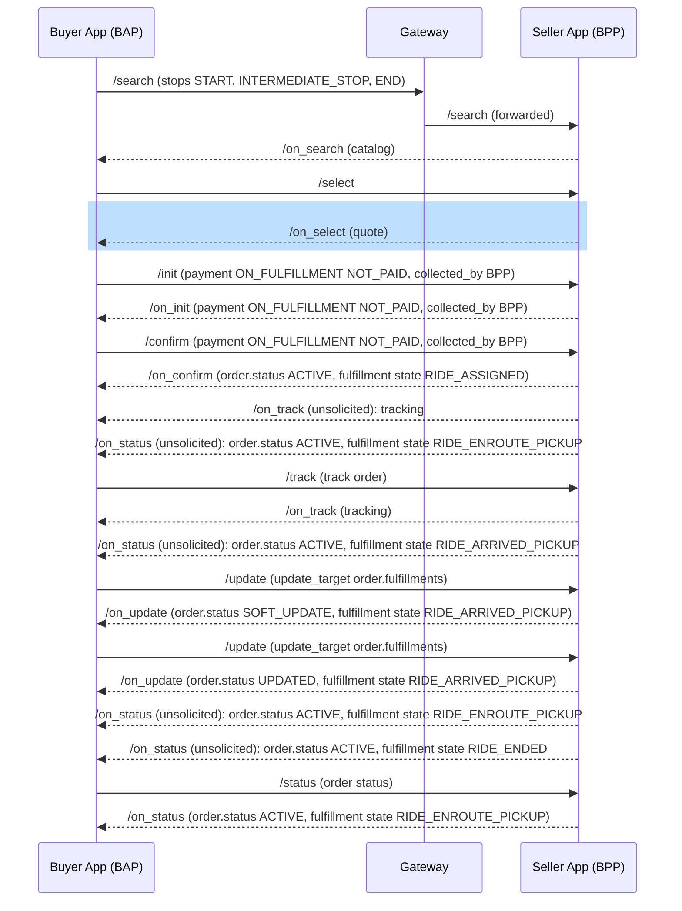
```mermaid
sequenceDiagram
  participant Buyer App (BAP)
  participant Gateway
  participant Seller App (BPP)
  Buyer App (BAP)->>Gateway: /search (stops START, INTERMEDIATE_STOP, END)
  Gateway->>Seller App (BPP): /search (forwarded)
  Seller App (BPP)-->>Buyer App (BAP): /on_search (catalog)
  Buyer App (BAP)->>Seller App (BPP): /select
  rect rgb(191, 223, 255)
  Seller App (BPP)-->>Buyer App (BAP): /on_select (quote)
  end
  Buyer App (BAP)->>Seller App (BPP): /init (payment ON_FULFILLMENT NOT_PAID, collected_by BPP)
  Seller App (BPP)-->>Buyer App (BAP): /on_init (payment ON_FULFILLMENT NOT_PAID, collected_by BPP)
  Buyer App (BAP)->>Seller App (BPP): /confirm (payment ON_FULFILLMENT NOT_PAID, collected_by BPP)
  Seller App (BPP)-->>Buyer App (BAP): /on_confirm (order.status ACTIVE, fulfillment state RIDE_ASSIGNED)
  Seller App (BPP)-->>Buyer App (BAP): /on_track (unsolicited): tracking
  Seller App (BPP)-->>Buyer App (BAP): /on_status (unsolicited): order.status ACTIVE, fulfillment state RIDE_ENROUTE_PICKUP
  Buyer App (BAP)->>Seller App (BPP): /track (track order)
  Seller App (BPP)-->>Buyer App (BAP): /on_track (tracking)
  Seller App (BPP)-->>Buyer App (BAP): /on_status (unsolicited): order.status ACTIVE, fulfillment state RIDE_ARRIVED_PICKUP
  Buyer App (BAP)->>Seller App (BPP): /update (update_target order.fulfillments)
  Seller App (BPP)-->>Buyer App (BAP): /on_update (order.status SOFT_UPDATE, fulfillment state RIDE_ARRIVED_PICKUP)
  Buyer App (BAP)->>Seller App (BPP): /update (update_target order.fulfillments)
  Seller App (BPP)-->>Buyer App (BAP): /on_update (order.status UPDATED, fulfillment state RIDE_ARRIVED_PICKUP)
  Seller App (BPP)-->>Buyer App (BAP): /on_status (unsolicited): order.status ACTIVE, fulfillment state RIDE_ENROUTE_PICKUP
  Seller App (BPP)-->>Buyer App (BAP): /on_status (unsolicited): order.status ACTIVE, fulfillment state RIDE_ENDED
  Buyer App (BAP)->>Seller App (BPP): /status (order status)
  Seller App (BPP)-->>Buyer App (BAP): /on_status (order.status ACTIVE, fulfillment state RIDE_ENROUTE_PICKUP)
```

## init

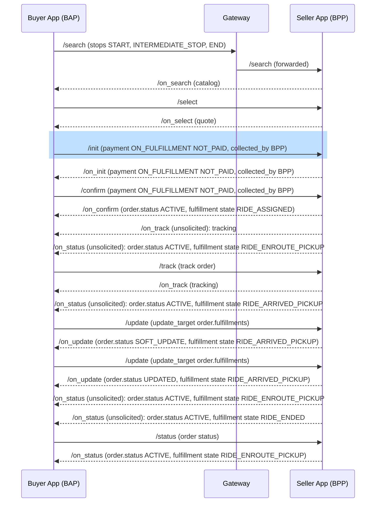
```mermaid
sequenceDiagram
  participant Buyer App (BAP)
  participant Gateway
  participant Seller App (BPP)
  Buyer App (BAP)->>Gateway: /search (stops START, INTERMEDIATE_STOP, END)
  Gateway->>Seller App (BPP): /search (forwarded)
  Seller App (BPP)-->>Buyer App (BAP): /on_search (catalog)
  Buyer App (BAP)->>Seller App (BPP): /select
  Seller App (BPP)-->>Buyer App (BAP): /on_select (quote)
  rect rgb(191, 223, 255)
  Buyer App (BAP)->>Seller App (BPP): /init (payment ON_FULFILLMENT NOT_PAID, collected_by BPP)
  end
  Seller App (BPP)-->>Buyer App (BAP): /on_init (payment ON_FULFILLMENT NOT_PAID, collected_by BPP)
  Buyer App (BAP)->>Seller App (BPP): /confirm (payment ON_FULFILLMENT NOT_PAID, collected_by BPP)
  Seller App (BPP)-->>Buyer App (BAP): /on_confirm (order.status ACTIVE, fulfillment state RIDE_ASSIGNED)
  Seller App (BPP)-->>Buyer App (BAP): /on_track (unsolicited): tracking
  Seller App (BPP)-->>Buyer App (BAP): /on_status (unsolicited): order.status ACTIVE, fulfillment state RIDE_ENROUTE_PICKUP
  Buyer App (BAP)->>Seller App (BPP): /track (track order)
  Seller App (BPP)-->>Buyer App (BAP): /on_track (tracking)
  Seller App (BPP)-->>Buyer App (BAP): /on_status (unsolicited): order.status ACTIVE, fulfillment state RIDE_ARRIVED_PICKUP
  Buyer App (BAP)->>Seller App (BPP): /update (update_target order.fulfillments)
  Seller App (BPP)-->>Buyer App (BAP): /on_update (order.status SOFT_UPDATE, fulfillment state RIDE_ARRIVED_PICKUP)
  Buyer App (BAP)->>Seller App (BPP): /update (update_target order.fulfillments)
  Seller App (BPP)-->>Buyer App (BAP): /on_update (order.status UPDATED, fulfillment state RIDE_ARRIVED_PICKUP)
  Seller App (BPP)-->>Buyer App (BAP): /on_status (unsolicited): order.status ACTIVE, fulfillment state RIDE_ENROUTE_PICKUP
  Seller App (BPP)-->>Buyer App (BAP): /on_status (unsolicited): order.status ACTIVE, fulfillment state RIDE_ENDED
  Buyer App (BAP)->>Seller App (BPP): /status (order status)
  Seller App (BPP)-->>Buyer App (BAP): /on_status (order.status ACTIVE, fulfillment state RIDE_ENROUTE_PICKUP)
```

## on_init

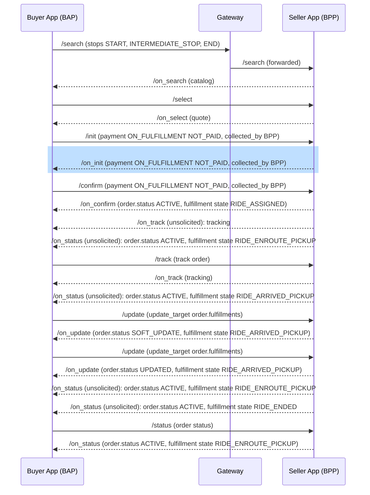
```mermaid
sequenceDiagram
  participant Buyer App (BAP)
  participant Gateway
  participant Seller App (BPP)
  Buyer App (BAP)->>Gateway: /search (stops START, INTERMEDIATE_STOP, END)
  Gateway->>Seller App (BPP): /search (forwarded)
  Seller App (BPP)-->>Buyer App (BAP): /on_search (catalog)
  Buyer App (BAP)->>Seller App (BPP): /select
  Seller App (BPP)-->>Buyer App (BAP): /on_select (quote)
  Buyer App (BAP)->>Seller App (BPP): /init (payment ON_FULFILLMENT NOT_PAID, collected_by BPP)
  rect rgb(191, 223, 255)
  Seller App (BPP)-->>Buyer App (BAP): /on_init (payment ON_FULFILLMENT NOT_PAID, collected_by BPP)
  end
  Buyer App (BAP)->>Seller App (BPP): /confirm (payment ON_FULFILLMENT NOT_PAID, collected_by BPP)
  Seller App (BPP)-->>Buyer App (BAP): /on_confirm (order.status ACTIVE, fulfillment state RIDE_ASSIGNED)
  Seller App (BPP)-->>Buyer App (BAP): /on_track (unsolicited): tracking
  Seller App (BPP)-->>Buyer App (BAP): /on_status (unsolicited): order.status ACTIVE, fulfillment state RIDE_ENROUTE_PICKUP
  Buyer App (BAP)->>Seller App (BPP): /track (track order)
  Seller App (BPP)-->>Buyer App (BAP): /on_track (tracking)
  Seller App (BPP)-->>Buyer App (BAP): /on_status (unsolicited): order.status ACTIVE, fulfillment state RIDE_ARRIVED_PICKUP
  Buyer App (BAP)->>Seller App (BPP): /update (update_target order.fulfillments)
  Seller App (BPP)-->>Buyer App (BAP): /on_update (order.status SOFT_UPDATE, fulfillment state RIDE_ARRIVED_PICKUP)
  Buyer App (BAP)->>Seller App (BPP): /update (update_target order.fulfillments)
  Seller App (BPP)-->>Buyer App (BAP): /on_update (order.status UPDATED, fulfillment state RIDE_ARRIVED_PICKUP)
  Seller App (BPP)-->>Buyer App (BAP): /on_status (unsolicited): order.status ACTIVE, fulfillment state RIDE_ENROUTE_PICKUP
  Seller App (BPP)-->>Buyer App (BAP): /on_status (unsolicited): order.status ACTIVE, fulfillment state RIDE_ENDED
  Buyer App (BAP)->>Seller App (BPP): /status (order status)
  Seller App (BPP)-->>Buyer App (BAP): /on_status (order.status ACTIVE, fulfillment state RIDE_ENROUTE_PICKUP)
```

## confirm

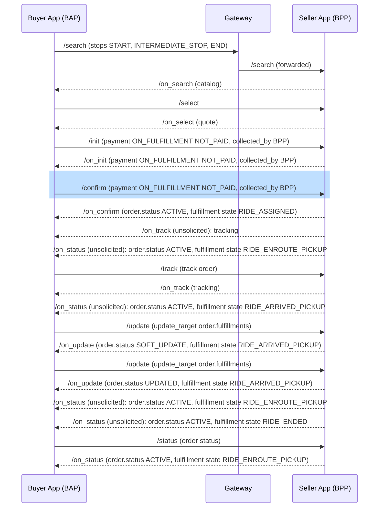
```mermaid
sequenceDiagram
  participant Buyer App (BAP)
  participant Gateway
  participant Seller App (BPP)
  Buyer App (BAP)->>Gateway: /search (stops START, INTERMEDIATE_STOP, END)
  Gateway->>Seller App (BPP): /search (forwarded)
  Seller App (BPP)-->>Buyer App (BAP): /on_search (catalog)
  Buyer App (BAP)->>Seller App (BPP): /select
  Seller App (BPP)-->>Buyer App (BAP): /on_select (quote)
  Buyer App (BAP)->>Seller App (BPP): /init (payment ON_FULFILLMENT NOT_PAID, collected_by BPP)
  Seller App (BPP)-->>Buyer App (BAP): /on_init (payment ON_FULFILLMENT NOT_PAID, collected_by BPP)
  rect rgb(191, 223, 255)
  Buyer App (BAP)->>Seller App (BPP): /confirm (payment ON_FULFILLMENT NOT_PAID, collected_by BPP)
  end
  Seller App (BPP)-->>Buyer App (BAP): /on_confirm (order.status ACTIVE, fulfillment state RIDE_ASSIGNED)
  Seller App (BPP)-->>Buyer App (BAP): /on_track (unsolicited): tracking
  Seller App (BPP)-->>Buyer App (BAP): /on_status (unsolicited): order.status ACTIVE, fulfillment state RIDE_ENROUTE_PICKUP
  Buyer App (BAP)->>Seller App (BPP): /track (track order)
  Seller App (BPP)-->>Buyer App (BAP): /on_track (tracking)
  Seller App (BPP)-->>Buyer App (BAP): /on_status (unsolicited): order.status ACTIVE, fulfillment state RIDE_ARRIVED_PICKUP
  Buyer App (BAP)->>Seller App (BPP): /update (update_target order.fulfillments)
  Seller App (BPP)-->>Buyer App (BAP): /on_update (order.status SOFT_UPDATE, fulfillment state RIDE_ARRIVED_PICKUP)
  Buyer App (BAP)->>Seller App (BPP): /update (update_target order.fulfillments)
  Seller App (BPP)-->>Buyer App (BAP): /on_update (order.status UPDATED, fulfillment state RIDE_ARRIVED_PICKUP)
  Seller App (BPP)-->>Buyer App (BAP): /on_status (unsolicited): order.status ACTIVE, fulfillment state RIDE_ENROUTE_PICKUP
  Seller App (BPP)-->>Buyer App (BAP): /on_status (unsolicited): order.status ACTIVE, fulfillment state RIDE_ENDED
  Buyer App (BAP)->>Seller App (BPP): /status (order status)
  Seller App (BPP)-->>Buyer App (BAP): /on_status (order.status ACTIVE, fulfillment state RIDE_ENROUTE_PICKUP)
```

## on_confirm

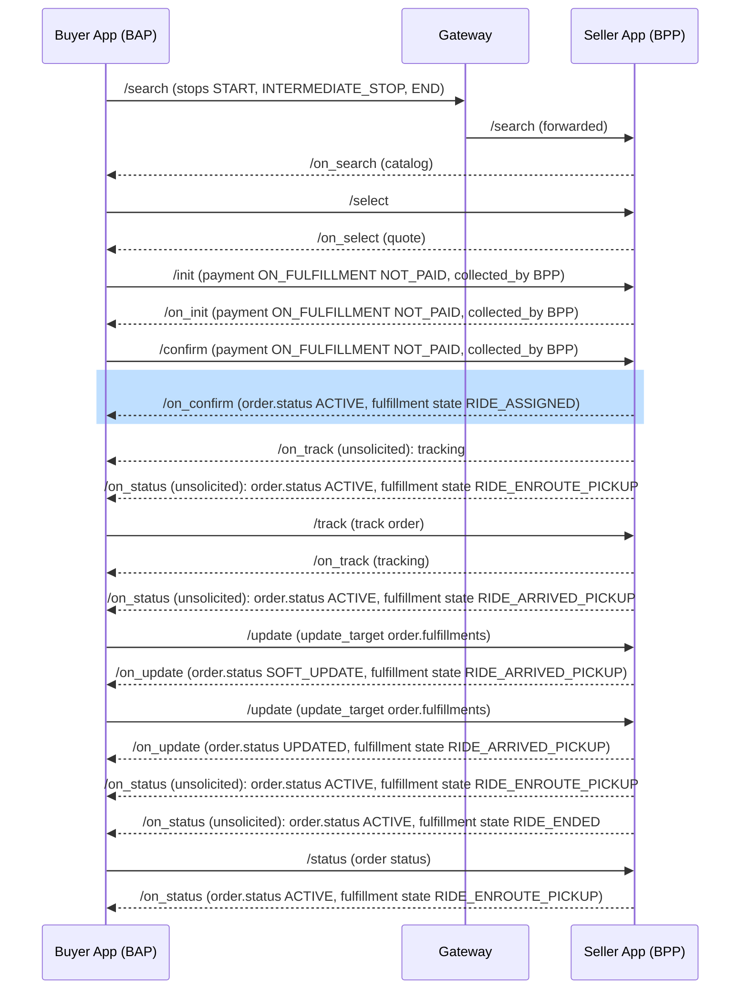
```mermaid
sequenceDiagram
  participant Buyer App (BAP)
  participant Gateway
  participant Seller App (BPP)
  Buyer App (BAP)->>Gateway: /search (stops START, INTERMEDIATE_STOP, END)
  Gateway->>Seller App (BPP): /search (forwarded)
  Seller App (BPP)-->>Buyer App (BAP): /on_search (catalog)
  Buyer App (BAP)->>Seller App (BPP): /select
  Seller App (BPP)-->>Buyer App (BAP): /on_select (quote)
  Buyer App (BAP)->>Seller App (BPP): /init (payment ON_FULFILLMENT NOT_PAID, collected_by BPP)
  Seller App (BPP)-->>Buyer App (BAP): /on_init (payment ON_FULFILLMENT NOT_PAID, collected_by BPP)
  Buyer App (BAP)->>Seller App (BPP): /confirm (payment ON_FULFILLMENT NOT_PAID, collected_by BPP)
  rect rgb(191, 223, 255)
  Seller App (BPP)-->>Buyer App (BAP): /on_confirm (order.status ACTIVE, fulfillment state RIDE_ASSIGNED)
  end
  Seller App (BPP)-->>Buyer App (BAP): /on_track (unsolicited): tracking
  Seller App (BPP)-->>Buyer App (BAP): /on_status (unsolicited): order.status ACTIVE, fulfillment state RIDE_ENROUTE_PICKUP
  Buyer App (BAP)->>Seller App (BPP): /track (track order)
  Seller App (BPP)-->>Buyer App (BAP): /on_track (tracking)
  Seller App (BPP)-->>Buyer App (BAP): /on_status (unsolicited): order.status ACTIVE, fulfillment state RIDE_ARRIVED_PICKUP
  Buyer App (BAP)->>Seller App (BPP): /update (update_target order.fulfillments)
  Seller App (BPP)-->>Buyer App (BAP): /on_update (order.status SOFT_UPDATE, fulfillment state RIDE_ARRIVED_PICKUP)
  Buyer App (BAP)->>Seller App (BPP): /update (update_target order.fulfillments)
  Seller App (BPP)-->>Buyer App (BAP): /on_update (order.status UPDATED, fulfillment state RIDE_ARRIVED_PICKUP)
  Seller App (BPP)-->>Buyer App (BAP): /on_status (unsolicited): order.status ACTIVE, fulfillment state RIDE_ENROUTE_PICKUP
  Seller App (BPP)-->>Buyer App (BAP): /on_status (unsolicited): order.status ACTIVE, fulfillment state RIDE_ENDED
  Buyer App (BAP)->>Seller App (BPP): /status (order status)
  Seller App (BPP)-->>Buyer App (BAP): /on_status (order.status ACTIVE, fulfillment state RIDE_ENROUTE_PICKUP)
```

## on_track_on_assign

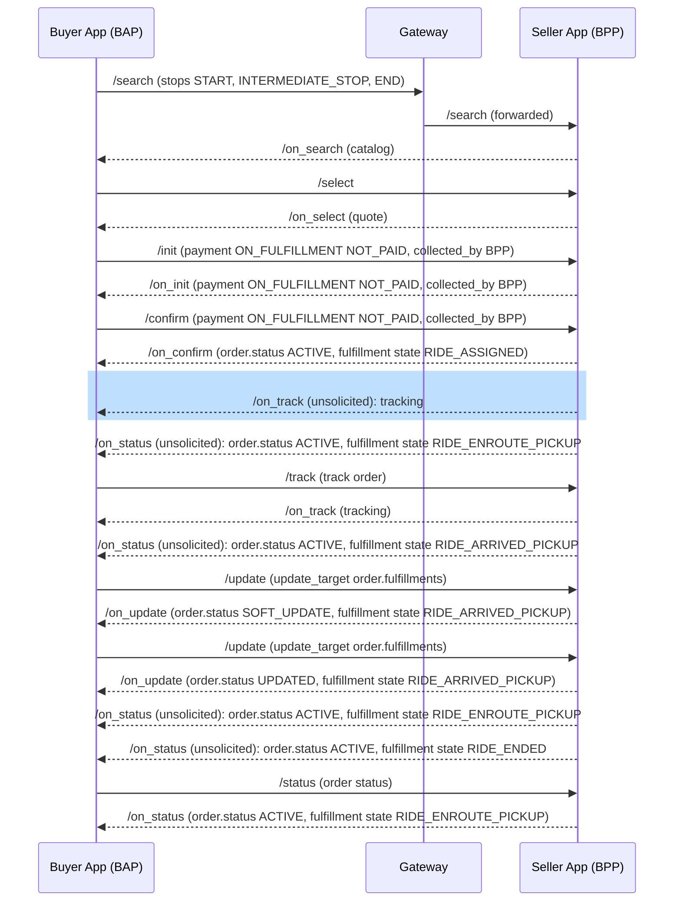
```mermaid
sequenceDiagram
  participant Buyer App (BAP)
  participant Gateway
  participant Seller App (BPP)
  Buyer App (BAP)->>Gateway: /search (stops START, INTERMEDIATE_STOP, END)
  Gateway->>Seller App (BPP): /search (forwarded)
  Seller App (BPP)-->>Buyer App (BAP): /on_search (catalog)
  Buyer App (BAP)->>Seller App (BPP): /select
  Seller App (BPP)-->>Buyer App (BAP): /on_select (quote)
  Buyer App (BAP)->>Seller App (BPP): /init (payment ON_FULFILLMENT NOT_PAID, collected_by BPP)
  Seller App (BPP)-->>Buyer App (BAP): /on_init (payment ON_FULFILLMENT NOT_PAID, collected_by BPP)
  Buyer App (BAP)->>Seller App (BPP): /confirm (payment ON_FULFILLMENT NOT_PAID, collected_by BPP)
  Seller App (BPP)-->>Buyer App (BAP): /on_confirm (order.status ACTIVE, fulfillment state RIDE_ASSIGNED)
  rect rgb(191, 223, 255)
  Seller App (BPP)-->>Buyer App (BAP): /on_track (unsolicited): tracking
  end
  Seller App (BPP)-->>Buyer App (BAP): /on_status (unsolicited): order.status ACTIVE, fulfillment state RIDE_ENROUTE_PICKUP
  Buyer App (BAP)->>Seller App (BPP): /track (track order)
  Seller App (BPP)-->>Buyer App (BAP): /on_track (tracking)
  Seller App (BPP)-->>Buyer App (BAP): /on_status (unsolicited): order.status ACTIVE, fulfillment state RIDE_ARRIVED_PICKUP
  Buyer App (BAP)->>Seller App (BPP): /update (update_target order.fulfillments)
  Seller App (BPP)-->>Buyer App (BAP): /on_update (order.status SOFT_UPDATE, fulfillment state RIDE_ARRIVED_PICKUP)
  Buyer App (BAP)->>Seller App (BPP): /update (update_target order.fulfillments)
  Seller App (BPP)-->>Buyer App (BAP): /on_update (order.status UPDATED, fulfillment state RIDE_ARRIVED_PICKUP)
  Seller App (BPP)-->>Buyer App (BAP): /on_status (unsolicited): order.status ACTIVE, fulfillment state RIDE_ENROUTE_PICKUP
  Seller App (BPP)-->>Buyer App (BAP): /on_status (unsolicited): order.status ACTIVE, fulfillment state RIDE_ENDED
  Buyer App (BAP)->>Seller App (BPP): /status (order status)
  Seller App (BPP)-->>Buyer App (BAP): /on_status (order.status ACTIVE, fulfillment state RIDE_ENROUTE_PICKUP)
```

## on_status_unsolicited

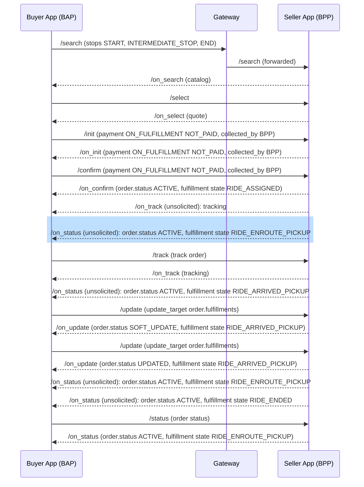
```mermaid
sequenceDiagram
  participant Buyer App (BAP)
  participant Gateway
  participant Seller App (BPP)
  Buyer App (BAP)->>Gateway: /search (stops START, INTERMEDIATE_STOP, END)
  Gateway->>Seller App (BPP): /search (forwarded)
  Seller App (BPP)-->>Buyer App (BAP): /on_search (catalog)
  Buyer App (BAP)->>Seller App (BPP): /select
  Seller App (BPP)-->>Buyer App (BAP): /on_select (quote)
  Buyer App (BAP)->>Seller App (BPP): /init (payment ON_FULFILLMENT NOT_PAID, collected_by BPP)
  Seller App (BPP)-->>Buyer App (BAP): /on_init (payment ON_FULFILLMENT NOT_PAID, collected_by BPP)
  Buyer App (BAP)->>Seller App (BPP): /confirm (payment ON_FULFILLMENT NOT_PAID, collected_by BPP)
  Seller App (BPP)-->>Buyer App (BAP): /on_confirm (order.status ACTIVE, fulfillment state RIDE_ASSIGNED)
  Seller App (BPP)-->>Buyer App (BAP): /on_track (unsolicited): tracking
  rect rgb(191, 223, 255)
  Seller App (BPP)-->>Buyer App (BAP): /on_status (unsolicited): order.status ACTIVE, fulfillment state RIDE_ENROUTE_PICKUP
  end
  Buyer App (BAP)->>Seller App (BPP): /track (track order)
  Seller App (BPP)-->>Buyer App (BAP): /on_track (tracking)
  Seller App (BPP)-->>Buyer App (BAP): /on_status (unsolicited): order.status ACTIVE, fulfillment state RIDE_ARRIVED_PICKUP
  Buyer App (BAP)->>Seller App (BPP): /update (update_target order.fulfillments)
  Seller App (BPP)-->>Buyer App (BAP): /on_update (order.status SOFT_UPDATE, fulfillment state RIDE_ARRIVED_PICKUP)
  Buyer App (BAP)->>Seller App (BPP): /update (update_target order.fulfillments)
  Seller App (BPP)-->>Buyer App (BAP): /on_update (order.status UPDATED, fulfillment state RIDE_ARRIVED_PICKUP)
  Seller App (BPP)-->>Buyer App (BAP): /on_status (unsolicited): order.status ACTIVE, fulfillment state RIDE_ENROUTE_PICKUP
  Seller App (BPP)-->>Buyer App (BAP): /on_status (unsolicited): order.status ACTIVE, fulfillment state RIDE_ENDED
  Buyer App (BAP)->>Seller App (BPP): /status (order status)
  Seller App (BPP)-->>Buyer App (BAP): /on_status (order.status ACTIVE, fulfillment state RIDE_ENROUTE_PICKUP)
```

## track

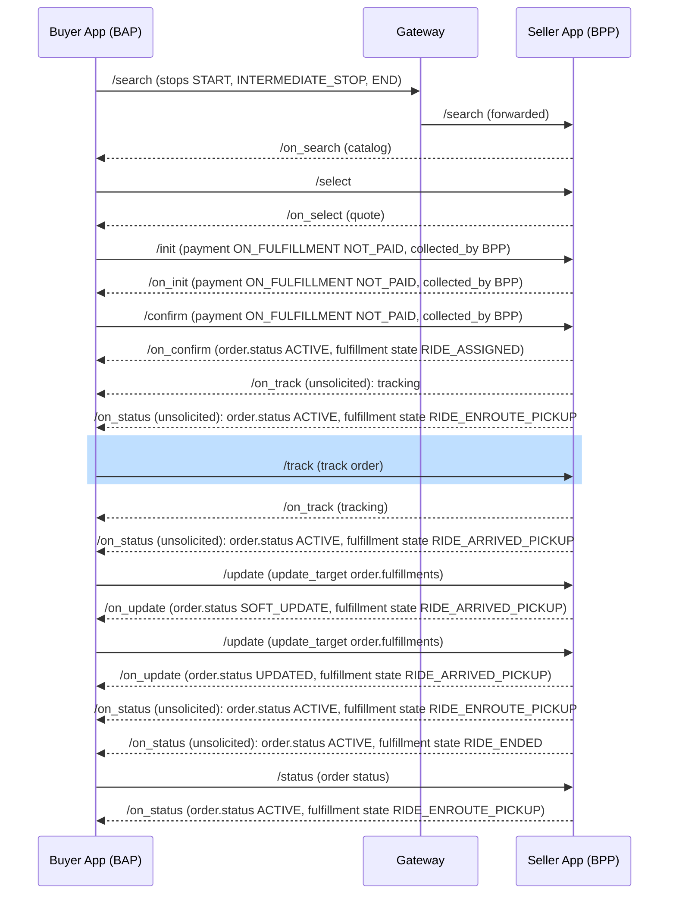
```mermaid
sequenceDiagram
  participant Buyer App (BAP)
  participant Gateway
  participant Seller App (BPP)
  Buyer App (BAP)->>Gateway: /search (stops START, INTERMEDIATE_STOP, END)
  Gateway->>Seller App (BPP): /search (forwarded)
  Seller App (BPP)-->>Buyer App (BAP): /on_search (catalog)
  Buyer App (BAP)->>Seller App (BPP): /select
  Seller App (BPP)-->>Buyer App (BAP): /on_select (quote)
  Buyer App (BAP)->>Seller App (BPP): /init (payment ON_FULFILLMENT NOT_PAID, collected_by BPP)
  Seller App (BPP)-->>Buyer App (BAP): /on_init (payment ON_FULFILLMENT NOT_PAID, collected_by BPP)
  Buyer App (BAP)->>Seller App (BPP): /confirm (payment ON_FULFILLMENT NOT_PAID, collected_by BPP)
  Seller App (BPP)-->>Buyer App (BAP): /on_confirm (order.status ACTIVE, fulfillment state RIDE_ASSIGNED)
  Seller App (BPP)-->>Buyer App (BAP): /on_track (unsolicited): tracking
  Seller App (BPP)-->>Buyer App (BAP): /on_status (unsolicited): order.status ACTIVE, fulfillment state RIDE_ENROUTE_PICKUP
  rect rgb(191, 223, 255)
  Buyer App (BAP)->>Seller App (BPP): /track (track order)
  end
  Seller App (BPP)-->>Buyer App (BAP): /on_track (tracking)
  Seller App (BPP)-->>Buyer App (BAP): /on_status (unsolicited): order.status ACTIVE, fulfillment state RIDE_ARRIVED_PICKUP
  Buyer App (BAP)->>Seller App (BPP): /update (update_target order.fulfillments)
  Seller App (BPP)-->>Buyer App (BAP): /on_update (order.status SOFT_UPDATE, fulfillment state RIDE_ARRIVED_PICKUP)
  Buyer App (BAP)->>Seller App (BPP): /update (update_target order.fulfillments)
  Seller App (BPP)-->>Buyer App (BAP): /on_update (order.status UPDATED, fulfillment state RIDE_ARRIVED_PICKUP)
  Seller App (BPP)-->>Buyer App (BAP): /on_status (unsolicited): order.status ACTIVE, fulfillment state RIDE_ENROUTE_PICKUP
  Seller App (BPP)-->>Buyer App (BAP): /on_status (unsolicited): order.status ACTIVE, fulfillment state RIDE_ENDED
  Buyer App (BAP)->>Seller App (BPP): /status (order status)
  Seller App (BPP)-->>Buyer App (BAP): /on_status (order.status ACTIVE, fulfillment state RIDE_ENROUTE_PICKUP)
```

## on_track

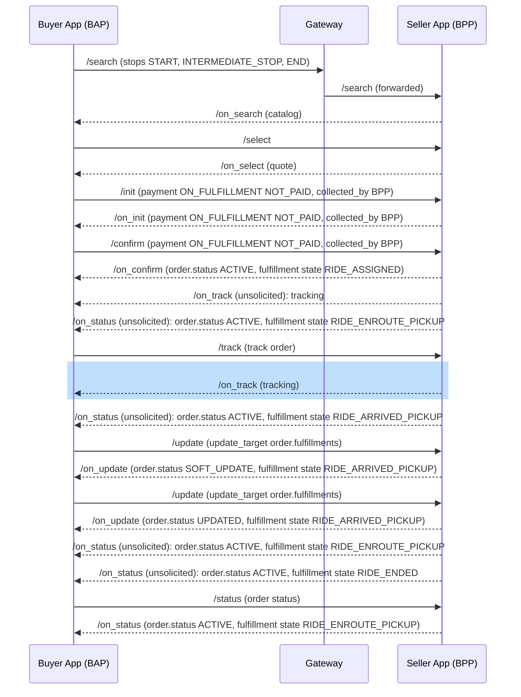
```mermaid
sequenceDiagram
  participant Buyer App (BAP)
  participant Gateway
  participant Seller App (BPP)
  Buyer App (BAP)->>Gateway: /search (stops START, INTERMEDIATE_STOP, END)
  Gateway->>Seller App (BPP): /search (forwarded)
  Seller App (BPP)-->>Buyer App (BAP): /on_search (catalog)
  Buyer App (BAP)->>Seller App (BPP): /select
  Seller App (BPP)-->>Buyer App (BAP): /on_select (quote)
  Buyer App (BAP)->>Seller App (BPP): /init (payment ON_FULFILLMENT NOT_PAID, collected_by BPP)
  Seller App (BPP)-->>Buyer App (BAP): /on_init (payment ON_FULFILLMENT NOT_PAID, collected_by BPP)
  Buyer App (BAP)->>Seller App (BPP): /confirm (payment ON_FULFILLMENT NOT_PAID, collected_by BPP)
  Seller App (BPP)-->>Buyer App (BAP): /on_confirm (order.status ACTIVE, fulfillment state RIDE_ASSIGNED)
  Seller App (BPP)-->>Buyer App (BAP): /on_track (unsolicited): tracking
  Seller App (BPP)-->>Buyer App (BAP): /on_status (unsolicited): order.status ACTIVE, fulfillment state RIDE_ENROUTE_PICKUP
  Buyer App (BAP)->>Seller App (BPP): /track (track order)
  rect rgb(191, 223, 255)
  Seller App (BPP)-->>Buyer App (BAP): /on_track (tracking)
  end
  Seller App (BPP)-->>Buyer App (BAP): /on_status (unsolicited): order.status ACTIVE, fulfillment state RIDE_ARRIVED_PICKUP
  Buyer App (BAP)->>Seller App (BPP): /update (update_target order.fulfillments)
  Seller App (BPP)-->>Buyer App (BAP): /on_update (order.status SOFT_UPDATE, fulfillment state RIDE_ARRIVED_PICKUP)
  Buyer App (BAP)->>Seller App (BPP): /update (update_target order.fulfillments)
  Seller App (BPP)-->>Buyer App (BAP): /on_update (order.status UPDATED, fulfillment state RIDE_ARRIVED_PICKUP)
  Seller App (BPP)-->>Buyer App (BAP): /on_status (unsolicited): order.status ACTIVE, fulfillment state RIDE_ENROUTE_PICKUP
  Seller App (BPP)-->>Buyer App (BAP): /on_status (unsolicited): order.status ACTIVE, fulfillment state RIDE_ENDED
  Buyer App (BAP)->>Seller App (BPP): /status (order status)
  Seller App (BPP)-->>Buyer App (BAP): /on_status (order.status ACTIVE, fulfillment state RIDE_ENROUTE_PICKUP)
```

## on_status_ride_arrived

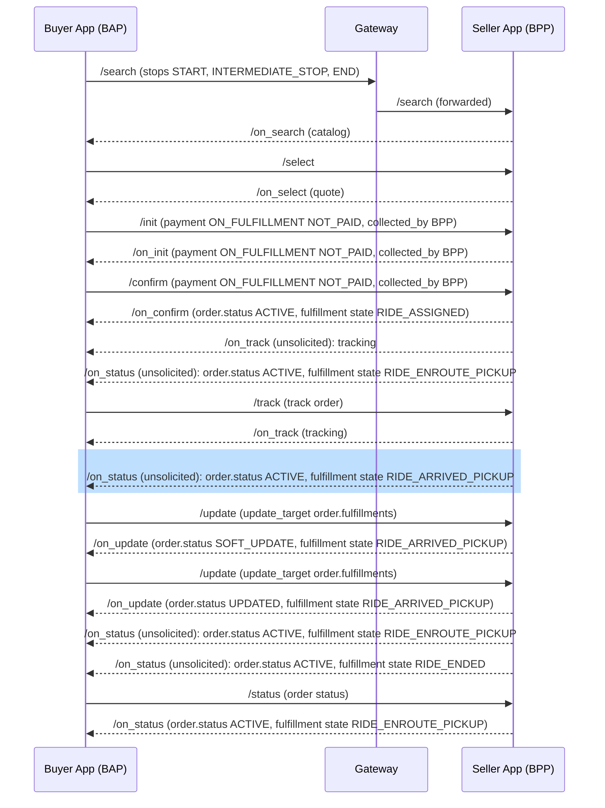
```mermaid
sequenceDiagram
  participant Buyer App (BAP)
  participant Gateway
  participant Seller App (BPP)
  Buyer App (BAP)->>Gateway: /search (stops START, INTERMEDIATE_STOP, END)
  Gateway->>Seller App (BPP): /search (forwarded)
  Seller App (BPP)-->>Buyer App (BAP): /on_search (catalog)
  Buyer App (BAP)->>Seller App (BPP): /select
  Seller App (BPP)-->>Buyer App (BAP): /on_select (quote)
  Buyer App (BAP)->>Seller App (BPP): /init (payment ON_FULFILLMENT NOT_PAID, collected_by BPP)
  Seller App (BPP)-->>Buyer App (BAP): /on_init (payment ON_FULFILLMENT NOT_PAID, collected_by BPP)
  Buyer App (BAP)->>Seller App (BPP): /confirm (payment ON_FULFILLMENT NOT_PAID, collected_by BPP)
  Seller App (BPP)-->>Buyer App (BAP): /on_confirm (order.status ACTIVE, fulfillment state RIDE_ASSIGNED)
  Seller App (BPP)-->>Buyer App (BAP): /on_track (unsolicited): tracking
  Seller App (BPP)-->>Buyer App (BAP): /on_status (unsolicited): order.status ACTIVE, fulfillment state RIDE_ENROUTE_PICKUP
  Buyer App (BAP)->>Seller App (BPP): /track (track order)
  Seller App (BPP)-->>Buyer App (BAP): /on_track (tracking)
  rect rgb(191, 223, 255)
  Seller App (BPP)-->>Buyer App (BAP): /on_status (unsolicited): order.status ACTIVE, fulfillment state RIDE_ARRIVED_PICKUP
  end
  Buyer App (BAP)->>Seller App (BPP): /update (update_target order.fulfillments)
  Seller App (BPP)-->>Buyer App (BAP): /on_update (order.status SOFT_UPDATE, fulfillment state RIDE_ARRIVED_PICKUP)
  Buyer App (BAP)->>Seller App (BPP): /update (update_target order.fulfillments)
  Seller App (BPP)-->>Buyer App (BAP): /on_update (order.status UPDATED, fulfillment state RIDE_ARRIVED_PICKUP)
  Seller App (BPP)-->>Buyer App (BAP): /on_status (unsolicited): order.status ACTIVE, fulfillment state RIDE_ENROUTE_PICKUP
  Seller App (BPP)-->>Buyer App (BAP): /on_status (unsolicited): order.status ACTIVE, fulfillment state RIDE_ENDED
  Buyer App (BAP)->>Seller App (BPP): /status (order status)
  Seller App (BPP)-->>Buyer App (BAP): /on_status (order.status ACTIVE, fulfillment state RIDE_ENROUTE_PICKUP)
```

## update

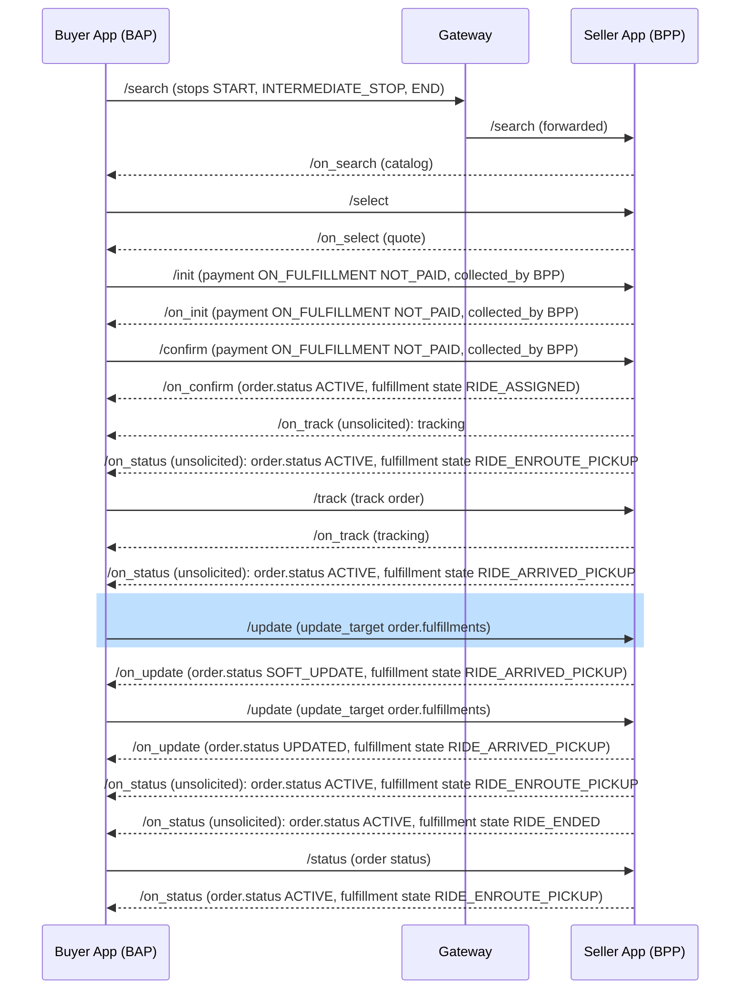
```mermaid
sequenceDiagram
  participant Buyer App (BAP)
  participant Gateway
  participant Seller App (BPP)
  Buyer App (BAP)->>Gateway: /search (stops START, INTERMEDIATE_STOP, END)
  Gateway->>Seller App (BPP): /search (forwarded)
  Seller App (BPP)-->>Buyer App (BAP): /on_search (catalog)
  Buyer App (BAP)->>Seller App (BPP): /select
  Seller App (BPP)-->>Buyer App (BAP): /on_select (quote)
  Buyer App (BAP)->>Seller App (BPP): /init (payment ON_FULFILLMENT NOT_PAID, collected_by BPP)
  Seller App (BPP)-->>Buyer App (BAP): /on_init (payment ON_FULFILLMENT NOT_PAID, collected_by BPP)
  Buyer App (BAP)->>Seller App (BPP): /confirm (payment ON_FULFILLMENT NOT_PAID, collected_by BPP)
  Seller App (BPP)-->>Buyer App (BAP): /on_confirm (order.status ACTIVE, fulfillment state RIDE_ASSIGNED)
  Seller App (BPP)-->>Buyer App (BAP): /on_track (unsolicited): tracking
  Seller App (BPP)-->>Buyer App (BAP): /on_status (unsolicited): order.status ACTIVE, fulfillment state RIDE_ENROUTE_PICKUP
  Buyer App (BAP)->>Seller App (BPP): /track (track order)
  Seller App (BPP)-->>Buyer App (BAP): /on_track (tracking)
  Seller App (BPP)-->>Buyer App (BAP): /on_status (unsolicited): order.status ACTIVE, fulfillment state RIDE_ARRIVED_PICKUP
  rect rgb(191, 223, 255)
  Buyer App (BAP)->>Seller App (BPP): /update (update_target order.fulfillments)
  end
  Seller App (BPP)-->>Buyer App (BAP): /on_update (order.status SOFT_UPDATE, fulfillment state RIDE_ARRIVED_PICKUP)
  Buyer App (BAP)->>Seller App (BPP): /update (update_target order.fulfillments)
  Seller App (BPP)-->>Buyer App (BAP): /on_update (order.status UPDATED, fulfillment state RIDE_ARRIVED_PICKUP)
  Seller App (BPP)-->>Buyer App (BAP): /on_status (unsolicited): order.status ACTIVE, fulfillment state RIDE_ENROUTE_PICKUP
  Seller App (BPP)-->>Buyer App (BAP): /on_status (unsolicited): order.status ACTIVE, fulfillment state RIDE_ENDED
  Buyer App (BAP)->>Seller App (BPP): /status (order status)
  Seller App (BPP)-->>Buyer App (BAP): /on_status (order.status ACTIVE, fulfillment state RIDE_ENROUTE_PICKUP)
```

## on_update_soft_update

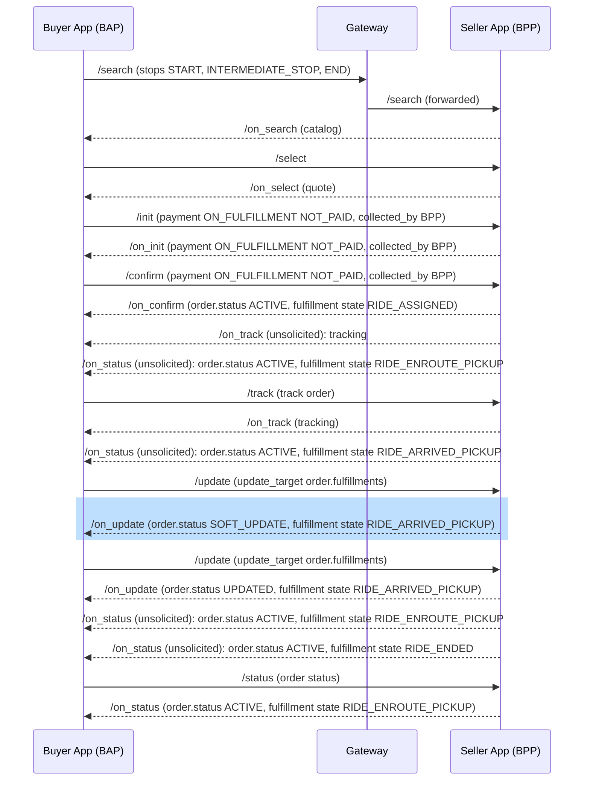
```mermaid
sequenceDiagram
  participant Buyer App (BAP)
  participant Gateway
  participant Seller App (BPP)
  Buyer App (BAP)->>Gateway: /search (stops START, INTERMEDIATE_STOP, END)
  Gateway->>Seller App (BPP): /search (forwarded)
  Seller App (BPP)-->>Buyer App (BAP): /on_search (catalog)
  Buyer App (BAP)->>Seller App (BPP): /select
  Seller App (BPP)-->>Buyer App (BAP): /on_select (quote)
  Buyer App (BAP)->>Seller App (BPP): /init (payment ON_FULFILLMENT NOT_PAID, collected_by BPP)
  Seller App (BPP)-->>Buyer App (BAP): /on_init (payment ON_FULFILLMENT NOT_PAID, collected_by BPP)
  Buyer App (BAP)->>Seller App (BPP): /confirm (payment ON_FULFILLMENT NOT_PAID, collected_by BPP)
  Seller App (BPP)-->>Buyer App (BAP): /on_confirm (order.status ACTIVE, fulfillment state RIDE_ASSIGNED)
  Seller App (BPP)-->>Buyer App (BAP): /on_track (unsolicited): tracking
  Seller App (BPP)-->>Buyer App (BAP): /on_status (unsolicited): order.status ACTIVE, fulfillment state RIDE_ENROUTE_PICKUP
  Buyer App (BAP)->>Seller App (BPP): /track (track order)
  Seller App (BPP)-->>Buyer App (BAP): /on_track (tracking)
  Seller App (BPP)-->>Buyer App (BAP): /on_status (unsolicited): order.status ACTIVE, fulfillment state RIDE_ARRIVED_PICKUP
  Buyer App (BAP)->>Seller App (BPP): /update (update_target order.fulfillments)
  rect rgb(191, 223, 255)
  Seller App (BPP)-->>Buyer App (BAP): /on_update (order.status SOFT_UPDATE, fulfillment state RIDE_ARRIVED_PICKUP)
  end
  Buyer App (BAP)->>Seller App (BPP): /update (update_target order.fulfillments)
  Seller App (BPP)-->>Buyer App (BAP): /on_update (order.status UPDATED, fulfillment state RIDE_ARRIVED_PICKUP)
  Seller App (BPP)-->>Buyer App (BAP): /on_status (unsolicited): order.status ACTIVE, fulfillment state RIDE_ENROUTE_PICKUP
  Seller App (BPP)-->>Buyer App (BAP): /on_status (unsolicited): order.status ACTIVE, fulfillment state RIDE_ENDED
  Buyer App (BAP)->>Seller App (BPP): /status (order status)
  Seller App (BPP)-->>Buyer App (BAP): /on_status (order.status ACTIVE, fulfillment state RIDE_ENROUTE_PICKUP)
```

## update_hard

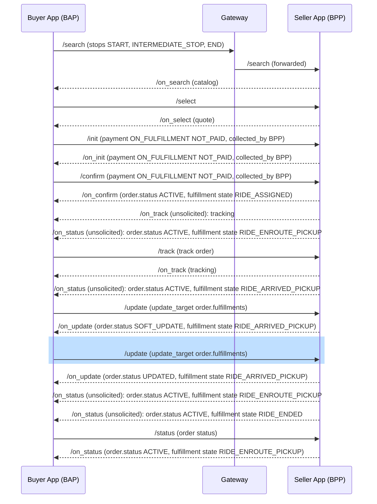
```mermaid
sequenceDiagram
  participant Buyer App (BAP)
  participant Gateway
  participant Seller App (BPP)
  Buyer App (BAP)->>Gateway: /search (stops START, INTERMEDIATE_STOP, END)
  Gateway->>Seller App (BPP): /search (forwarded)
  Seller App (BPP)-->>Buyer App (BAP): /on_search (catalog)
  Buyer App (BAP)->>Seller App (BPP): /select
  Seller App (BPP)-->>Buyer App (BAP): /on_select (quote)
  Buyer App (BAP)->>Seller App (BPP): /init (payment ON_FULFILLMENT NOT_PAID, collected_by BPP)
  Seller App (BPP)-->>Buyer App (BAP): /on_init (payment ON_FULFILLMENT NOT_PAID, collected_by BPP)
  Buyer App (BAP)->>Seller App (BPP): /confirm (payment ON_FULFILLMENT NOT_PAID, collected_by BPP)
  Seller App (BPP)-->>Buyer App (BAP): /on_confirm (order.status ACTIVE, fulfillment state RIDE_ASSIGNED)
  Seller App (BPP)-->>Buyer App (BAP): /on_track (unsolicited): tracking
  Seller App (BPP)-->>Buyer App (BAP): /on_status (unsolicited): order.status ACTIVE, fulfillment state RIDE_ENROUTE_PICKUP
  Buyer App (BAP)->>Seller App (BPP): /track (track order)
  Seller App (BPP)-->>Buyer App (BAP): /on_track (tracking)
  Seller App (BPP)-->>Buyer App (BAP): /on_status (unsolicited): order.status ACTIVE, fulfillment state RIDE_ARRIVED_PICKUP
  Buyer App (BAP)->>Seller App (BPP): /update (update_target order.fulfillments)
  Seller App (BPP)-->>Buyer App (BAP): /on_update (order.status SOFT_UPDATE, fulfillment state RIDE_ARRIVED_PICKUP)
  rect rgb(191, 223, 255)
  Buyer App (BAP)->>Seller App (BPP): /update (update_target order.fulfillments)
  end
  Seller App (BPP)-->>Buyer App (BAP): /on_update (order.status UPDATED, fulfillment state RIDE_ARRIVED_PICKUP)
  Seller App (BPP)-->>Buyer App (BAP): /on_status (unsolicited): order.status ACTIVE, fulfillment state RIDE_ENROUTE_PICKUP
  Seller App (BPP)-->>Buyer App (BAP): /on_status (unsolicited): order.status ACTIVE, fulfillment state RIDE_ENDED
  Buyer App (BAP)->>Seller App (BPP): /status (order status)
  Seller App (BPP)-->>Buyer App (BAP): /on_status (order.status ACTIVE, fulfillment state RIDE_ENROUTE_PICKUP)
```

## on_update_ride_updated

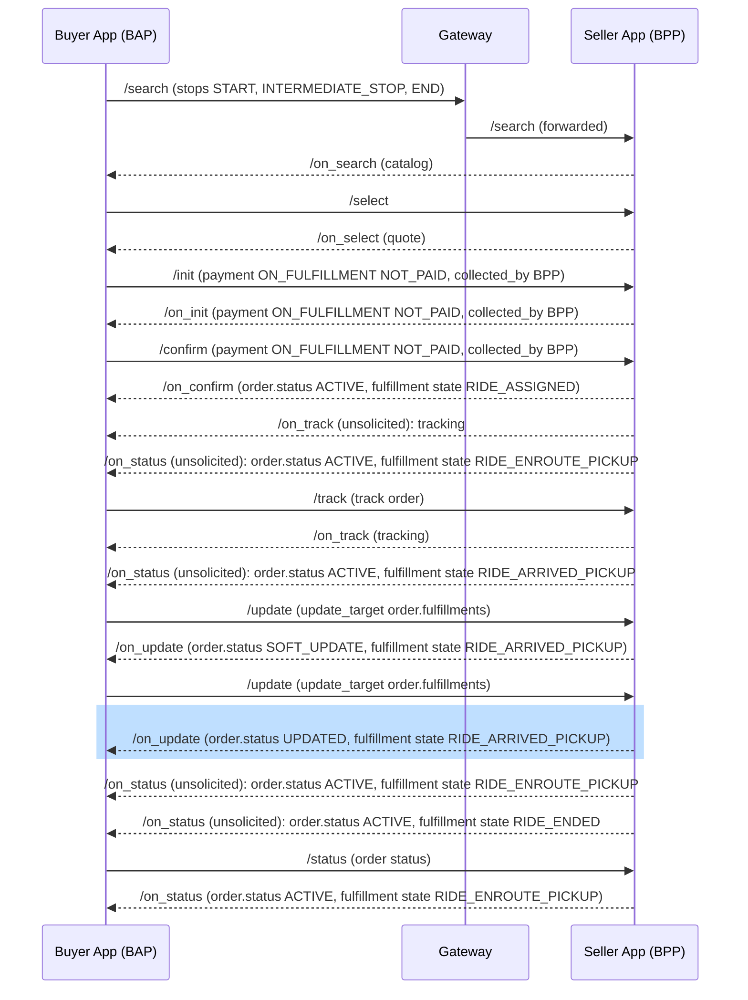
```mermaid
sequenceDiagram
  participant Buyer App (BAP)
  participant Gateway
  participant Seller App (BPP)
  Buyer App (BAP)->>Gateway: /search (stops START, INTERMEDIATE_STOP, END)
  Gateway->>Seller App (BPP): /search (forwarded)
  Seller App (BPP)-->>Buyer App (BAP): /on_search (catalog)
  Buyer App (BAP)->>Seller App (BPP): /select
  Seller App (BPP)-->>Buyer App (BAP): /on_select (quote)
  Buyer App (BAP)->>Seller App (BPP): /init (payment ON_FULFILLMENT NOT_PAID, collected_by BPP)
  Seller App (BPP)-->>Buyer App (BAP): /on_init (payment ON_FULFILLMENT NOT_PAID, collected_by BPP)
  Buyer App (BAP)->>Seller App (BPP): /confirm (payment ON_FULFILLMENT NOT_PAID, collected_by BPP)
  Seller App (BPP)-->>Buyer App (BAP): /on_confirm (order.status ACTIVE, fulfillment state RIDE_ASSIGNED)
  Seller App (BPP)-->>Buyer App (BAP): /on_track (unsolicited): tracking
  Seller App (BPP)-->>Buyer App (BAP): /on_status (unsolicited): order.status ACTIVE, fulfillment state RIDE_ENROUTE_PICKUP
  Buyer App (BAP)->>Seller App (BPP): /track (track order)
  Seller App (BPP)-->>Buyer App (BAP): /on_track (tracking)
  Seller App (BPP)-->>Buyer App (BAP): /on_status (unsolicited): order.status ACTIVE, fulfillment state RIDE_ARRIVED_PICKUP
  Buyer App (BAP)->>Seller App (BPP): /update (update_target order.fulfillments)
  Seller App (BPP)-->>Buyer App (BAP): /on_update (order.status SOFT_UPDATE, fulfillment state RIDE_ARRIVED_PICKUP)
  Buyer App (BAP)->>Seller App (BPP): /update (update_target order.fulfillments)
  rect rgb(191, 223, 255)
  Seller App (BPP)-->>Buyer App (BAP): /on_update (order.status UPDATED, fulfillment state RIDE_ARRIVED_PICKUP)
  end
  Seller App (BPP)-->>Buyer App (BAP): /on_status (unsolicited): order.status ACTIVE, fulfillment state RIDE_ENROUTE_PICKUP
  Seller App (BPP)-->>Buyer App (BAP): /on_status (unsolicited): order.status ACTIVE, fulfillment state RIDE_ENDED
  Buyer App (BAP)->>Seller App (BPP): /status (order status)
  Seller App (BPP)-->>Buyer App (BAP): /on_status (order.status ACTIVE, fulfillment state RIDE_ENROUTE_PICKUP)
```

## on_status_ride_started

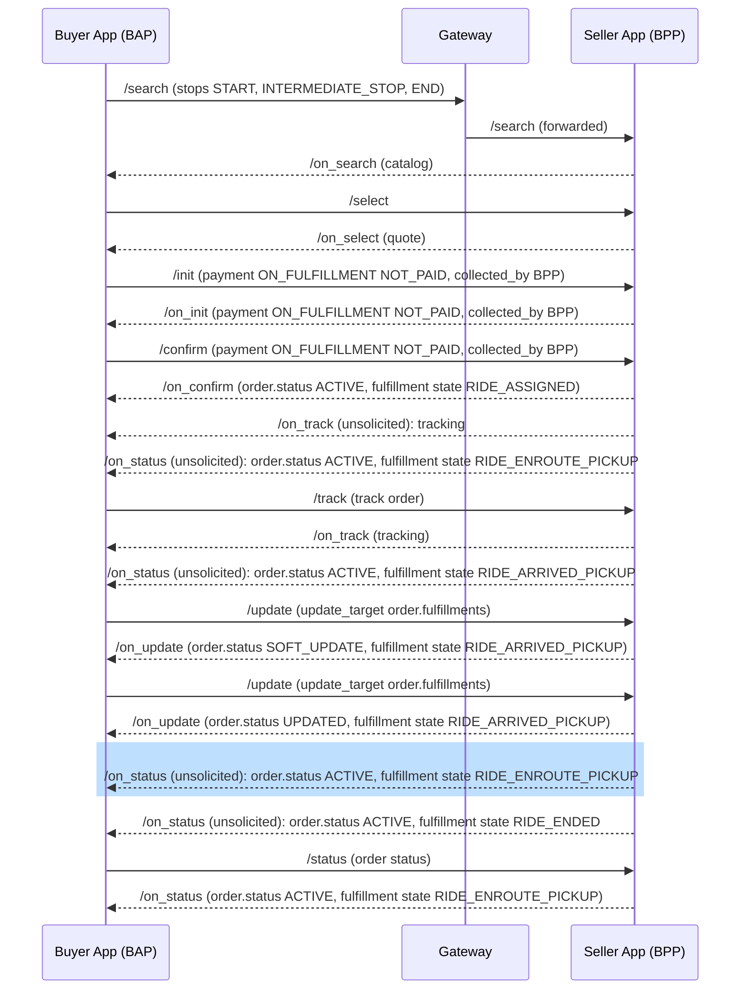
```mermaid
sequenceDiagram
  participant Buyer App (BAP)
  participant Gateway
  participant Seller App (BPP)
  Buyer App (BAP)->>Gateway: /search (stops START, INTERMEDIATE_STOP, END)
  Gateway->>Seller App (BPP): /search (forwarded)
  Seller App (BPP)-->>Buyer App (BAP): /on_search (catalog)
  Buyer App (BAP)->>Seller App (BPP): /select
  Seller App (BPP)-->>Buyer App (BAP): /on_select (quote)
  Buyer App (BAP)->>Seller App (BPP): /init (payment ON_FULFILLMENT NOT_PAID, collected_by BPP)
  Seller App (BPP)-->>Buyer App (BAP): /on_init (payment ON_FULFILLMENT NOT_PAID, collected_by BPP)
  Buyer App (BAP)->>Seller App (BPP): /confirm (payment ON_FULFILLMENT NOT_PAID, collected_by BPP)
  Seller App (BPP)-->>Buyer App (BAP): /on_confirm (order.status ACTIVE, fulfillment state RIDE_ASSIGNED)
  Seller App (BPP)-->>Buyer App (BAP): /on_track (unsolicited): tracking
  Seller App (BPP)-->>Buyer App (BAP): /on_status (unsolicited): order.status ACTIVE, fulfillment state RIDE_ENROUTE_PICKUP
  Buyer App (BAP)->>Seller App (BPP): /track (track order)
  Seller App (BPP)-->>Buyer App (BAP): /on_track (tracking)
  Seller App (BPP)-->>Buyer App (BAP): /on_status (unsolicited): order.status ACTIVE, fulfillment state RIDE_ARRIVED_PICKUP
  Buyer App (BAP)->>Seller App (BPP): /update (update_target order.fulfillments)
  Seller App (BPP)-->>Buyer App (BAP): /on_update (order.status SOFT_UPDATE, fulfillment state RIDE_ARRIVED_PICKUP)
  Buyer App (BAP)->>Seller App (BPP): /update (update_target order.fulfillments)
  Seller App (BPP)-->>Buyer App (BAP): /on_update (order.status UPDATED, fulfillment state RIDE_ARRIVED_PICKUP)
  rect rgb(191, 223, 255)
  Seller App (BPP)-->>Buyer App (BAP): /on_status (unsolicited): order.status ACTIVE, fulfillment state RIDE_ENROUTE_PICKUP
  end
  Seller App (BPP)-->>Buyer App (BAP): /on_status (unsolicited): order.status ACTIVE, fulfillment state RIDE_ENDED
  Buyer App (BAP)->>Seller App (BPP): /status (order status)
  Seller App (BPP)-->>Buyer App (BAP): /on_status (order.status ACTIVE, fulfillment state RIDE_ENROUTE_PICKUP)
```

## on_status_ride_ended

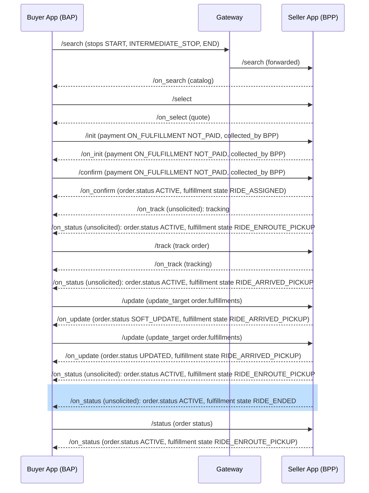
```mermaid
sequenceDiagram
  participant Buyer App (BAP)
  participant Gateway
  participant Seller App (BPP)
  Buyer App (BAP)->>Gateway: /search (stops START, INTERMEDIATE_STOP, END)
  Gateway->>Seller App (BPP): /search (forwarded)
  Seller App (BPP)-->>Buyer App (BAP): /on_search (catalog)
  Buyer App (BAP)->>Seller App (BPP): /select
  Seller App (BPP)-->>Buyer App (BAP): /on_select (quote)
  Buyer App (BAP)->>Seller App (BPP): /init (payment ON_FULFILLMENT NOT_PAID, collected_by BPP)
  Seller App (BPP)-->>Buyer App (BAP): /on_init (payment ON_FULFILLMENT NOT_PAID, collected_by BPP)
  Buyer App (BAP)->>Seller App (BPP): /confirm (payment ON_FULFILLMENT NOT_PAID, collected_by BPP)
  Seller App (BPP)-->>Buyer App (BAP): /on_confirm (order.status ACTIVE, fulfillment state RIDE_ASSIGNED)
  Seller App (BPP)-->>Buyer App (BAP): /on_track (unsolicited): tracking
  Seller App (BPP)-->>Buyer App (BAP): /on_status (unsolicited): order.status ACTIVE, fulfillment state RIDE_ENROUTE_PICKUP
  Buyer App (BAP)->>Seller App (BPP): /track (track order)
  Seller App (BPP)-->>Buyer App (BAP): /on_track (tracking)
  Seller App (BPP)-->>Buyer App (BAP): /on_status (unsolicited): order.status ACTIVE, fulfillment state RIDE_ARRIVED_PICKUP
  Buyer App (BAP)->>Seller App (BPP): /update (update_target order.fulfillments)
  Seller App (BPP)-->>Buyer App (BAP): /on_update (order.status SOFT_UPDATE, fulfillment state RIDE_ARRIVED_PICKUP)
  Buyer App (BAP)->>Seller App (BPP): /update (update_target order.fulfillments)
  Seller App (BPP)-->>Buyer App (BAP): /on_update (order.status UPDATED, fulfillment state RIDE_ARRIVED_PICKUP)
  Seller App (BPP)-->>Buyer App (BAP): /on_status (unsolicited): order.status ACTIVE, fulfillment state RIDE_ENROUTE_PICKUP
  rect rgb(191, 223, 255)
  Seller App (BPP)-->>Buyer App (BAP): /on_status (unsolicited): order.status ACTIVE, fulfillment state RIDE_ENDED
  end
  Buyer App (BAP)->>Seller App (BPP): /status (order status)
  Seller App (BPP)-->>Buyer App (BAP): /on_status (order.status ACTIVE, fulfillment state RIDE_ENROUTE_PICKUP)
```

## status

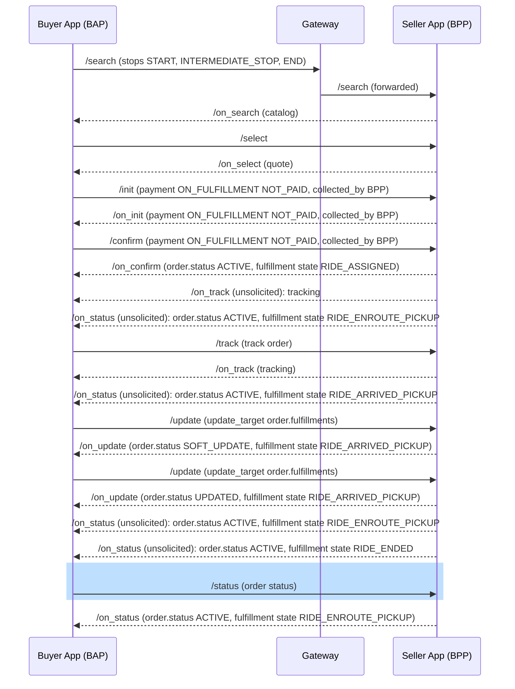
```mermaid
sequenceDiagram
  participant Buyer App (BAP)
  participant Gateway
  participant Seller App (BPP)
  Buyer App (BAP)->>Gateway: /search (stops START, INTERMEDIATE_STOP, END)
  Gateway->>Seller App (BPP): /search (forwarded)
  Seller App (BPP)-->>Buyer App (BAP): /on_search (catalog)
  Buyer App (BAP)->>Seller App (BPP): /select
  Seller App (BPP)-->>Buyer App (BAP): /on_select (quote)
  Buyer App (BAP)->>Seller App (BPP): /init (payment ON_FULFILLMENT NOT_PAID, collected_by BPP)
  Seller App (BPP)-->>Buyer App (BAP): /on_init (payment ON_FULFILLMENT NOT_PAID, collected_by BPP)
  Buyer App (BAP)->>Seller App (BPP): /confirm (payment ON_FULFILLMENT NOT_PAID, collected_by BPP)
  Seller App (BPP)-->>Buyer App (BAP): /on_confirm (order.status ACTIVE, fulfillment state RIDE_ASSIGNED)
  Seller App (BPP)-->>Buyer App (BAP): /on_track (unsolicited): tracking
  Seller App (BPP)-->>Buyer App (BAP): /on_status (unsolicited): order.status ACTIVE, fulfillment state RIDE_ENROUTE_PICKUP
  Buyer App (BAP)->>Seller App (BPP): /track (track order)
  Seller App (BPP)-->>Buyer App (BAP): /on_track (tracking)
  Seller App (BPP)-->>Buyer App (BAP): /on_status (unsolicited): order.status ACTIVE, fulfillment state RIDE_ARRIVED_PICKUP
  Buyer App (BAP)->>Seller App (BPP): /update (update_target order.fulfillments)
  Seller App (BPP)-->>Buyer App (BAP): /on_update (order.status SOFT_UPDATE, fulfillment state RIDE_ARRIVED_PICKUP)
  Buyer App (BAP)->>Seller App (BPP): /update (update_target order.fulfillments)
  Seller App (BPP)-->>Buyer App (BAP): /on_update (order.status UPDATED, fulfillment state RIDE_ARRIVED_PICKUP)
  Seller App (BPP)-->>Buyer App (BAP): /on_status (unsolicited): order.status ACTIVE, fulfillment state RIDE_ENROUTE_PICKUP
  Seller App (BPP)-->>Buyer App (BAP): /on_status (unsolicited): order.status ACTIVE, fulfillment state RIDE_ENDED
  rect rgb(191, 223, 255)
  Buyer App (BAP)->>Seller App (BPP): /status (order status)
  end
  Seller App (BPP)-->>Buyer App (BAP): /on_status (order.status ACTIVE, fulfillment state RIDE_ENROUTE_PICKUP)
```

## on_status_solicited

```mermaid
sequenceDiagram
  participant Buyer App (BAP)
  participant Gateway
  participant Seller App (BPP)
  Buyer App (BAP)->>Gateway: /search (stops START, INTERMEDIATE_STOP, END)
  Gateway->>Seller App (BPP): /search (forwarded)
  Seller App (BPP)-->>Buyer App (BAP): /on_search (catalog)
  Buyer App (BAP)->>Seller App (BPP): /select
  Seller App (BPP)-->>Buyer App (BAP): /on_select (quote)
  Buyer App (BAP)->>Seller App (BPP): /init (payment ON_FULFILLMENT NOT_PAID, collected_by BPP)
  Seller App (BPP)-->>Buyer App (BAP): /on_init (payment ON_FULFILLMENT NOT_PAID, collected_by BPP)
  Buyer App (BAP)->>Seller App (BPP): /confirm (payment ON_FULFILLMENT NOT_PAID, collected_by BPP)
  Seller App (BPP)-->>Buyer App (BAP): /on_confirm (order.status ACTIVE, fulfillment state RIDE_ASSIGNED)
  Seller App (BPP)-->>Buyer App (BAP): /on_track (unsolicited): tracking
  Seller App (BPP)-->>Buyer App (BAP): /on_status (unsolicited): order.status ACTIVE, fulfillment state RIDE_ENROUTE_PICKUP
  Buyer App (BAP)->>Seller App (BPP): /track (track order)
  Seller App (BPP)-->>Buyer App (BAP): /on_track (tracking)
  Seller App (BPP)-->>Buyer App (BAP): /on_status (unsolicited): order.status ACTIVE, fulfillment state RIDE_ARRIVED_PICKUP
  Buyer App (BAP)->>Seller App (BPP): /update (update_target order.fulfillments)
  Seller App (BPP)-->>Buyer App (BAP): /on_update (order.status SOFT_UPDATE, fulfillment state RIDE_ARRIVED_PICKUP)
  Buyer App (BAP)->>Seller App (BPP): /update (update_target order.fulfillments)
  Seller App (BPP)-->>Buyer App (BAP): /on_update (order.status UPDATED, fulfillment state RIDE_ARRIVED_PICKUP)
  Seller App (BPP)-->>Buyer App (BAP): /on_status (unsolicited): order.status ACTIVE, fulfillment state RIDE_ENROUTE_PICKUP
  Seller App (BPP)-->>Buyer App (BAP): /on_status (unsolicited): order.status ACTIVE, fulfillment state RIDE_ENDED
  Buyer App (BAP)->>Seller App (BPP): /status (order status)
  rect rgb(191, 223, 255)
  Seller App (BPP)-->>Buyer App (BAP): /on_status (order.status ACTIVE, fulfillment state RIDE_ENROUTE_PICKUP)
  end
```
