# order flow baseline with igm(v-1.0.0) — Sequence Diagrams

Internal data file consumed by the Developer Guide's "Sequence Diagram" tab (API Walkthrough).
Not meant to be shown as its own docs page — the frontend filters this slug out of the Use Case
Brief / Additional Resources / Changelog tab lists and instead looks up the section matching the
selected API call's `action_id` (the `##` heading below) to render that step's diagram.

One `## <action_id>` heading per step of `ORDER_FLOW_BASELINE_WITH_IGM_v_1.0.0.yaml`, in that flow's own step order, each followed by its Mermaid `sequenceDiagram`: the whole flow, with that call's own message(s) highlighted — same convention as the other domains' per-step sequence-diagram docs.

## search_1

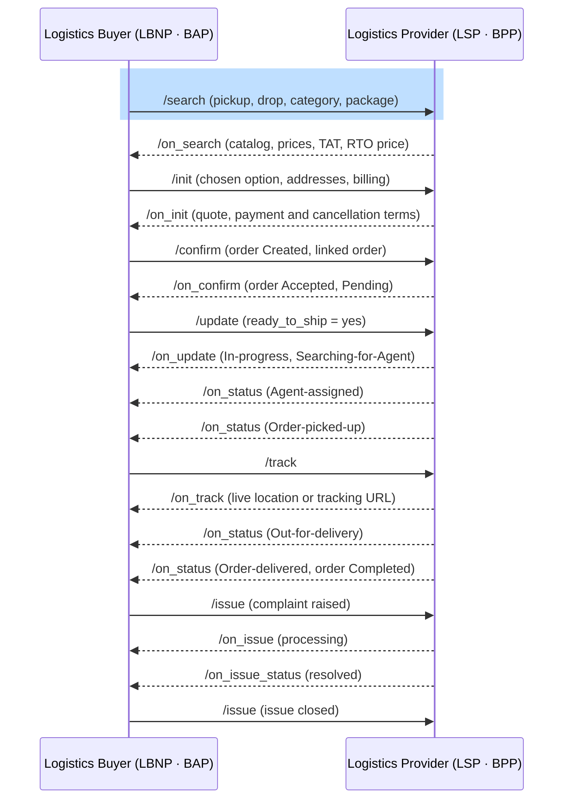
```mermaid
sequenceDiagram
  participant LBNP as Logistics Buyer (LBNP · BAP)
  participant LSP as Logistics Provider (LSP · BPP)
  rect rgb(191, 223, 255)
  LBNP->>LSP: /search (pickup, drop, category, package)
  end
  LSP-->>LBNP: /on_search (catalog, prices, TAT, RTO price)
  LBNP->>LSP: /init (chosen option, addresses, billing)
  LSP-->>LBNP: /on_init (quote, payment and cancellation terms)
  LBNP->>LSP: /confirm (order Created, linked order)
  LSP-->>LBNP: /on_confirm (order Accepted, Pending)
  LBNP->>LSP: /update (ready_to_ship = yes)
  LSP-->>LBNP: /on_update (In-progress, Searching-for-Agent)
  LSP-->>LBNP: /on_status (Agent-assigned)
  LSP-->>LBNP: /on_status (Order-picked-up)
  LBNP->>LSP: /track
  LSP-->>LBNP: /on_track (live location or tracking URL)
  LSP-->>LBNP: /on_status (Out-for-delivery)
  LSP-->>LBNP: /on_status (Order-delivered, order Completed)
  LBNP->>LSP: /issue (complaint raised)
  LSP-->>LBNP: /on_issue (processing)
  LSP-->>LBNP: /on_issue_status (resolved)
  LBNP->>LSP: /issue (issue closed)
```

## on_search_1

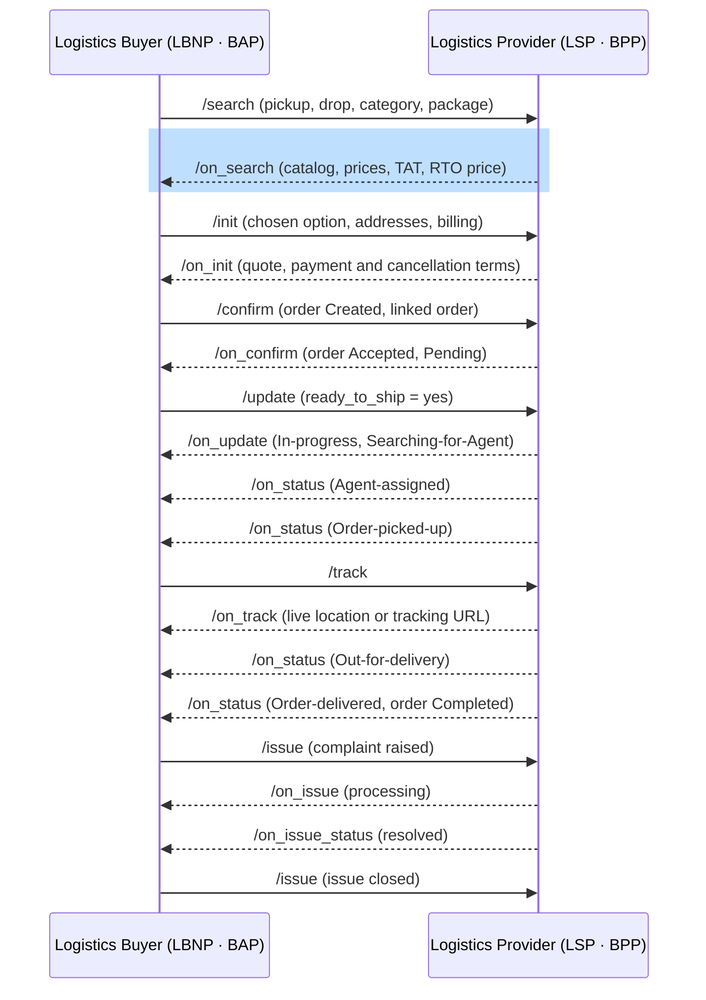
```mermaid
sequenceDiagram
  participant LBNP as Logistics Buyer (LBNP · BAP)
  participant LSP as Logistics Provider (LSP · BPP)
  LBNP->>LSP: /search (pickup, drop, category, package)
  rect rgb(191, 223, 255)
  LSP-->>LBNP: /on_search (catalog, prices, TAT, RTO price)
  end
  LBNP->>LSP: /init (chosen option, addresses, billing)
  LSP-->>LBNP: /on_init (quote, payment and cancellation terms)
  LBNP->>LSP: /confirm (order Created, linked order)
  LSP-->>LBNP: /on_confirm (order Accepted, Pending)
  LBNP->>LSP: /update (ready_to_ship = yes)
  LSP-->>LBNP: /on_update (In-progress, Searching-for-Agent)
  LSP-->>LBNP: /on_status (Agent-assigned)
  LSP-->>LBNP: /on_status (Order-picked-up)
  LBNP->>LSP: /track
  LSP-->>LBNP: /on_track (live location or tracking URL)
  LSP-->>LBNP: /on_status (Out-for-delivery)
  LSP-->>LBNP: /on_status (Order-delivered, order Completed)
  LBNP->>LSP: /issue (complaint raised)
  LSP-->>LBNP: /on_issue (processing)
  LSP-->>LBNP: /on_issue_status (resolved)
  LBNP->>LSP: /issue (issue closed)
```

## init_1

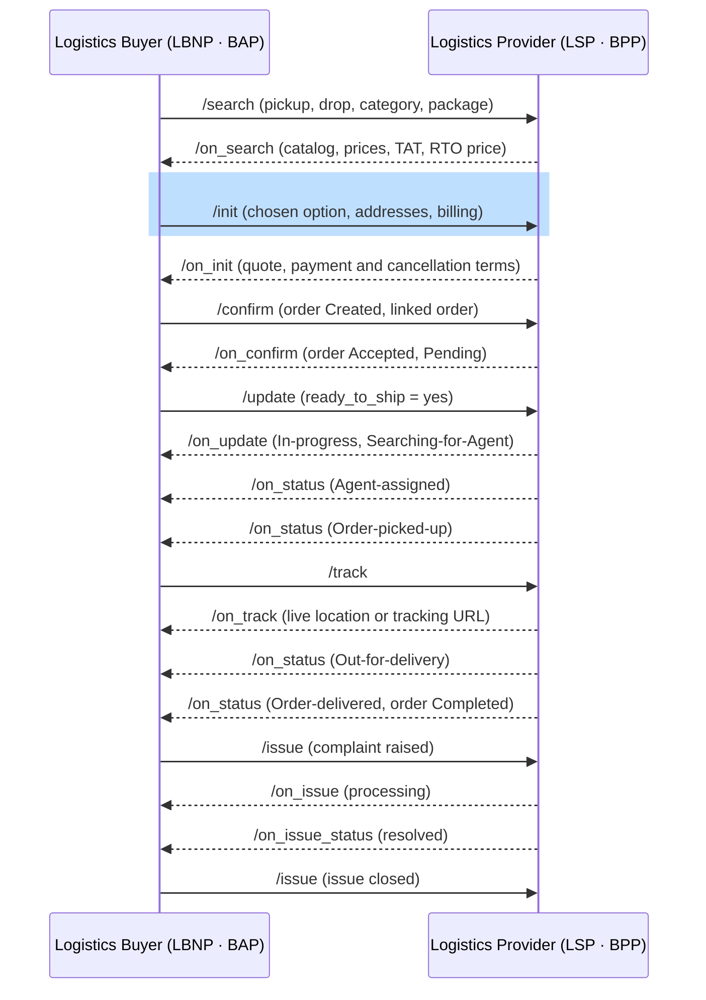
```mermaid
sequenceDiagram
  participant LBNP as Logistics Buyer (LBNP · BAP)
  participant LSP as Logistics Provider (LSP · BPP)
  LBNP->>LSP: /search (pickup, drop, category, package)
  LSP-->>LBNP: /on_search (catalog, prices, TAT, RTO price)
  rect rgb(191, 223, 255)
  LBNP->>LSP: /init (chosen option, addresses, billing)
  end
  LSP-->>LBNP: /on_init (quote, payment and cancellation terms)
  LBNP->>LSP: /confirm (order Created, linked order)
  LSP-->>LBNP: /on_confirm (order Accepted, Pending)
  LBNP->>LSP: /update (ready_to_ship = yes)
  LSP-->>LBNP: /on_update (In-progress, Searching-for-Agent)
  LSP-->>LBNP: /on_status (Agent-assigned)
  LSP-->>LBNP: /on_status (Order-picked-up)
  LBNP->>LSP: /track
  LSP-->>LBNP: /on_track (live location or tracking URL)
  LSP-->>LBNP: /on_status (Out-for-delivery)
  LSP-->>LBNP: /on_status (Order-delivered, order Completed)
  LBNP->>LSP: /issue (complaint raised)
  LSP-->>LBNP: /on_issue (processing)
  LSP-->>LBNP: /on_issue_status (resolved)
  LBNP->>LSP: /issue (issue closed)
```

## on_init_1

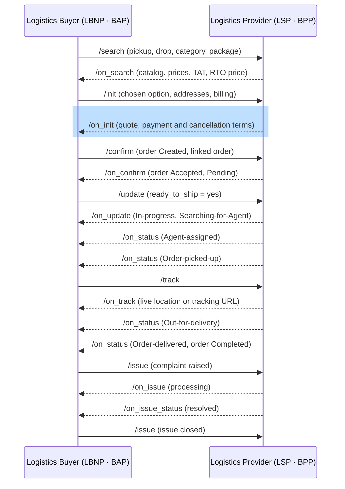
```mermaid
sequenceDiagram
  participant LBNP as Logistics Buyer (LBNP · BAP)
  participant LSP as Logistics Provider (LSP · BPP)
  LBNP->>LSP: /search (pickup, drop, category, package)
  LSP-->>LBNP: /on_search (catalog, prices, TAT, RTO price)
  LBNP->>LSP: /init (chosen option, addresses, billing)
  rect rgb(191, 223, 255)
  LSP-->>LBNP: /on_init (quote, payment and cancellation terms)
  end
  LBNP->>LSP: /confirm (order Created, linked order)
  LSP-->>LBNP: /on_confirm (order Accepted, Pending)
  LBNP->>LSP: /update (ready_to_ship = yes)
  LSP-->>LBNP: /on_update (In-progress, Searching-for-Agent)
  LSP-->>LBNP: /on_status (Agent-assigned)
  LSP-->>LBNP: /on_status (Order-picked-up)
  LBNP->>LSP: /track
  LSP-->>LBNP: /on_track (live location or tracking URL)
  LSP-->>LBNP: /on_status (Out-for-delivery)
  LSP-->>LBNP: /on_status (Order-delivered, order Completed)
  LBNP->>LSP: /issue (complaint raised)
  LSP-->>LBNP: /on_issue (processing)
  LSP-->>LBNP: /on_issue_status (resolved)
  LBNP->>LSP: /issue (issue closed)
```

## confirm_1

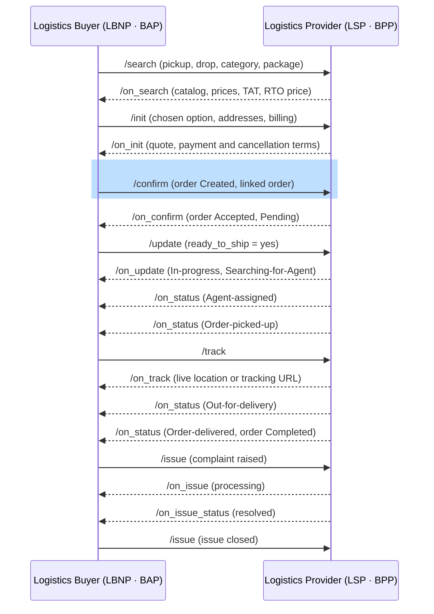
```mermaid
sequenceDiagram
  participant LBNP as Logistics Buyer (LBNP · BAP)
  participant LSP as Logistics Provider (LSP · BPP)
  LBNP->>LSP: /search (pickup, drop, category, package)
  LSP-->>LBNP: /on_search (catalog, prices, TAT, RTO price)
  LBNP->>LSP: /init (chosen option, addresses, billing)
  LSP-->>LBNP: /on_init (quote, payment and cancellation terms)
  rect rgb(191, 223, 255)
  LBNP->>LSP: /confirm (order Created, linked order)
  end
  LSP-->>LBNP: /on_confirm (order Accepted, Pending)
  LBNP->>LSP: /update (ready_to_ship = yes)
  LSP-->>LBNP: /on_update (In-progress, Searching-for-Agent)
  LSP-->>LBNP: /on_status (Agent-assigned)
  LSP-->>LBNP: /on_status (Order-picked-up)
  LBNP->>LSP: /track
  LSP-->>LBNP: /on_track (live location or tracking URL)
  LSP-->>LBNP: /on_status (Out-for-delivery)
  LSP-->>LBNP: /on_status (Order-delivered, order Completed)
  LBNP->>LSP: /issue (complaint raised)
  LSP-->>LBNP: /on_issue (processing)
  LSP-->>LBNP: /on_issue_status (resolved)
  LBNP->>LSP: /issue (issue closed)
```

## on_confirm1

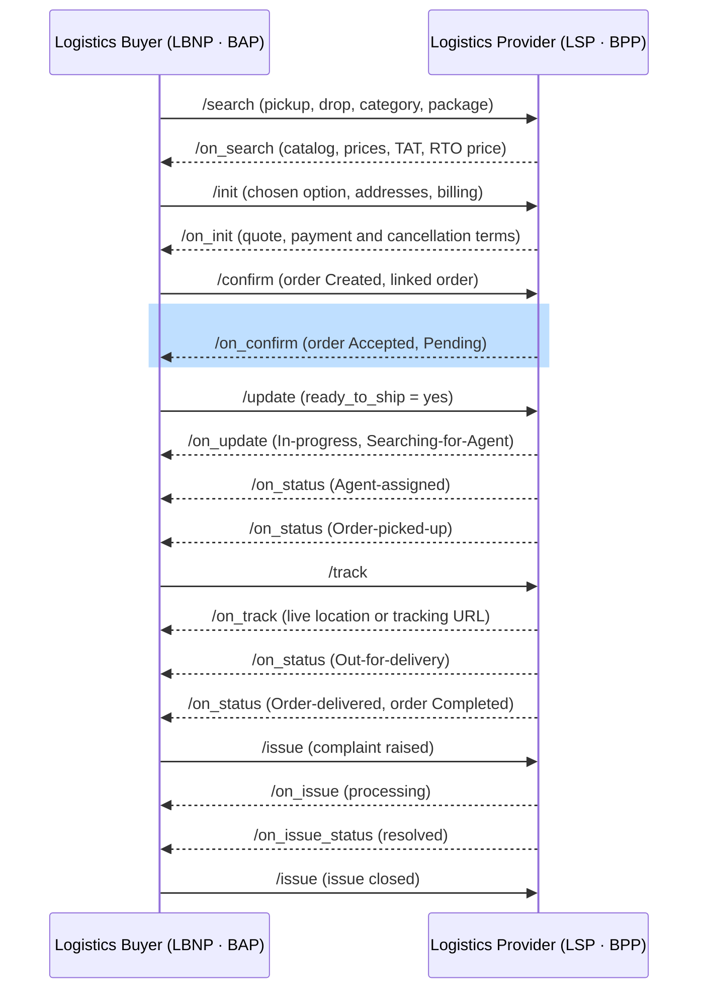
```mermaid
sequenceDiagram
  participant LBNP as Logistics Buyer (LBNP · BAP)
  participant LSP as Logistics Provider (LSP · BPP)
  LBNP->>LSP: /search (pickup, drop, category, package)
  LSP-->>LBNP: /on_search (catalog, prices, TAT, RTO price)
  LBNP->>LSP: /init (chosen option, addresses, billing)
  LSP-->>LBNP: /on_init (quote, payment and cancellation terms)
  LBNP->>LSP: /confirm (order Created, linked order)
  rect rgb(191, 223, 255)
  LSP-->>LBNP: /on_confirm (order Accepted, Pending)
  end
  LBNP->>LSP: /update (ready_to_ship = yes)
  LSP-->>LBNP: /on_update (In-progress, Searching-for-Agent)
  LSP-->>LBNP: /on_status (Agent-assigned)
  LSP-->>LBNP: /on_status (Order-picked-up)
  LBNP->>LSP: /track
  LSP-->>LBNP: /on_track (live location or tracking URL)
  LSP-->>LBNP: /on_status (Out-for-delivery)
  LSP-->>LBNP: /on_status (Order-delivered, order Completed)
  LBNP->>LSP: /issue (complaint raised)
  LSP-->>LBNP: /on_issue (processing)
  LSP-->>LBNP: /on_issue_status (resolved)
  LBNP->>LSP: /issue (issue closed)
```

## update_1

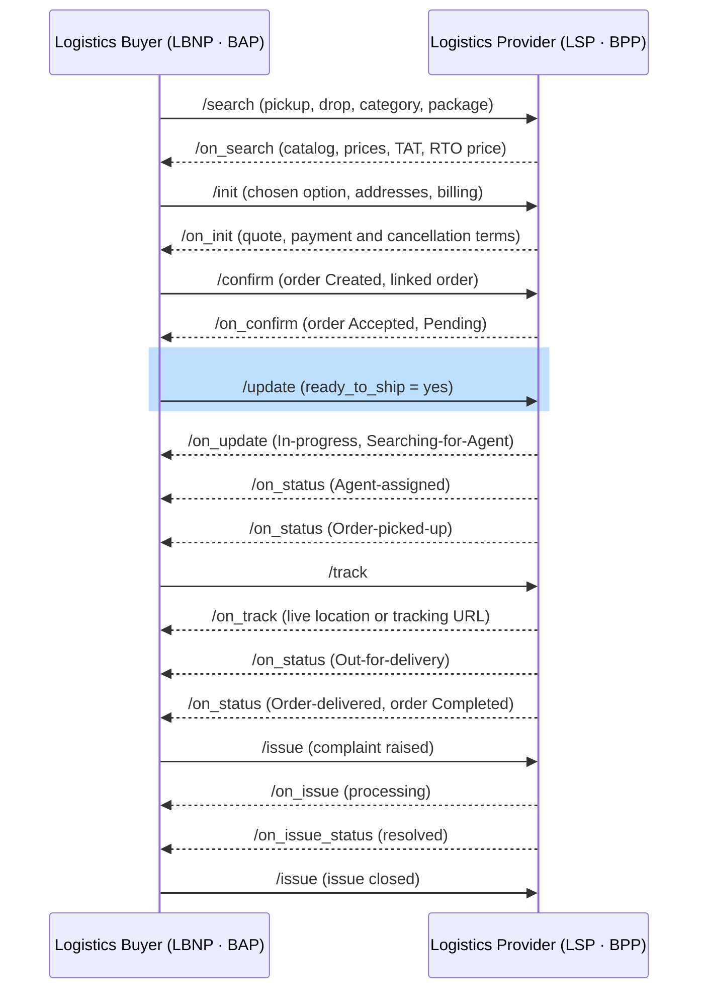
```mermaid
sequenceDiagram
  participant LBNP as Logistics Buyer (LBNP · BAP)
  participant LSP as Logistics Provider (LSP · BPP)
  LBNP->>LSP: /search (pickup, drop, category, package)
  LSP-->>LBNP: /on_search (catalog, prices, TAT, RTO price)
  LBNP->>LSP: /init (chosen option, addresses, billing)
  LSP-->>LBNP: /on_init (quote, payment and cancellation terms)
  LBNP->>LSP: /confirm (order Created, linked order)
  LSP-->>LBNP: /on_confirm (order Accepted, Pending)
  rect rgb(191, 223, 255)
  LBNP->>LSP: /update (ready_to_ship = yes)
  end
  LSP-->>LBNP: /on_update (In-progress, Searching-for-Agent)
  LSP-->>LBNP: /on_status (Agent-assigned)
  LSP-->>LBNP: /on_status (Order-picked-up)
  LBNP->>LSP: /track
  LSP-->>LBNP: /on_track (live location or tracking URL)
  LSP-->>LBNP: /on_status (Out-for-delivery)
  LSP-->>LBNP: /on_status (Order-delivered, order Completed)
  LBNP->>LSP: /issue (complaint raised)
  LSP-->>LBNP: /on_issue (processing)
  LSP-->>LBNP: /on_issue_status (resolved)
  LBNP->>LSP: /issue (issue closed)
```

## on_update_1

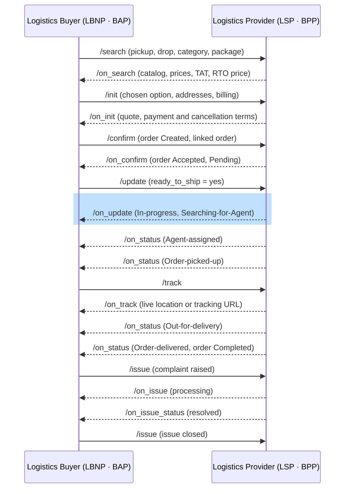
```mermaid
sequenceDiagram
  participant LBNP as Logistics Buyer (LBNP · BAP)
  participant LSP as Logistics Provider (LSP · BPP)
  LBNP->>LSP: /search (pickup, drop, category, package)
  LSP-->>LBNP: /on_search (catalog, prices, TAT, RTO price)
  LBNP->>LSP: /init (chosen option, addresses, billing)
  LSP-->>LBNP: /on_init (quote, payment and cancellation terms)
  LBNP->>LSP: /confirm (order Created, linked order)
  LSP-->>LBNP: /on_confirm (order Accepted, Pending)
  LBNP->>LSP: /update (ready_to_ship = yes)
  rect rgb(191, 223, 255)
  LSP-->>LBNP: /on_update (In-progress, Searching-for-Agent)
  end
  LSP-->>LBNP: /on_status (Agent-assigned)
  LSP-->>LBNP: /on_status (Order-picked-up)
  LBNP->>LSP: /track
  LSP-->>LBNP: /on_track (live location or tracking URL)
  LSP-->>LBNP: /on_status (Out-for-delivery)
  LSP-->>LBNP: /on_status (Order-delivered, order Completed)
  LBNP->>LSP: /issue (complaint raised)
  LSP-->>LBNP: /on_issue (processing)
  LSP-->>LBNP: /on_issue_status (resolved)
  LBNP->>LSP: /issue (issue closed)
```

## on_status_agent_assigned

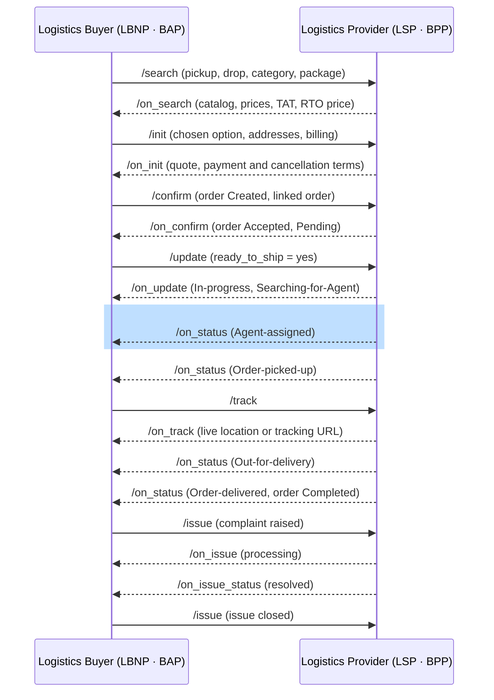
```mermaid
sequenceDiagram
  participant LBNP as Logistics Buyer (LBNP · BAP)
  participant LSP as Logistics Provider (LSP · BPP)
  LBNP->>LSP: /search (pickup, drop, category, package)
  LSP-->>LBNP: /on_search (catalog, prices, TAT, RTO price)
  LBNP->>LSP: /init (chosen option, addresses, billing)
  LSP-->>LBNP: /on_init (quote, payment and cancellation terms)
  LBNP->>LSP: /confirm (order Created, linked order)
  LSP-->>LBNP: /on_confirm (order Accepted, Pending)
  LBNP->>LSP: /update (ready_to_ship = yes)
  LSP-->>LBNP: /on_update (In-progress, Searching-for-Agent)
  rect rgb(191, 223, 255)
  LSP-->>LBNP: /on_status (Agent-assigned)
  end
  LSP-->>LBNP: /on_status (Order-picked-up)
  LBNP->>LSP: /track
  LSP-->>LBNP: /on_track (live location or tracking URL)
  LSP-->>LBNP: /on_status (Out-for-delivery)
  LSP-->>LBNP: /on_status (Order-delivered, order Completed)
  LBNP->>LSP: /issue (complaint raised)
  LSP-->>LBNP: /on_issue (processing)
  LSP-->>LBNP: /on_issue_status (resolved)
  LBNP->>LSP: /issue (issue closed)
```

## on_status_order_picked_up

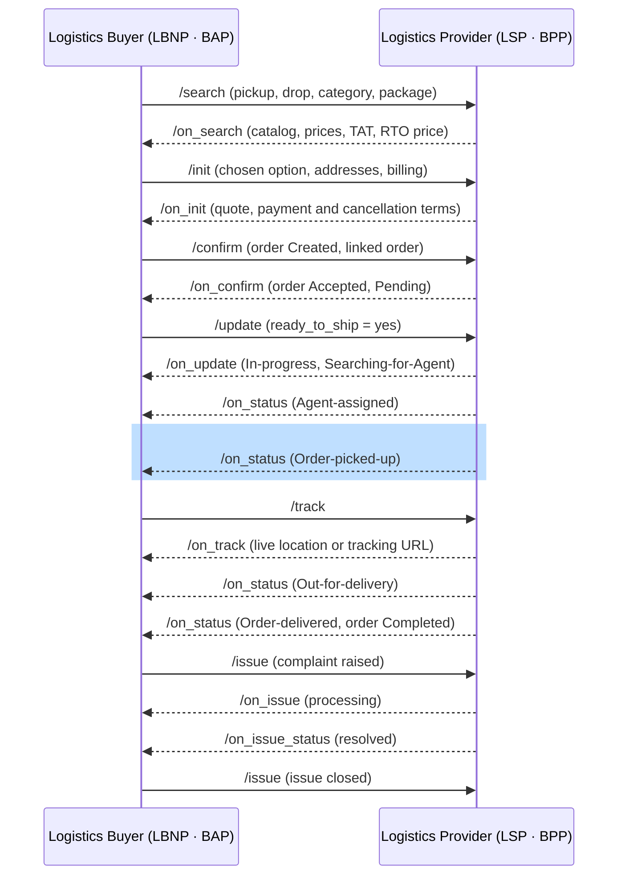
```mermaid
sequenceDiagram
  participant LBNP as Logistics Buyer (LBNP · BAP)
  participant LSP as Logistics Provider (LSP · BPP)
  LBNP->>LSP: /search (pickup, drop, category, package)
  LSP-->>LBNP: /on_search (catalog, prices, TAT, RTO price)
  LBNP->>LSP: /init (chosen option, addresses, billing)
  LSP-->>LBNP: /on_init (quote, payment and cancellation terms)
  LBNP->>LSP: /confirm (order Created, linked order)
  LSP-->>LBNP: /on_confirm (order Accepted, Pending)
  LBNP->>LSP: /update (ready_to_ship = yes)
  LSP-->>LBNP: /on_update (In-progress, Searching-for-Agent)
  LSP-->>LBNP: /on_status (Agent-assigned)
  rect rgb(191, 223, 255)
  LSP-->>LBNP: /on_status (Order-picked-up)
  end
  LBNP->>LSP: /track
  LSP-->>LBNP: /on_track (live location or tracking URL)
  LSP-->>LBNP: /on_status (Out-for-delivery)
  LSP-->>LBNP: /on_status (Order-delivered, order Completed)
  LBNP->>LSP: /issue (complaint raised)
  LSP-->>LBNP: /on_issue (processing)
  LSP-->>LBNP: /on_issue_status (resolved)
  LBNP->>LSP: /issue (issue closed)
```

## track_1

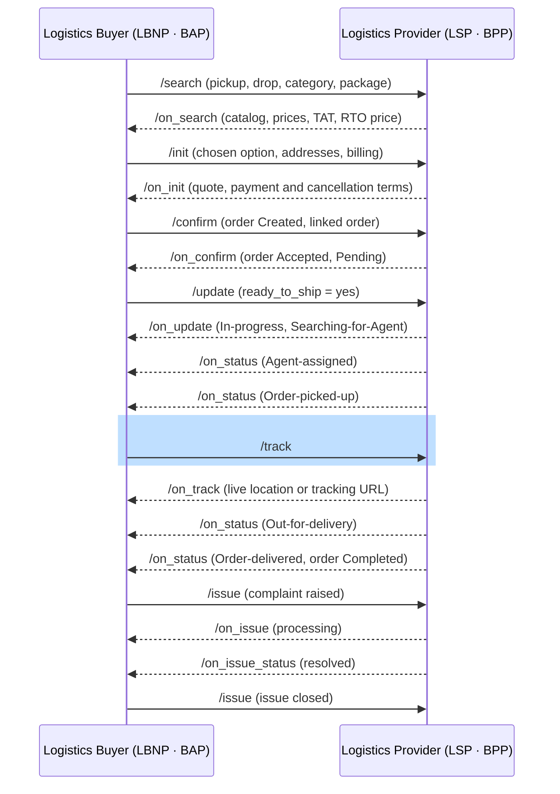
```mermaid
sequenceDiagram
  participant LBNP as Logistics Buyer (LBNP · BAP)
  participant LSP as Logistics Provider (LSP · BPP)
  LBNP->>LSP: /search (pickup, drop, category, package)
  LSP-->>LBNP: /on_search (catalog, prices, TAT, RTO price)
  LBNP->>LSP: /init (chosen option, addresses, billing)
  LSP-->>LBNP: /on_init (quote, payment and cancellation terms)
  LBNP->>LSP: /confirm (order Created, linked order)
  LSP-->>LBNP: /on_confirm (order Accepted, Pending)
  LBNP->>LSP: /update (ready_to_ship = yes)
  LSP-->>LBNP: /on_update (In-progress, Searching-for-Agent)
  LSP-->>LBNP: /on_status (Agent-assigned)
  LSP-->>LBNP: /on_status (Order-picked-up)
  rect rgb(191, 223, 255)
  LBNP->>LSP: /track
  end
  LSP-->>LBNP: /on_track (live location or tracking URL)
  LSP-->>LBNP: /on_status (Out-for-delivery)
  LSP-->>LBNP: /on_status (Order-delivered, order Completed)
  LBNP->>LSP: /issue (complaint raised)
  LSP-->>LBNP: /on_issue (processing)
  LSP-->>LBNP: /on_issue_status (resolved)
  LBNP->>LSP: /issue (issue closed)
```

## on_track_1

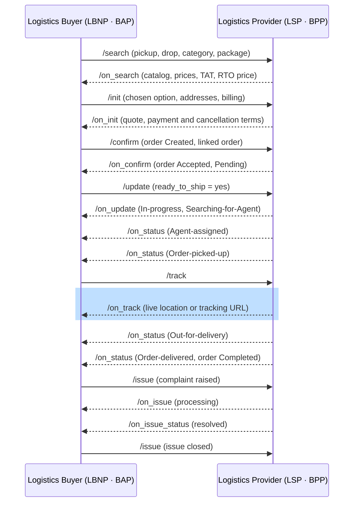
```mermaid
sequenceDiagram
  participant LBNP as Logistics Buyer (LBNP · BAP)
  participant LSP as Logistics Provider (LSP · BPP)
  LBNP->>LSP: /search (pickup, drop, category, package)
  LSP-->>LBNP: /on_search (catalog, prices, TAT, RTO price)
  LBNP->>LSP: /init (chosen option, addresses, billing)
  LSP-->>LBNP: /on_init (quote, payment and cancellation terms)
  LBNP->>LSP: /confirm (order Created, linked order)
  LSP-->>LBNP: /on_confirm (order Accepted, Pending)
  LBNP->>LSP: /update (ready_to_ship = yes)
  LSP-->>LBNP: /on_update (In-progress, Searching-for-Agent)
  LSP-->>LBNP: /on_status (Agent-assigned)
  LSP-->>LBNP: /on_status (Order-picked-up)
  LBNP->>LSP: /track
  rect rgb(191, 223, 255)
  LSP-->>LBNP: /on_track (live location or tracking URL)
  end
  LSP-->>LBNP: /on_status (Out-for-delivery)
  LSP-->>LBNP: /on_status (Order-delivered, order Completed)
  LBNP->>LSP: /issue (complaint raised)
  LSP-->>LBNP: /on_issue (processing)
  LSP-->>LBNP: /on_issue_status (resolved)
  LBNP->>LSP: /issue (issue closed)
```

## on_status_out_for_delivery

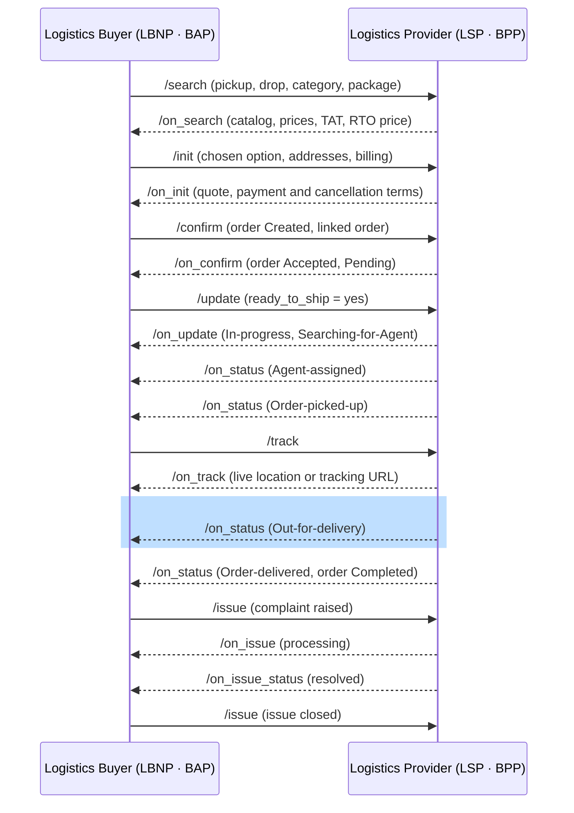
```mermaid
sequenceDiagram
  participant LBNP as Logistics Buyer (LBNP · BAP)
  participant LSP as Logistics Provider (LSP · BPP)
  LBNP->>LSP: /search (pickup, drop, category, package)
  LSP-->>LBNP: /on_search (catalog, prices, TAT, RTO price)
  LBNP->>LSP: /init (chosen option, addresses, billing)
  LSP-->>LBNP: /on_init (quote, payment and cancellation terms)
  LBNP->>LSP: /confirm (order Created, linked order)
  LSP-->>LBNP: /on_confirm (order Accepted, Pending)
  LBNP->>LSP: /update (ready_to_ship = yes)
  LSP-->>LBNP: /on_update (In-progress, Searching-for-Agent)
  LSP-->>LBNP: /on_status (Agent-assigned)
  LSP-->>LBNP: /on_status (Order-picked-up)
  LBNP->>LSP: /track
  LSP-->>LBNP: /on_track (live location or tracking URL)
  rect rgb(191, 223, 255)
  LSP-->>LBNP: /on_status (Out-for-delivery)
  end
  LSP-->>LBNP: /on_status (Order-delivered, order Completed)
  LBNP->>LSP: /issue (complaint raised)
  LSP-->>LBNP: /on_issue (processing)
  LSP-->>LBNP: /on_issue_status (resolved)
  LBNP->>LSP: /issue (issue closed)
```

## on_status_order_delivered

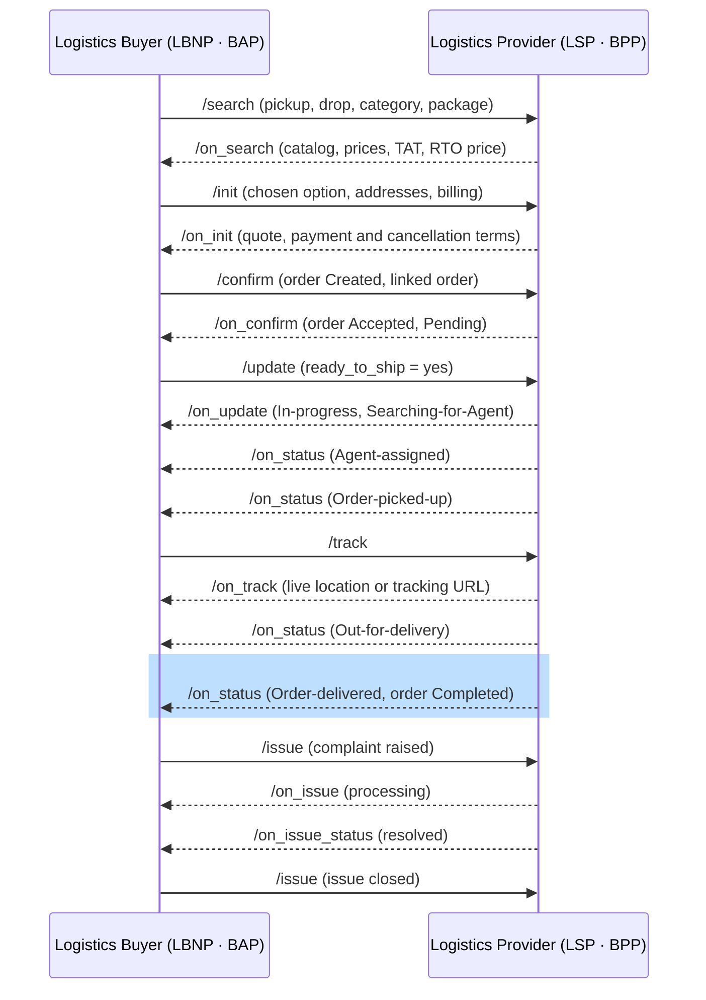
```mermaid
sequenceDiagram
  participant LBNP as Logistics Buyer (LBNP · BAP)
  participant LSP as Logistics Provider (LSP · BPP)
  LBNP->>LSP: /search (pickup, drop, category, package)
  LSP-->>LBNP: /on_search (catalog, prices, TAT, RTO price)
  LBNP->>LSP: /init (chosen option, addresses, billing)
  LSP-->>LBNP: /on_init (quote, payment and cancellation terms)
  LBNP->>LSP: /confirm (order Created, linked order)
  LSP-->>LBNP: /on_confirm (order Accepted, Pending)
  LBNP->>LSP: /update (ready_to_ship = yes)
  LSP-->>LBNP: /on_update (In-progress, Searching-for-Agent)
  LSP-->>LBNP: /on_status (Agent-assigned)
  LSP-->>LBNP: /on_status (Order-picked-up)
  LBNP->>LSP: /track
  LSP-->>LBNP: /on_track (live location or tracking URL)
  LSP-->>LBNP: /on_status (Out-for-delivery)
  rect rgb(191, 223, 255)
  LSP-->>LBNP: /on_status (Order-delivered, order Completed)
  end
  LBNP->>LSP: /issue (complaint raised)
  LSP-->>LBNP: /on_issue (processing)
  LSP-->>LBNP: /on_issue_status (resolved)
  LBNP->>LSP: /issue (issue closed)
```

## issue_open_100

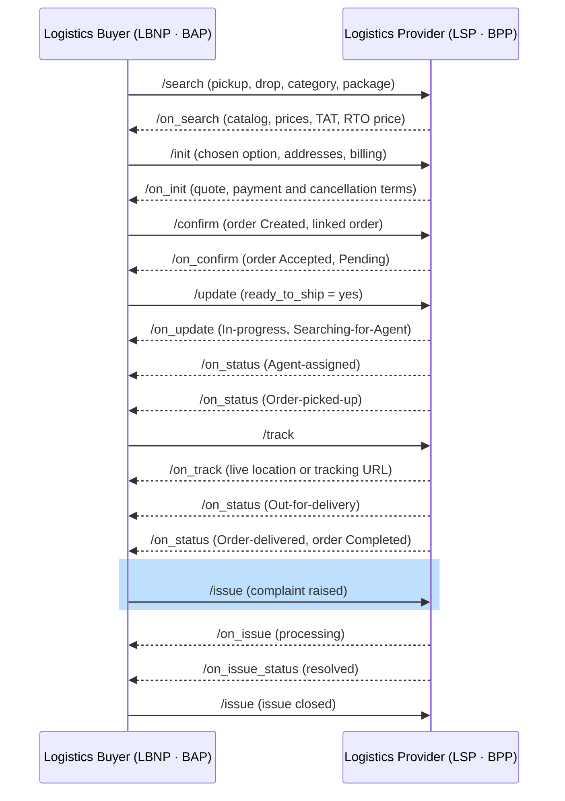
```mermaid
sequenceDiagram
  participant LBNP as Logistics Buyer (LBNP · BAP)
  participant LSP as Logistics Provider (LSP · BPP)
  LBNP->>LSP: /search (pickup, drop, category, package)
  LSP-->>LBNP: /on_search (catalog, prices, TAT, RTO price)
  LBNP->>LSP: /init (chosen option, addresses, billing)
  LSP-->>LBNP: /on_init (quote, payment and cancellation terms)
  LBNP->>LSP: /confirm (order Created, linked order)
  LSP-->>LBNP: /on_confirm (order Accepted, Pending)
  LBNP->>LSP: /update (ready_to_ship = yes)
  LSP-->>LBNP: /on_update (In-progress, Searching-for-Agent)
  LSP-->>LBNP: /on_status (Agent-assigned)
  LSP-->>LBNP: /on_status (Order-picked-up)
  LBNP->>LSP: /track
  LSP-->>LBNP: /on_track (live location or tracking URL)
  LSP-->>LBNP: /on_status (Out-for-delivery)
  LSP-->>LBNP: /on_status (Order-delivered, order Completed)
  rect rgb(191, 223, 255)
  LBNP->>LSP: /issue (complaint raised)
  end
  LSP-->>LBNP: /on_issue (processing)
  LSP-->>LBNP: /on_issue_status (resolved)
  LBNP->>LSP: /issue (issue closed)
```

## on_issue_processing_100

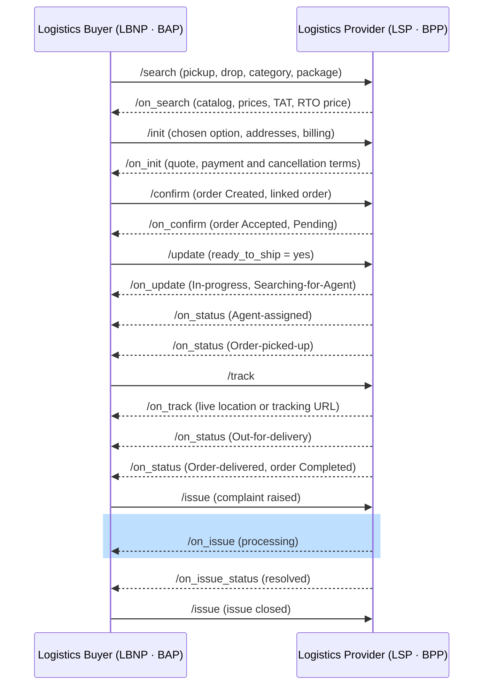
```mermaid
sequenceDiagram
  participant LBNP as Logistics Buyer (LBNP · BAP)
  participant LSP as Logistics Provider (LSP · BPP)
  LBNP->>LSP: /search (pickup, drop, category, package)
  LSP-->>LBNP: /on_search (catalog, prices, TAT, RTO price)
  LBNP->>LSP: /init (chosen option, addresses, billing)
  LSP-->>LBNP: /on_init (quote, payment and cancellation terms)
  LBNP->>LSP: /confirm (order Created, linked order)
  LSP-->>LBNP: /on_confirm (order Accepted, Pending)
  LBNP->>LSP: /update (ready_to_ship = yes)
  LSP-->>LBNP: /on_update (In-progress, Searching-for-Agent)
  LSP-->>LBNP: /on_status (Agent-assigned)
  LSP-->>LBNP: /on_status (Order-picked-up)
  LBNP->>LSP: /track
  LSP-->>LBNP: /on_track (live location or tracking URL)
  LSP-->>LBNP: /on_status (Out-for-delivery)
  LSP-->>LBNP: /on_status (Order-delivered, order Completed)
  LBNP->>LSP: /issue (complaint raised)
  rect rgb(191, 223, 255)
  LSP-->>LBNP: /on_issue (processing)
  end
  LSP-->>LBNP: /on_issue_status (resolved)
  LBNP->>LSP: /issue (issue closed)
```

## on_issue_resolved_100

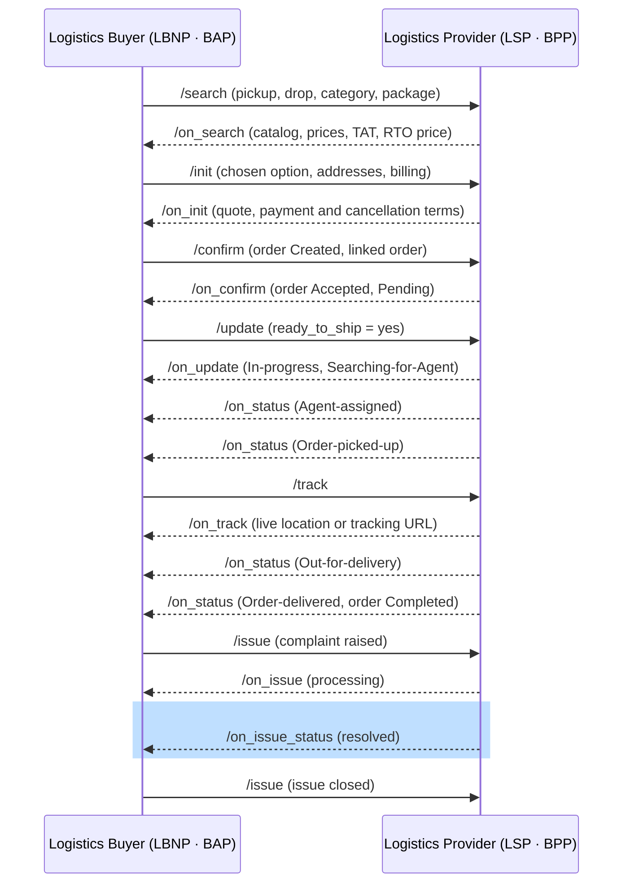
```mermaid
sequenceDiagram
  participant LBNP as Logistics Buyer (LBNP · BAP)
  participant LSP as Logistics Provider (LSP · BPP)
  LBNP->>LSP: /search (pickup, drop, category, package)
  LSP-->>LBNP: /on_search (catalog, prices, TAT, RTO price)
  LBNP->>LSP: /init (chosen option, addresses, billing)
  LSP-->>LBNP: /on_init (quote, payment and cancellation terms)
  LBNP->>LSP: /confirm (order Created, linked order)
  LSP-->>LBNP: /on_confirm (order Accepted, Pending)
  LBNP->>LSP: /update (ready_to_ship = yes)
  LSP-->>LBNP: /on_update (In-progress, Searching-for-Agent)
  LSP-->>LBNP: /on_status (Agent-assigned)
  LSP-->>LBNP: /on_status (Order-picked-up)
  LBNP->>LSP: /track
  LSP-->>LBNP: /on_track (live location or tracking URL)
  LSP-->>LBNP: /on_status (Out-for-delivery)
  LSP-->>LBNP: /on_status (Order-delivered, order Completed)
  LBNP->>LSP: /issue (complaint raised)
  LSP-->>LBNP: /on_issue (processing)
  rect rgb(191, 223, 255)
  LSP-->>LBNP: /on_issue_status (resolved)
  end
  LBNP->>LSP: /issue (issue closed)
```

## issue_close_100

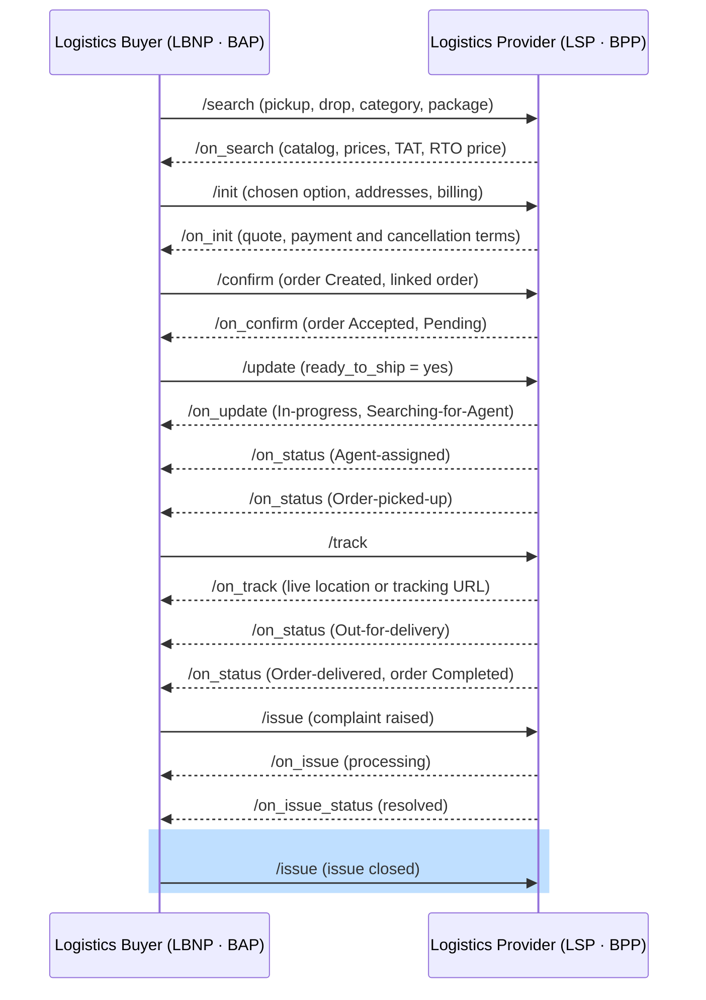
```mermaid
sequenceDiagram
  participant LBNP as Logistics Buyer (LBNP · BAP)
  participant LSP as Logistics Provider (LSP · BPP)
  LBNP->>LSP: /search (pickup, drop, category, package)
  LSP-->>LBNP: /on_search (catalog, prices, TAT, RTO price)
  LBNP->>LSP: /init (chosen option, addresses, billing)
  LSP-->>LBNP: /on_init (quote, payment and cancellation terms)
  LBNP->>LSP: /confirm (order Created, linked order)
  LSP-->>LBNP: /on_confirm (order Accepted, Pending)
  LBNP->>LSP: /update (ready_to_ship = yes)
  LSP-->>LBNP: /on_update (In-progress, Searching-for-Agent)
  LSP-->>LBNP: /on_status (Agent-assigned)
  LSP-->>LBNP: /on_status (Order-picked-up)
  LBNP->>LSP: /track
  LSP-->>LBNP: /on_track (live location or tracking URL)
  LSP-->>LBNP: /on_status (Out-for-delivery)
  LSP-->>LBNP: /on_status (Order-delivered, order Completed)
  LBNP->>LSP: /issue (complaint raised)
  LSP-->>LBNP: /on_issue (processing)
  LSP-->>LBNP: /on_issue_status (resolved)
  rect rgb(191, 223, 255)
  LBNP->>LSP: /issue (issue closed)
  end
```
