# Out of Stock(Error code) — Sequence Diagrams

Internal data file consumed by the Developer Guide's "Sequence Diagram" tab (API Walkthrough).
Not meant to be shown as its own docs page — the frontend filters this slug out of the Use Case
Brief / Additional Resources / Changelog tab lists and instead looks up the section matching the
selected API call's `action_id` (the `##` heading below) to render that step's diagram.

One `## <action_id>` heading per step of `Out_of_Stock_Error_code_.yaml`, in that flow's own step order, each followed by its Mermaid `sequenceDiagram`: the whole flow, with that call's own message(s) highlighted — same convention as the other domains' per-step sequence-diagram docs.

## select0

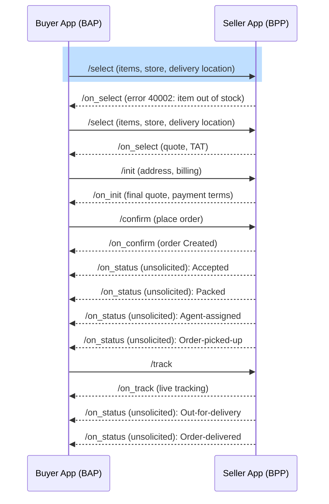
```mermaid
sequenceDiagram
  participant Buyer App (BAP)
  participant Seller App (BPP)
  rect rgb(191, 223, 255)
  Buyer App (BAP)->>Seller App (BPP): /select (items, store, delivery location)
  end
  Seller App (BPP)-->>Buyer App (BAP): /on_select (error 40002: item out of stock)
  Buyer App (BAP)->>Seller App (BPP): /select (items, store, delivery location)
  Seller App (BPP)-->>Buyer App (BAP): /on_select (quote, TAT)
  Buyer App (BAP)->>Seller App (BPP): /init (address, billing)
  Seller App (BPP)-->>Buyer App (BAP): /on_init (final quote, payment terms)
  Buyer App (BAP)->>Seller App (BPP): /confirm (place order)
  Seller App (BPP)-->>Buyer App (BAP): /on_confirm (order Created)
  Seller App (BPP)-->>Buyer App (BAP): /on_status (unsolicited): Accepted
  Seller App (BPP)-->>Buyer App (BAP): /on_status (unsolicited): Packed
  Seller App (BPP)-->>Buyer App (BAP): /on_status (unsolicited): Agent-assigned
  Seller App (BPP)-->>Buyer App (BAP): /on_status (unsolicited): Order-picked-up
  Buyer App (BAP)->>Seller App (BPP): /track
  Seller App (BPP)-->>Buyer App (BAP): /on_track (live tracking)
  Seller App (BPP)-->>Buyer App (BAP): /on_status (unsolicited): Out-for-delivery
  Seller App (BPP)-->>Buyer App (BAP): /on_status (unsolicited): Order-delivered
```

## on_select_out_of_stock

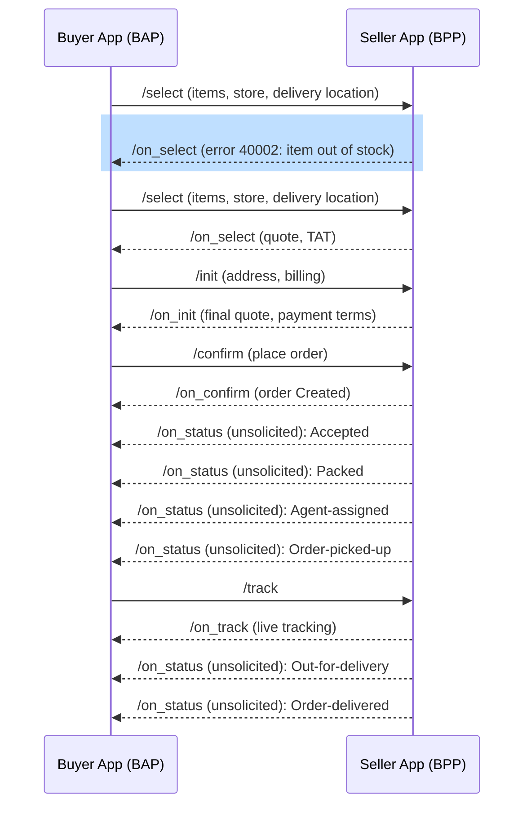
```mermaid
sequenceDiagram
  participant Buyer App (BAP)
  participant Seller App (BPP)
  Buyer App (BAP)->>Seller App (BPP): /select (items, store, delivery location)
  rect rgb(191, 223, 255)
  Seller App (BPP)-->>Buyer App (BAP): /on_select (error 40002: item out of stock)
  end
  Buyer App (BAP)->>Seller App (BPP): /select (items, store, delivery location)
  Seller App (BPP)-->>Buyer App (BAP): /on_select (quote, TAT)
  Buyer App (BAP)->>Seller App (BPP): /init (address, billing)
  Seller App (BPP)-->>Buyer App (BAP): /on_init (final quote, payment terms)
  Buyer App (BAP)->>Seller App (BPP): /confirm (place order)
  Seller App (BPP)-->>Buyer App (BAP): /on_confirm (order Created)
  Seller App (BPP)-->>Buyer App (BAP): /on_status (unsolicited): Accepted
  Seller App (BPP)-->>Buyer App (BAP): /on_status (unsolicited): Packed
  Seller App (BPP)-->>Buyer App (BAP): /on_status (unsolicited): Agent-assigned
  Seller App (BPP)-->>Buyer App (BAP): /on_status (unsolicited): Order-picked-up
  Buyer App (BAP)->>Seller App (BPP): /track
  Seller App (BPP)-->>Buyer App (BAP): /on_track (live tracking)
  Seller App (BPP)-->>Buyer App (BAP): /on_status (unsolicited): Out-for-delivery
  Seller App (BPP)-->>Buyer App (BAP): /on_status (unsolicited): Order-delivered
```

## select

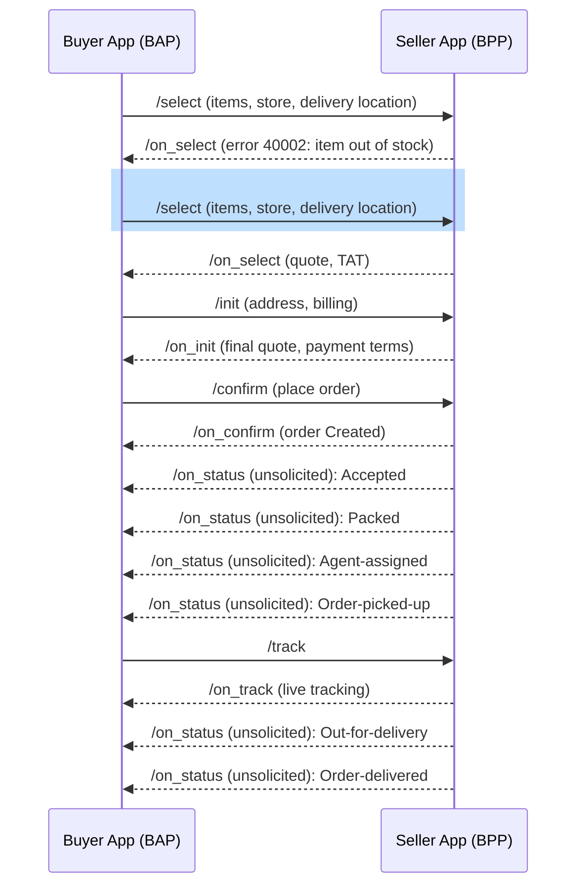
```mermaid
sequenceDiagram
  participant Buyer App (BAP)
  participant Seller App (BPP)
  Buyer App (BAP)->>Seller App (BPP): /select (items, store, delivery location)
  Seller App (BPP)-->>Buyer App (BAP): /on_select (error 40002: item out of stock)
  rect rgb(191, 223, 255)
  Buyer App (BAP)->>Seller App (BPP): /select (items, store, delivery location)
  end
  Seller App (BPP)-->>Buyer App (BAP): /on_select (quote, TAT)
  Buyer App (BAP)->>Seller App (BPP): /init (address, billing)
  Seller App (BPP)-->>Buyer App (BAP): /on_init (final quote, payment terms)
  Buyer App (BAP)->>Seller App (BPP): /confirm (place order)
  Seller App (BPP)-->>Buyer App (BAP): /on_confirm (order Created)
  Seller App (BPP)-->>Buyer App (BAP): /on_status (unsolicited): Accepted
  Seller App (BPP)-->>Buyer App (BAP): /on_status (unsolicited): Packed
  Seller App (BPP)-->>Buyer App (BAP): /on_status (unsolicited): Agent-assigned
  Seller App (BPP)-->>Buyer App (BAP): /on_status (unsolicited): Order-picked-up
  Buyer App (BAP)->>Seller App (BPP): /track
  Seller App (BPP)-->>Buyer App (BAP): /on_track (live tracking)
  Seller App (BPP)-->>Buyer App (BAP): /on_status (unsolicited): Out-for-delivery
  Seller App (BPP)-->>Buyer App (BAP): /on_status (unsolicited): Order-delivered
```

## on_select

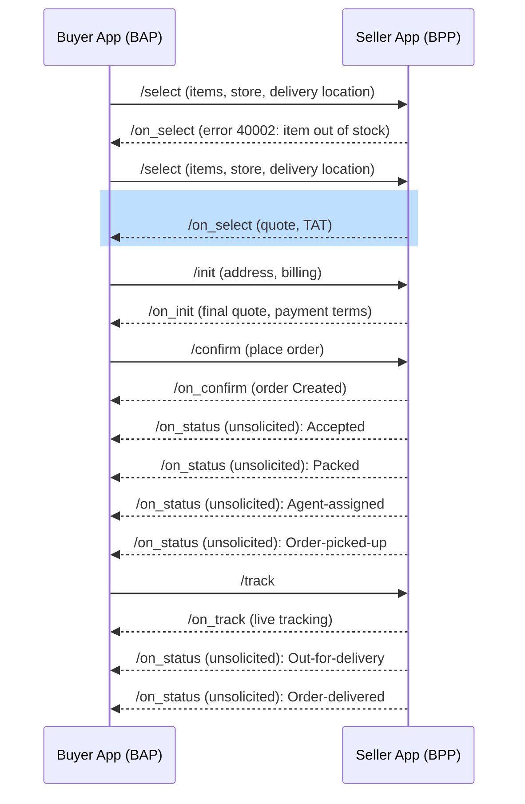
```mermaid
sequenceDiagram
  participant Buyer App (BAP)
  participant Seller App (BPP)
  Buyer App (BAP)->>Seller App (BPP): /select (items, store, delivery location)
  Seller App (BPP)-->>Buyer App (BAP): /on_select (error 40002: item out of stock)
  Buyer App (BAP)->>Seller App (BPP): /select (items, store, delivery location)
  rect rgb(191, 223, 255)
  Seller App (BPP)-->>Buyer App (BAP): /on_select (quote, TAT)
  end
  Buyer App (BAP)->>Seller App (BPP): /init (address, billing)
  Seller App (BPP)-->>Buyer App (BAP): /on_init (final quote, payment terms)
  Buyer App (BAP)->>Seller App (BPP): /confirm (place order)
  Seller App (BPP)-->>Buyer App (BAP): /on_confirm (order Created)
  Seller App (BPP)-->>Buyer App (BAP): /on_status (unsolicited): Accepted
  Seller App (BPP)-->>Buyer App (BAP): /on_status (unsolicited): Packed
  Seller App (BPP)-->>Buyer App (BAP): /on_status (unsolicited): Agent-assigned
  Seller App (BPP)-->>Buyer App (BAP): /on_status (unsolicited): Order-picked-up
  Buyer App (BAP)->>Seller App (BPP): /track
  Seller App (BPP)-->>Buyer App (BAP): /on_track (live tracking)
  Seller App (BPP)-->>Buyer App (BAP): /on_status (unsolicited): Out-for-delivery
  Seller App (BPP)-->>Buyer App (BAP): /on_status (unsolicited): Order-delivered
```

## init

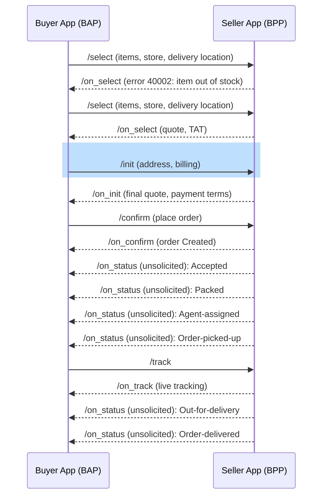
```mermaid
sequenceDiagram
  participant Buyer App (BAP)
  participant Seller App (BPP)
  Buyer App (BAP)->>Seller App (BPP): /select (items, store, delivery location)
  Seller App (BPP)-->>Buyer App (BAP): /on_select (error 40002: item out of stock)
  Buyer App (BAP)->>Seller App (BPP): /select (items, store, delivery location)
  Seller App (BPP)-->>Buyer App (BAP): /on_select (quote, TAT)
  rect rgb(191, 223, 255)
  Buyer App (BAP)->>Seller App (BPP): /init (address, billing)
  end
  Seller App (BPP)-->>Buyer App (BAP): /on_init (final quote, payment terms)
  Buyer App (BAP)->>Seller App (BPP): /confirm (place order)
  Seller App (BPP)-->>Buyer App (BAP): /on_confirm (order Created)
  Seller App (BPP)-->>Buyer App (BAP): /on_status (unsolicited): Accepted
  Seller App (BPP)-->>Buyer App (BAP): /on_status (unsolicited): Packed
  Seller App (BPP)-->>Buyer App (BAP): /on_status (unsolicited): Agent-assigned
  Seller App (BPP)-->>Buyer App (BAP): /on_status (unsolicited): Order-picked-up
  Buyer App (BAP)->>Seller App (BPP): /track
  Seller App (BPP)-->>Buyer App (BAP): /on_track (live tracking)
  Seller App (BPP)-->>Buyer App (BAP): /on_status (unsolicited): Out-for-delivery
  Seller App (BPP)-->>Buyer App (BAP): /on_status (unsolicited): Order-delivered
```

## on_init

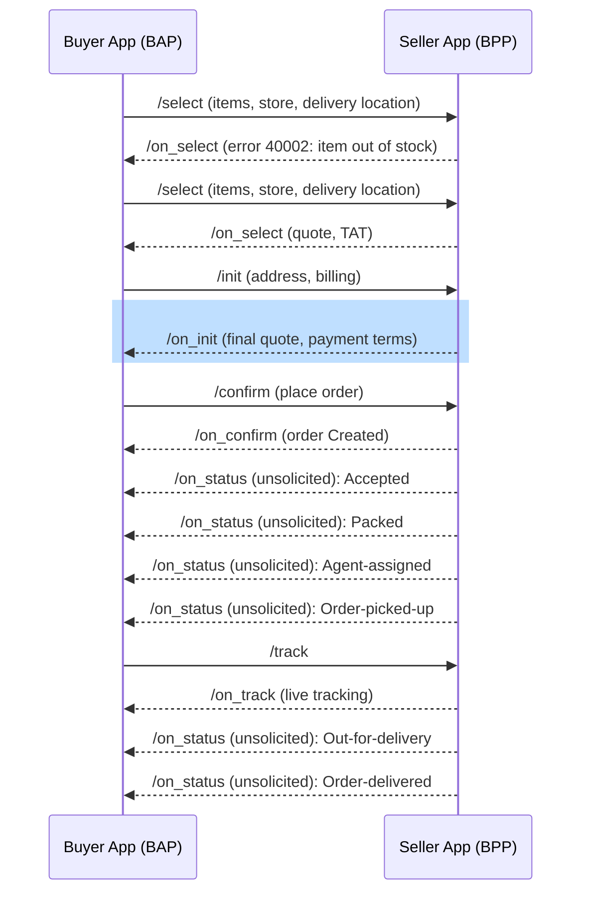
```mermaid
sequenceDiagram
  participant Buyer App (BAP)
  participant Seller App (BPP)
  Buyer App (BAP)->>Seller App (BPP): /select (items, store, delivery location)
  Seller App (BPP)-->>Buyer App (BAP): /on_select (error 40002: item out of stock)
  Buyer App (BAP)->>Seller App (BPP): /select (items, store, delivery location)
  Seller App (BPP)-->>Buyer App (BAP): /on_select (quote, TAT)
  Buyer App (BAP)->>Seller App (BPP): /init (address, billing)
  rect rgb(191, 223, 255)
  Seller App (BPP)-->>Buyer App (BAP): /on_init (final quote, payment terms)
  end
  Buyer App (BAP)->>Seller App (BPP): /confirm (place order)
  Seller App (BPP)-->>Buyer App (BAP): /on_confirm (order Created)
  Seller App (BPP)-->>Buyer App (BAP): /on_status (unsolicited): Accepted
  Seller App (BPP)-->>Buyer App (BAP): /on_status (unsolicited): Packed
  Seller App (BPP)-->>Buyer App (BAP): /on_status (unsolicited): Agent-assigned
  Seller App (BPP)-->>Buyer App (BAP): /on_status (unsolicited): Order-picked-up
  Buyer App (BAP)->>Seller App (BPP): /track
  Seller App (BPP)-->>Buyer App (BAP): /on_track (live tracking)
  Seller App (BPP)-->>Buyer App (BAP): /on_status (unsolicited): Out-for-delivery
  Seller App (BPP)-->>Buyer App (BAP): /on_status (unsolicited): Order-delivered
```

## confirm

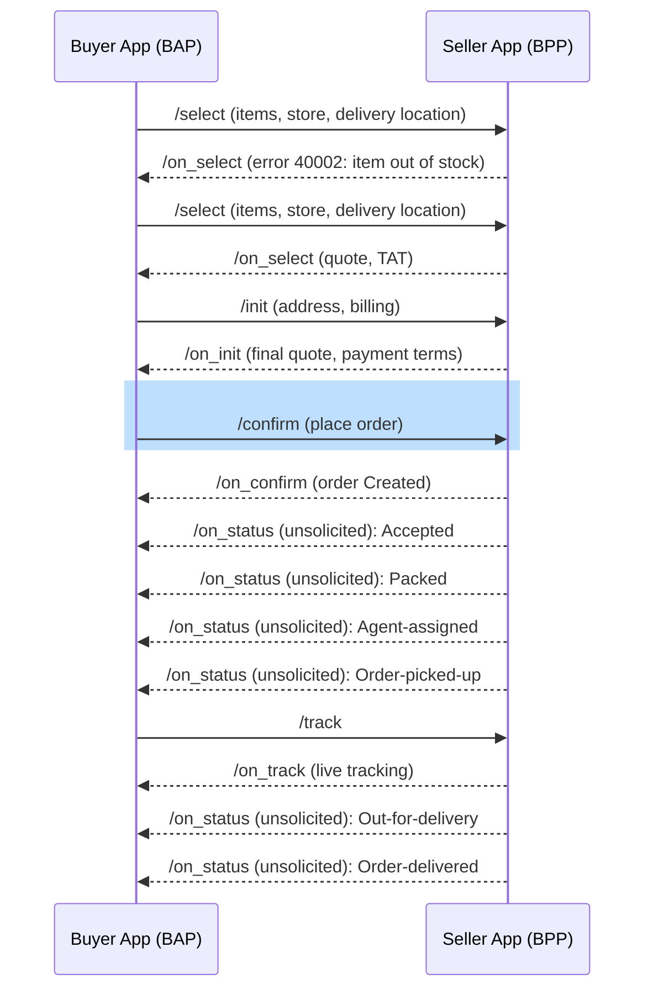
```mermaid
sequenceDiagram
  participant Buyer App (BAP)
  participant Seller App (BPP)
  Buyer App (BAP)->>Seller App (BPP): /select (items, store, delivery location)
  Seller App (BPP)-->>Buyer App (BAP): /on_select (error 40002: item out of stock)
  Buyer App (BAP)->>Seller App (BPP): /select (items, store, delivery location)
  Seller App (BPP)-->>Buyer App (BAP): /on_select (quote, TAT)
  Buyer App (BAP)->>Seller App (BPP): /init (address, billing)
  Seller App (BPP)-->>Buyer App (BAP): /on_init (final quote, payment terms)
  rect rgb(191, 223, 255)
  Buyer App (BAP)->>Seller App (BPP): /confirm (place order)
  end
  Seller App (BPP)-->>Buyer App (BAP): /on_confirm (order Created)
  Seller App (BPP)-->>Buyer App (BAP): /on_status (unsolicited): Accepted
  Seller App (BPP)-->>Buyer App (BAP): /on_status (unsolicited): Packed
  Seller App (BPP)-->>Buyer App (BAP): /on_status (unsolicited): Agent-assigned
  Seller App (BPP)-->>Buyer App (BAP): /on_status (unsolicited): Order-picked-up
  Buyer App (BAP)->>Seller App (BPP): /track
  Seller App (BPP)-->>Buyer App (BAP): /on_track (live tracking)
  Seller App (BPP)-->>Buyer App (BAP): /on_status (unsolicited): Out-for-delivery
  Seller App (BPP)-->>Buyer App (BAP): /on_status (unsolicited): Order-delivered
```

## on_confirm

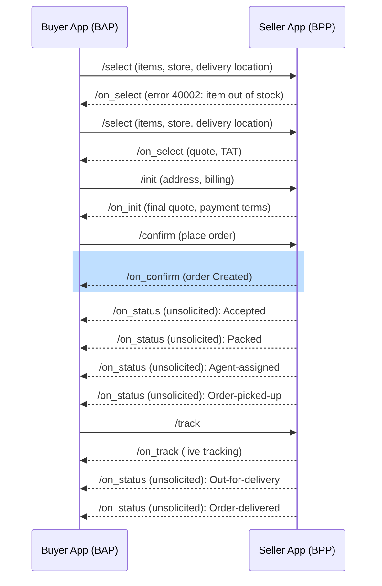
```mermaid
sequenceDiagram
  participant Buyer App (BAP)
  participant Seller App (BPP)
  Buyer App (BAP)->>Seller App (BPP): /select (items, store, delivery location)
  Seller App (BPP)-->>Buyer App (BAP): /on_select (error 40002: item out of stock)
  Buyer App (BAP)->>Seller App (BPP): /select (items, store, delivery location)
  Seller App (BPP)-->>Buyer App (BAP): /on_select (quote, TAT)
  Buyer App (BAP)->>Seller App (BPP): /init (address, billing)
  Seller App (BPP)-->>Buyer App (BAP): /on_init (final quote, payment terms)
  Buyer App (BAP)->>Seller App (BPP): /confirm (place order)
  rect rgb(191, 223, 255)
  Seller App (BPP)-->>Buyer App (BAP): /on_confirm (order Created)
  end
  Seller App (BPP)-->>Buyer App (BAP): /on_status (unsolicited): Accepted
  Seller App (BPP)-->>Buyer App (BAP): /on_status (unsolicited): Packed
  Seller App (BPP)-->>Buyer App (BAP): /on_status (unsolicited): Agent-assigned
  Seller App (BPP)-->>Buyer App (BAP): /on_status (unsolicited): Order-picked-up
  Buyer App (BAP)->>Seller App (BPP): /track
  Seller App (BPP)-->>Buyer App (BAP): /on_track (live tracking)
  Seller App (BPP)-->>Buyer App (BAP): /on_status (unsolicited): Out-for-delivery
  Seller App (BPP)-->>Buyer App (BAP): /on_status (unsolicited): Order-delivered
```

## on_status_accepted

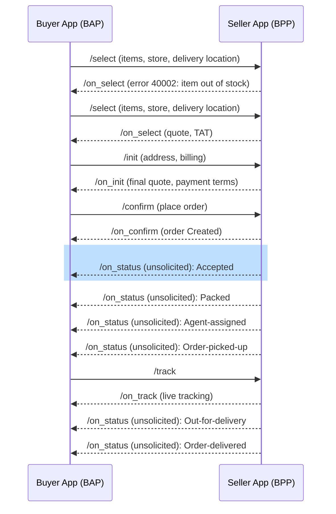
```mermaid
sequenceDiagram
  participant Buyer App (BAP)
  participant Seller App (BPP)
  Buyer App (BAP)->>Seller App (BPP): /select (items, store, delivery location)
  Seller App (BPP)-->>Buyer App (BAP): /on_select (error 40002: item out of stock)
  Buyer App (BAP)->>Seller App (BPP): /select (items, store, delivery location)
  Seller App (BPP)-->>Buyer App (BAP): /on_select (quote, TAT)
  Buyer App (BAP)->>Seller App (BPP): /init (address, billing)
  Seller App (BPP)-->>Buyer App (BAP): /on_init (final quote, payment terms)
  Buyer App (BAP)->>Seller App (BPP): /confirm (place order)
  Seller App (BPP)-->>Buyer App (BAP): /on_confirm (order Created)
  rect rgb(191, 223, 255)
  Seller App (BPP)-->>Buyer App (BAP): /on_status (unsolicited): Accepted
  end
  Seller App (BPP)-->>Buyer App (BAP): /on_status (unsolicited): Packed
  Seller App (BPP)-->>Buyer App (BAP): /on_status (unsolicited): Agent-assigned
  Seller App (BPP)-->>Buyer App (BAP): /on_status (unsolicited): Order-picked-up
  Buyer App (BAP)->>Seller App (BPP): /track
  Seller App (BPP)-->>Buyer App (BAP): /on_track (live tracking)
  Seller App (BPP)-->>Buyer App (BAP): /on_status (unsolicited): Out-for-delivery
  Seller App (BPP)-->>Buyer App (BAP): /on_status (unsolicited): Order-delivered
```

## on_status_packed

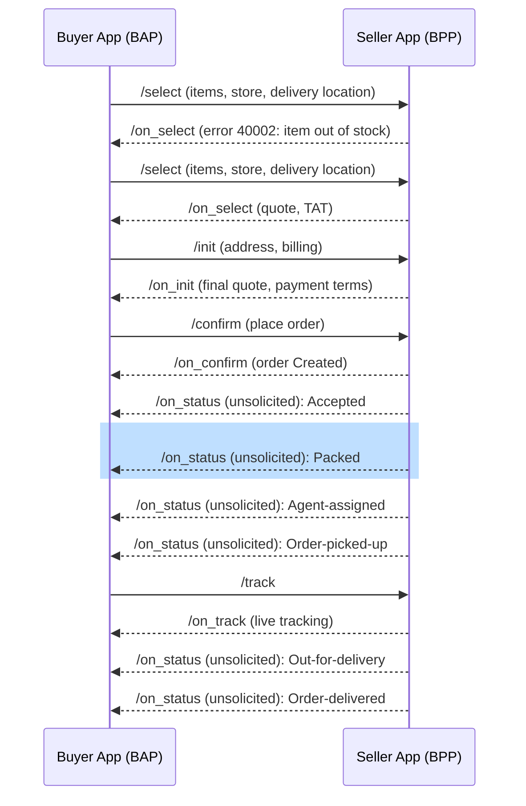
```mermaid
sequenceDiagram
  participant Buyer App (BAP)
  participant Seller App (BPP)
  Buyer App (BAP)->>Seller App (BPP): /select (items, store, delivery location)
  Seller App (BPP)-->>Buyer App (BAP): /on_select (error 40002: item out of stock)
  Buyer App (BAP)->>Seller App (BPP): /select (items, store, delivery location)
  Seller App (BPP)-->>Buyer App (BAP): /on_select (quote, TAT)
  Buyer App (BAP)->>Seller App (BPP): /init (address, billing)
  Seller App (BPP)-->>Buyer App (BAP): /on_init (final quote, payment terms)
  Buyer App (BAP)->>Seller App (BPP): /confirm (place order)
  Seller App (BPP)-->>Buyer App (BAP): /on_confirm (order Created)
  Seller App (BPP)-->>Buyer App (BAP): /on_status (unsolicited): Accepted
  rect rgb(191, 223, 255)
  Seller App (BPP)-->>Buyer App (BAP): /on_status (unsolicited): Packed
  end
  Seller App (BPP)-->>Buyer App (BAP): /on_status (unsolicited): Agent-assigned
  Seller App (BPP)-->>Buyer App (BAP): /on_status (unsolicited): Order-picked-up
  Buyer App (BAP)->>Seller App (BPP): /track
  Seller App (BPP)-->>Buyer App (BAP): /on_track (live tracking)
  Seller App (BPP)-->>Buyer App (BAP): /on_status (unsolicited): Out-for-delivery
  Seller App (BPP)-->>Buyer App (BAP): /on_status (unsolicited): Order-delivered
```

## on_status_agent_assigned

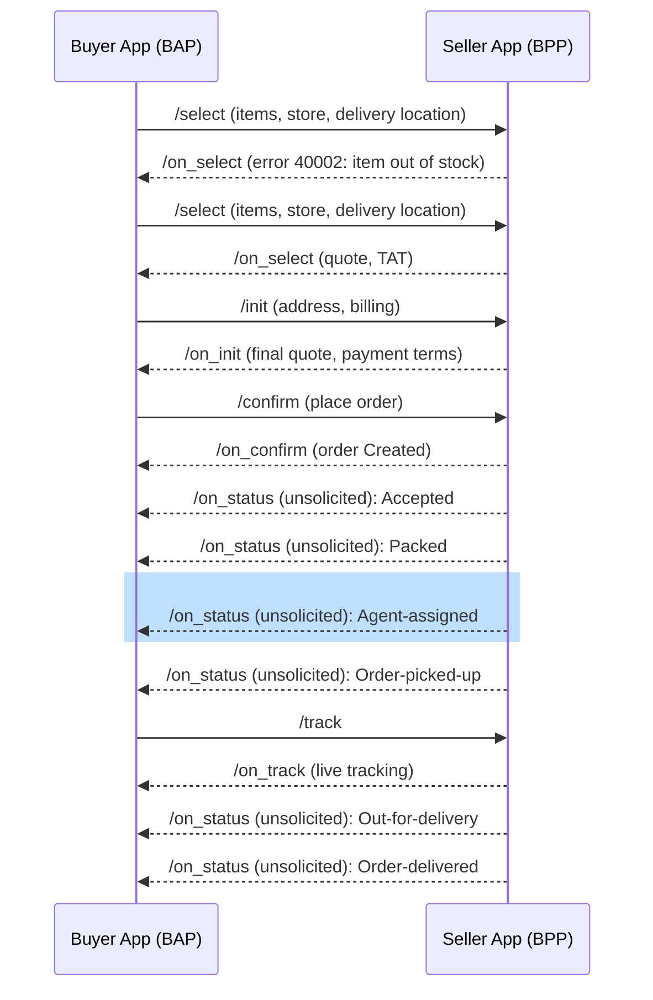
```mermaid
sequenceDiagram
  participant Buyer App (BAP)
  participant Seller App (BPP)
  Buyer App (BAP)->>Seller App (BPP): /select (items, store, delivery location)
  Seller App (BPP)-->>Buyer App (BAP): /on_select (error 40002: item out of stock)
  Buyer App (BAP)->>Seller App (BPP): /select (items, store, delivery location)
  Seller App (BPP)-->>Buyer App (BAP): /on_select (quote, TAT)
  Buyer App (BAP)->>Seller App (BPP): /init (address, billing)
  Seller App (BPP)-->>Buyer App (BAP): /on_init (final quote, payment terms)
  Buyer App (BAP)->>Seller App (BPP): /confirm (place order)
  Seller App (BPP)-->>Buyer App (BAP): /on_confirm (order Created)
  Seller App (BPP)-->>Buyer App (BAP): /on_status (unsolicited): Accepted
  Seller App (BPP)-->>Buyer App (BAP): /on_status (unsolicited): Packed
  rect rgb(191, 223, 255)
  Seller App (BPP)-->>Buyer App (BAP): /on_status (unsolicited): Agent-assigned
  end
  Seller App (BPP)-->>Buyer App (BAP): /on_status (unsolicited): Order-picked-up
  Buyer App (BAP)->>Seller App (BPP): /track
  Seller App (BPP)-->>Buyer App (BAP): /on_track (live tracking)
  Seller App (BPP)-->>Buyer App (BAP): /on_status (unsolicited): Out-for-delivery
  Seller App (BPP)-->>Buyer App (BAP): /on_status (unsolicited): Order-delivered
```

## on_status_picked

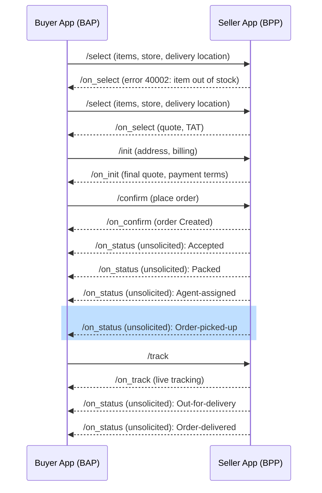
```mermaid
sequenceDiagram
  participant Buyer App (BAP)
  participant Seller App (BPP)
  Buyer App (BAP)->>Seller App (BPP): /select (items, store, delivery location)
  Seller App (BPP)-->>Buyer App (BAP): /on_select (error 40002: item out of stock)
  Buyer App (BAP)->>Seller App (BPP): /select (items, store, delivery location)
  Seller App (BPP)-->>Buyer App (BAP): /on_select (quote, TAT)
  Buyer App (BAP)->>Seller App (BPP): /init (address, billing)
  Seller App (BPP)-->>Buyer App (BAP): /on_init (final quote, payment terms)
  Buyer App (BAP)->>Seller App (BPP): /confirm (place order)
  Seller App (BPP)-->>Buyer App (BAP): /on_confirm (order Created)
  Seller App (BPP)-->>Buyer App (BAP): /on_status (unsolicited): Accepted
  Seller App (BPP)-->>Buyer App (BAP): /on_status (unsolicited): Packed
  Seller App (BPP)-->>Buyer App (BAP): /on_status (unsolicited): Agent-assigned
  rect rgb(191, 223, 255)
  Seller App (BPP)-->>Buyer App (BAP): /on_status (unsolicited): Order-picked-up
  end
  Buyer App (BAP)->>Seller App (BPP): /track
  Seller App (BPP)-->>Buyer App (BAP): /on_track (live tracking)
  Seller App (BPP)-->>Buyer App (BAP): /on_status (unsolicited): Out-for-delivery
  Seller App (BPP)-->>Buyer App (BAP): /on_status (unsolicited): Order-delivered
```

## track

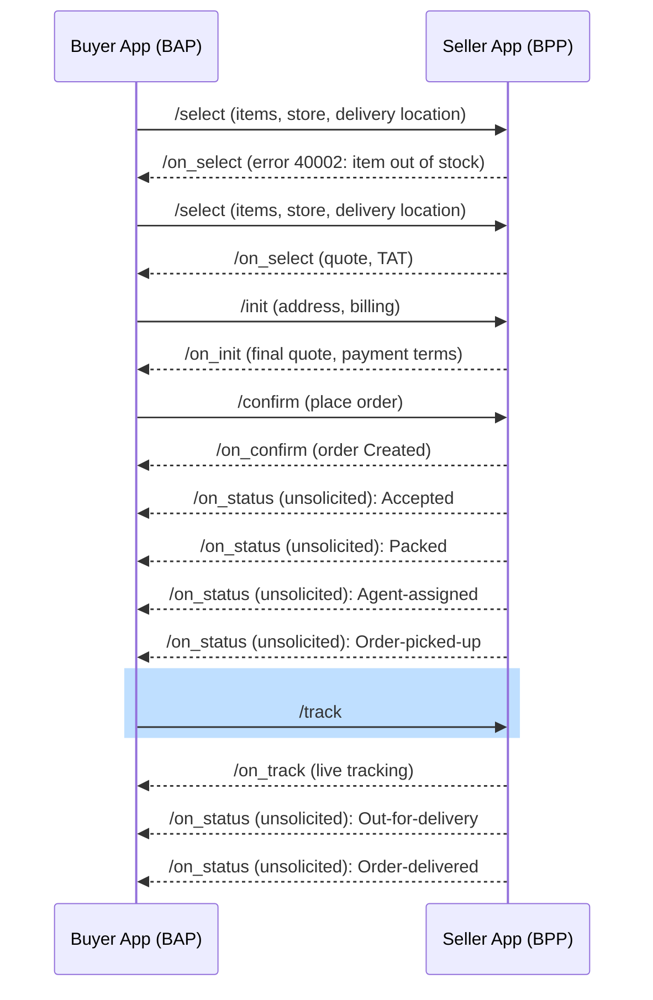
```mermaid
sequenceDiagram
  participant Buyer App (BAP)
  participant Seller App (BPP)
  Buyer App (BAP)->>Seller App (BPP): /select (items, store, delivery location)
  Seller App (BPP)-->>Buyer App (BAP): /on_select (error 40002: item out of stock)
  Buyer App (BAP)->>Seller App (BPP): /select (items, store, delivery location)
  Seller App (BPP)-->>Buyer App (BAP): /on_select (quote, TAT)
  Buyer App (BAP)->>Seller App (BPP): /init (address, billing)
  Seller App (BPP)-->>Buyer App (BAP): /on_init (final quote, payment terms)
  Buyer App (BAP)->>Seller App (BPP): /confirm (place order)
  Seller App (BPP)-->>Buyer App (BAP): /on_confirm (order Created)
  Seller App (BPP)-->>Buyer App (BAP): /on_status (unsolicited): Accepted
  Seller App (BPP)-->>Buyer App (BAP): /on_status (unsolicited): Packed
  Seller App (BPP)-->>Buyer App (BAP): /on_status (unsolicited): Agent-assigned
  Seller App (BPP)-->>Buyer App (BAP): /on_status (unsolicited): Order-picked-up
  rect rgb(191, 223, 255)
  Buyer App (BAP)->>Seller App (BPP): /track
  end
  Seller App (BPP)-->>Buyer App (BAP): /on_track (live tracking)
  Seller App (BPP)-->>Buyer App (BAP): /on_status (unsolicited): Out-for-delivery
  Seller App (BPP)-->>Buyer App (BAP): /on_status (unsolicited): Order-delivered
```

## on_track

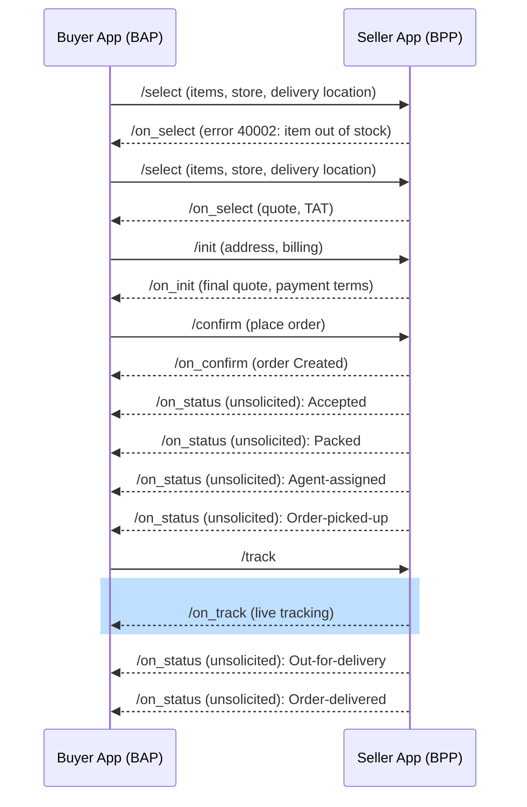
```mermaid
sequenceDiagram
  participant Buyer App (BAP)
  participant Seller App (BPP)
  Buyer App (BAP)->>Seller App (BPP): /select (items, store, delivery location)
  Seller App (BPP)-->>Buyer App (BAP): /on_select (error 40002: item out of stock)
  Buyer App (BAP)->>Seller App (BPP): /select (items, store, delivery location)
  Seller App (BPP)-->>Buyer App (BAP): /on_select (quote, TAT)
  Buyer App (BAP)->>Seller App (BPP): /init (address, billing)
  Seller App (BPP)-->>Buyer App (BAP): /on_init (final quote, payment terms)
  Buyer App (BAP)->>Seller App (BPP): /confirm (place order)
  Seller App (BPP)-->>Buyer App (BAP): /on_confirm (order Created)
  Seller App (BPP)-->>Buyer App (BAP): /on_status (unsolicited): Accepted
  Seller App (BPP)-->>Buyer App (BAP): /on_status (unsolicited): Packed
  Seller App (BPP)-->>Buyer App (BAP): /on_status (unsolicited): Agent-assigned
  Seller App (BPP)-->>Buyer App (BAP): /on_status (unsolicited): Order-picked-up
  Buyer App (BAP)->>Seller App (BPP): /track
  rect rgb(191, 223, 255)
  Seller App (BPP)-->>Buyer App (BAP): /on_track (live tracking)
  end
  Seller App (BPP)-->>Buyer App (BAP): /on_status (unsolicited): Out-for-delivery
  Seller App (BPP)-->>Buyer App (BAP): /on_status (unsolicited): Order-delivered
```

## on_status_out_for_delivery

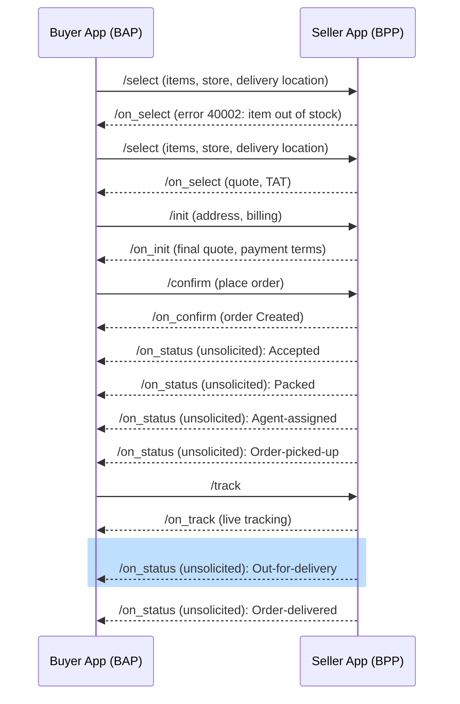
```mermaid
sequenceDiagram
  participant Buyer App (BAP)
  participant Seller App (BPP)
  Buyer App (BAP)->>Seller App (BPP): /select (items, store, delivery location)
  Seller App (BPP)-->>Buyer App (BAP): /on_select (error 40002: item out of stock)
  Buyer App (BAP)->>Seller App (BPP): /select (items, store, delivery location)
  Seller App (BPP)-->>Buyer App (BAP): /on_select (quote, TAT)
  Buyer App (BAP)->>Seller App (BPP): /init (address, billing)
  Seller App (BPP)-->>Buyer App (BAP): /on_init (final quote, payment terms)
  Buyer App (BAP)->>Seller App (BPP): /confirm (place order)
  Seller App (BPP)-->>Buyer App (BAP): /on_confirm (order Created)
  Seller App (BPP)-->>Buyer App (BAP): /on_status (unsolicited): Accepted
  Seller App (BPP)-->>Buyer App (BAP): /on_status (unsolicited): Packed
  Seller App (BPP)-->>Buyer App (BAP): /on_status (unsolicited): Agent-assigned
  Seller App (BPP)-->>Buyer App (BAP): /on_status (unsolicited): Order-picked-up
  Buyer App (BAP)->>Seller App (BPP): /track
  Seller App (BPP)-->>Buyer App (BAP): /on_track (live tracking)
  rect rgb(191, 223, 255)
  Seller App (BPP)-->>Buyer App (BAP): /on_status (unsolicited): Out-for-delivery
  end
  Seller App (BPP)-->>Buyer App (BAP): /on_status (unsolicited): Order-delivered
```

## on_status_order_delivered

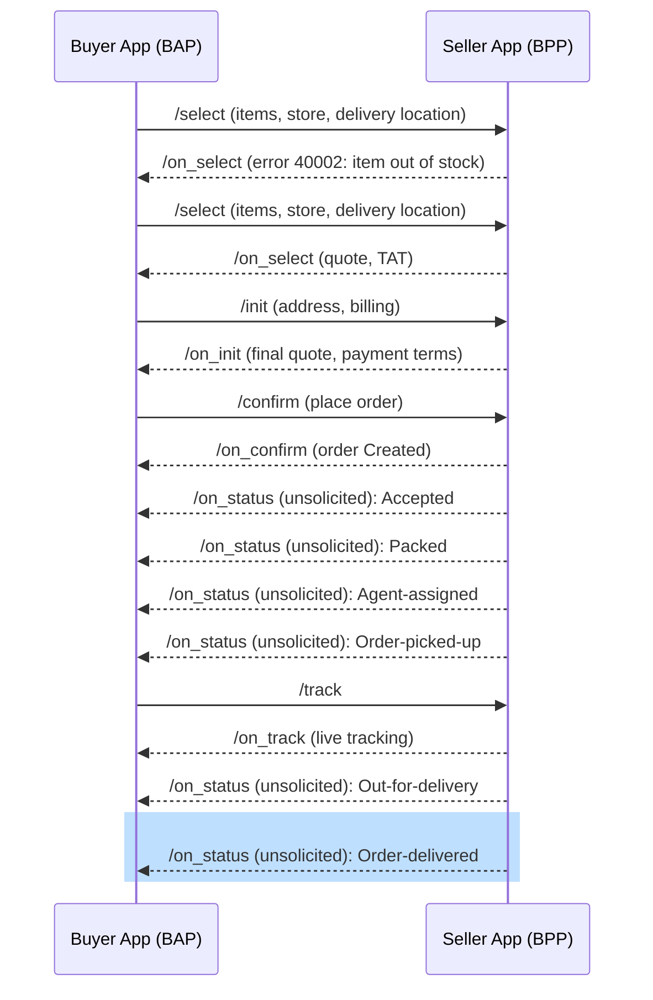
```mermaid
sequenceDiagram
  participant Buyer App (BAP)
  participant Seller App (BPP)
  Buyer App (BAP)->>Seller App (BPP): /select (items, store, delivery location)
  Seller App (BPP)-->>Buyer App (BAP): /on_select (error 40002: item out of stock)
  Buyer App (BAP)->>Seller App (BPP): /select (items, store, delivery location)
  Seller App (BPP)-->>Buyer App (BAP): /on_select (quote, TAT)
  Buyer App (BAP)->>Seller App (BPP): /init (address, billing)
  Seller App (BPP)-->>Buyer App (BAP): /on_init (final quote, payment terms)
  Buyer App (BAP)->>Seller App (BPP): /confirm (place order)
  Seller App (BPP)-->>Buyer App (BAP): /on_confirm (order Created)
  Seller App (BPP)-->>Buyer App (BAP): /on_status (unsolicited): Accepted
  Seller App (BPP)-->>Buyer App (BAP): /on_status (unsolicited): Packed
  Seller App (BPP)-->>Buyer App (BAP): /on_status (unsolicited): Agent-assigned
  Seller App (BPP)-->>Buyer App (BAP): /on_status (unsolicited): Order-picked-up
  Buyer App (BAP)->>Seller App (BPP): /track
  Seller App (BPP)-->>Buyer App (BAP): /on_track (live tracking)
  Seller App (BPP)-->>Buyer App (BAP): /on_status (unsolicited): Out-for-delivery
  rect rgb(191, 223, 255)
  Seller App (BPP)-->>Buyer App (BAP): /on_status (unsolicited): Order-delivered
  end
```
