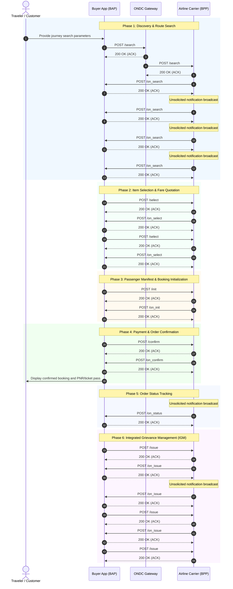

```mermaid
sequenceDiagram
    autonumber
    actor User as Traveler / Customer
    participant BAP as Buyer App (BAP)
    participant BG as ONDC Gateway
    participant BPP as Airline Carrier (BPP)

    rect rgb(240, 248, 255)
    Note over BAP,BPP: Phase 1: Discovery & Route Search
    User->>BAP: Provide journey search parameters
    BAP->>BG: POST /search
    BG-->>BAP: 200 OK (ACK)
    BG->>BPP: POST /search
    BPP-->>BG: 200 OK (ACK)
    BPP->>BAP: POST /on_search
    BAP-->>BPP: 200 OK (ACK)
    Note over BPP: Unsolicited notification broadcast
    BPP->>BAP: POST /on_search
    BAP-->>BPP: 200 OK (ACK)
    Note over BPP: Unsolicited notification broadcast
    BPP->>BAP: POST /on_search
    BAP-->>BPP: 200 OK (ACK)
    Note over BPP: Unsolicited notification broadcast
    BPP->>BAP: POST /on_search
    BAP-->>BPP: 200 OK (ACK)
    end

    rect rgb(245, 255, 250)
    Note over BAP,BPP: Phase 2: Item Selection & Fare Quotation
    BAP->>BPP: POST /select
    BPP-->>BAP: 200 OK (ACK)
    BPP->>BAP: POST /on_select
    BAP-->>BPP: 200 OK (ACK)
    BAP->>BPP: POST /select
    BPP-->>BAP: 200 OK (ACK)
    BPP->>BAP: POST /on_select
    BAP-->>BPP: 200 OK (ACK)
    end

    rect rgb(255, 250, 240)
    Note over BAP,BPP: Phase 3: Passenger Manifest & Booking Initialization
    BAP->>BPP: POST /init
    BPP-->>BAP: 200 OK (ACK)
    BPP->>BAP: POST /on_init
    BAP-->>BPP: 200 OK (ACK)
    end

    rect rgb(240, 255, 240)
    Note over BAP,BPP: Phase 4: Payment & Order Confirmation
    BAP->>BPP: POST /confirm
    BPP-->>BAP: 200 OK (ACK)
    BPP->>BAP: POST /on_confirm
    BAP-->>BPP: 200 OK (ACK)
    BAP->>User: Display confirmed booking and PNR/ticket pass
    end

    rect rgb(245, 248, 255)
    Note over BAP,BPP: Phase 5: Order Status Tracking
    Note over BPP: Unsolicited notification broadcast
    BPP->>BAP: POST /on_status
    BAP-->>BPP: 200 OK (ACK)
    end

    rect rgb(253, 245, 255)
    Note over BAP,BPP: Phase 6: Integrated Grievance Management (IGM)
    BAP->>BPP: POST /issue
    BPP-->>BAP: 200 OK (ACK)
    BPP->>BAP: POST /on_issue
    BAP-->>BPP: 200 OK (ACK)
    Note over BPP: Unsolicited notification broadcast
    BPP->>BAP: POST /on_issue
    BAP-->>BPP: 200 OK (ACK)
    BAP->>BPP: POST /issue
    BPP-->>BAP: 200 OK (ACK)
    BPP->>BAP: POST /on_issue
    BAP-->>BPP: 200 OK (ACK)
    BAP->>BPP: POST /issue
    BPP-->>BAP: 200 OK (ACK)
    end
```
