# purchase journey without form with IGM(v-2.0.0) — Sequence Diagrams

Internal data file consumed by the Developer Guide's "Sequence Diagram" tab (API Walkthrough).
Not meant to be shown as its own docs page — the frontend filters this slug out of the Use Case
Brief / Additional Resources / Changelog tab lists and instead looks up the section matching the
selected API call's `action_id` (the `##` heading below) to render that step's diagram.

One `## <action_id>` heading per step of `purchase_journey_without_form_with_IGM_v-2_0_0_.yaml`, in that flow's own step order, each followed by its Mermaid `sequenceDiagram`: the whole flow, with that call's own message(s) highlighted — same convention as the other domains' per-step sequence-diagram docs.

## select

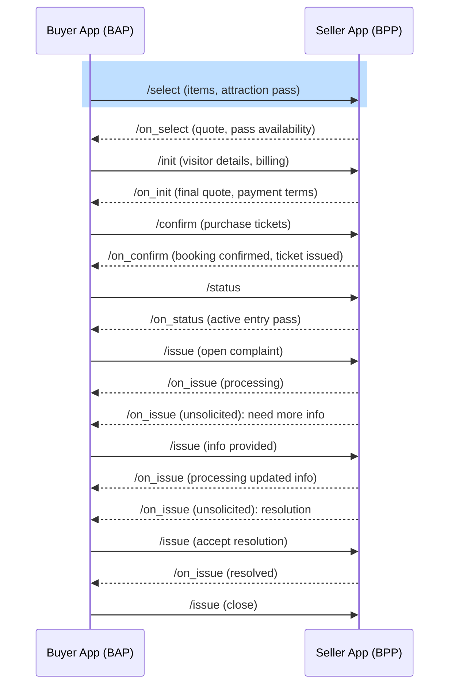
```mermaid
sequenceDiagram
  participant Buyer App (BAP)
  participant Seller App (BPP)
  rect rgb(191, 223, 255)
  Buyer App (BAP)->>Seller App (BPP): /select (items, attraction pass)
  end
  Seller App (BPP)-->>Buyer App (BAP): /on_select (quote, pass availability)
  Buyer App (BAP)->>Seller App (BPP): /init (visitor details, billing)
  Seller App (BPP)-->>Buyer App (BAP): /on_init (final quote, payment terms)
  Buyer App (BAP)->>Seller App (BPP): /confirm (purchase tickets)
  Seller App (BPP)-->>Buyer App (BAP): /on_confirm (booking confirmed, ticket issued)
  Buyer App (BAP)->>Seller App (BPP): /status
  Seller App (BPP)-->>Buyer App (BAP): /on_status (active entry pass)
  Buyer App (BAP)->>Seller App (BPP): /issue (open complaint)
  Seller App (BPP)-->>Buyer App (BAP): /on_issue (processing)
  Seller App (BPP)-->>Buyer App (BAP): /on_issue (unsolicited): need more info
  Buyer App (BAP)->>Seller App (BPP): /issue (info provided)
  Seller App (BPP)-->>Buyer App (BAP): /on_issue (processing updated info)
  Seller App (BPP)-->>Buyer App (BAP): /on_issue (unsolicited): resolution
  Buyer App (BAP)->>Seller App (BPP): /issue (accept resolution)
  Seller App (BPP)-->>Buyer App (BAP): /on_issue (resolved)
  Buyer App (BAP)->>Seller App (BPP): /issue (close)
```

## on_select_without_form

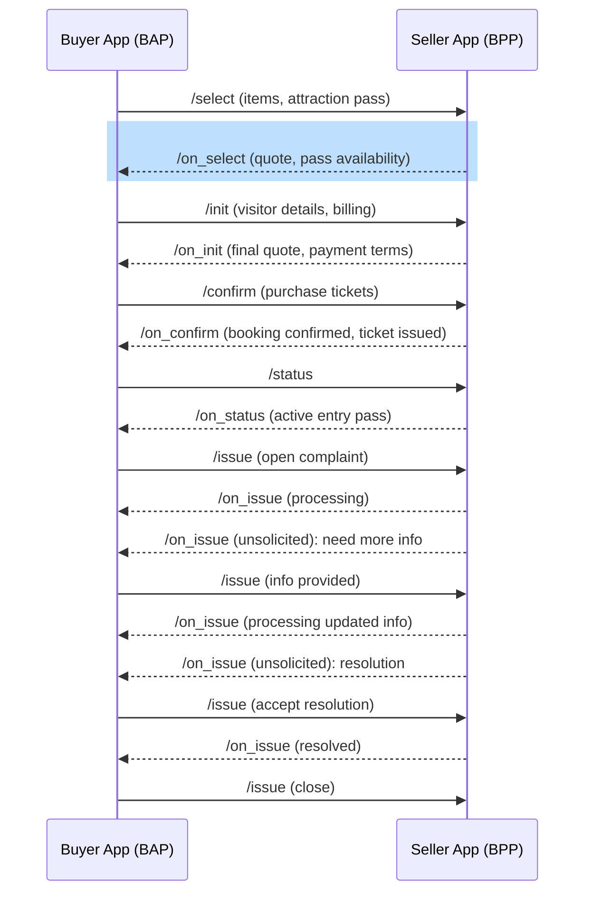
```mermaid
sequenceDiagram
  participant Buyer App (BAP)
  participant Seller App (BPP)
  Buyer App (BAP)->>Seller App (BPP): /select (items, attraction pass)
  rect rgb(191, 223, 255)
  Seller App (BPP)-->>Buyer App (BAP): /on_select (quote, pass availability)
  end
  Buyer App (BAP)->>Seller App (BPP): /init (visitor details, billing)
  Seller App (BPP)-->>Buyer App (BAP): /on_init (final quote, payment terms)
  Buyer App (BAP)->>Seller App (BPP): /confirm (purchase tickets)
  Seller App (BPP)-->>Buyer App (BAP): /on_confirm (booking confirmed, ticket issued)
  Buyer App (BAP)->>Seller App (BPP): /status
  Seller App (BPP)-->>Buyer App (BAP): /on_status (active entry pass)
  Buyer App (BAP)->>Seller App (BPP): /issue (open complaint)
  Seller App (BPP)-->>Buyer App (BAP): /on_issue (processing)
  Seller App (BPP)-->>Buyer App (BAP): /on_issue (unsolicited): need more info
  Buyer App (BAP)->>Seller App (BPP): /issue (info provided)
  Seller App (BPP)-->>Buyer App (BAP): /on_issue (processing updated info)
  Seller App (BPP)-->>Buyer App (BAP): /on_issue (unsolicited): resolution
  Buyer App (BAP)->>Seller App (BPP): /issue (accept resolution)
  Seller App (BPP)-->>Buyer App (BAP): /on_issue (resolved)
  Buyer App (BAP)->>Seller App (BPP): /issue (close)
```

## init

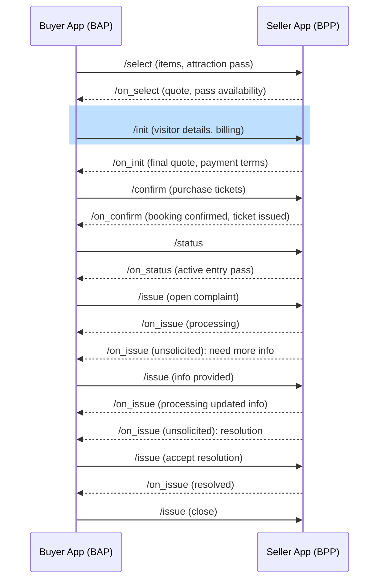
```mermaid
sequenceDiagram
  participant Buyer App (BAP)
  participant Seller App (BPP)
  Buyer App (BAP)->>Seller App (BPP): /select (items, attraction pass)
  Seller App (BPP)-->>Buyer App (BAP): /on_select (quote, pass availability)
  rect rgb(191, 223, 255)
  Buyer App (BAP)->>Seller App (BPP): /init (visitor details, billing)
  end
  Seller App (BPP)-->>Buyer App (BAP): /on_init (final quote, payment terms)
  Buyer App (BAP)->>Seller App (BPP): /confirm (purchase tickets)
  Seller App (BPP)-->>Buyer App (BAP): /on_confirm (booking confirmed, ticket issued)
  Buyer App (BAP)->>Seller App (BPP): /status
  Seller App (BPP)-->>Buyer App (BAP): /on_status (active entry pass)
  Buyer App (BAP)->>Seller App (BPP): /issue (open complaint)
  Seller App (BPP)-->>Buyer App (BAP): /on_issue (processing)
  Seller App (BPP)-->>Buyer App (BAP): /on_issue (unsolicited): need more info
  Buyer App (BAP)->>Seller App (BPP): /issue (info provided)
  Seller App (BPP)-->>Buyer App (BAP): /on_issue (processing updated info)
  Seller App (BPP)-->>Buyer App (BAP): /on_issue (unsolicited): resolution
  Buyer App (BAP)->>Seller App (BPP): /issue (accept resolution)
  Seller App (BPP)-->>Buyer App (BAP): /on_issue (resolved)
  Buyer App (BAP)->>Seller App (BPP): /issue (close)
```

## on_init

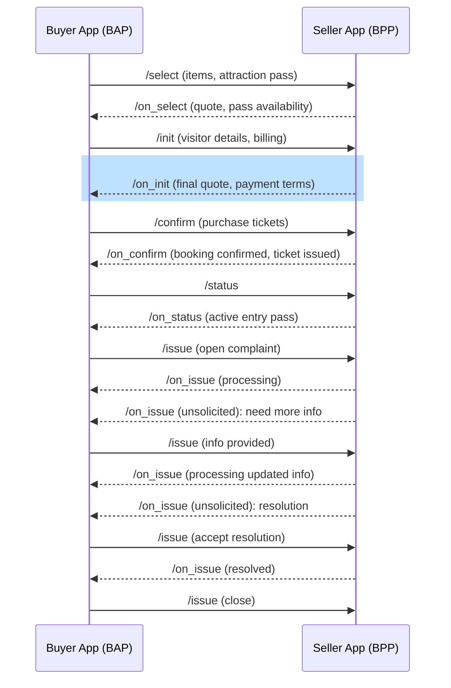
```mermaid
sequenceDiagram
  participant Buyer App (BAP)
  participant Seller App (BPP)
  Buyer App (BAP)->>Seller App (BPP): /select (items, attraction pass)
  Seller App (BPP)-->>Buyer App (BAP): /on_select (quote, pass availability)
  Buyer App (BAP)->>Seller App (BPP): /init (visitor details, billing)
  rect rgb(191, 223, 255)
  Seller App (BPP)-->>Buyer App (BAP): /on_init (final quote, payment terms)
  end
  Buyer App (BAP)->>Seller App (BPP): /confirm (purchase tickets)
  Seller App (BPP)-->>Buyer App (BAP): /on_confirm (booking confirmed, ticket issued)
  Buyer App (BAP)->>Seller App (BPP): /status
  Seller App (BPP)-->>Buyer App (BAP): /on_status (active entry pass)
  Buyer App (BAP)->>Seller App (BPP): /issue (open complaint)
  Seller App (BPP)-->>Buyer App (BAP): /on_issue (processing)
  Seller App (BPP)-->>Buyer App (BAP): /on_issue (unsolicited): need more info
  Buyer App (BAP)->>Seller App (BPP): /issue (info provided)
  Seller App (BPP)-->>Buyer App (BAP): /on_issue (processing updated info)
  Seller App (BPP)-->>Buyer App (BAP): /on_issue (unsolicited): resolution
  Buyer App (BAP)->>Seller App (BPP): /issue (accept resolution)
  Seller App (BPP)-->>Buyer App (BAP): /on_issue (resolved)
  Buyer App (BAP)->>Seller App (BPP): /issue (close)
```

## confirm

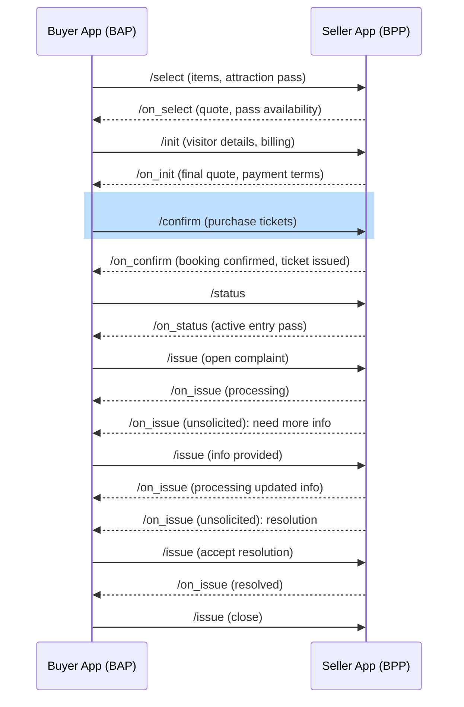
```mermaid
sequenceDiagram
  participant Buyer App (BAP)
  participant Seller App (BPP)
  Buyer App (BAP)->>Seller App (BPP): /select (items, attraction pass)
  Seller App (BPP)-->>Buyer App (BAP): /on_select (quote, pass availability)
  Buyer App (BAP)->>Seller App (BPP): /init (visitor details, billing)
  Seller App (BPP)-->>Buyer App (BAP): /on_init (final quote, payment terms)
  rect rgb(191, 223, 255)
  Buyer App (BAP)->>Seller App (BPP): /confirm (purchase tickets)
  end
  Seller App (BPP)-->>Buyer App (BAP): /on_confirm (booking confirmed, ticket issued)
  Buyer App (BAP)->>Seller App (BPP): /status
  Seller App (BPP)-->>Buyer App (BAP): /on_status (active entry pass)
  Buyer App (BAP)->>Seller App (BPP): /issue (open complaint)
  Seller App (BPP)-->>Buyer App (BAP): /on_issue (processing)
  Seller App (BPP)-->>Buyer App (BAP): /on_issue (unsolicited): need more info
  Buyer App (BAP)->>Seller App (BPP): /issue (info provided)
  Seller App (BPP)-->>Buyer App (BAP): /on_issue (processing updated info)
  Seller App (BPP)-->>Buyer App (BAP): /on_issue (unsolicited): resolution
  Buyer App (BAP)->>Seller App (BPP): /issue (accept resolution)
  Seller App (BPP)-->>Buyer App (BAP): /on_issue (resolved)
  Buyer App (BAP)->>Seller App (BPP): /issue (close)
```

## on_confirm

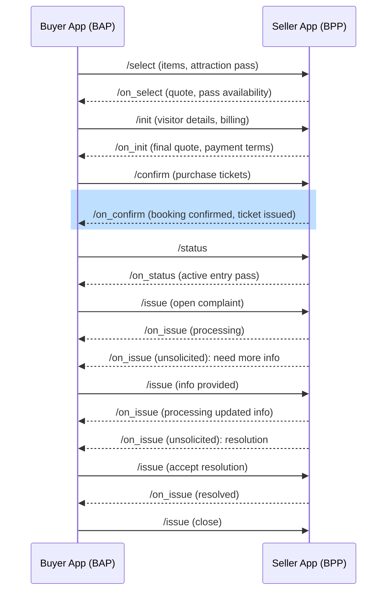
```mermaid
sequenceDiagram
  participant Buyer App (BAP)
  participant Seller App (BPP)
  Buyer App (BAP)->>Seller App (BPP): /select (items, attraction pass)
  Seller App (BPP)-->>Buyer App (BAP): /on_select (quote, pass availability)
  Buyer App (BAP)->>Seller App (BPP): /init (visitor details, billing)
  Seller App (BPP)-->>Buyer App (BAP): /on_init (final quote, payment terms)
  Buyer App (BAP)->>Seller App (BPP): /confirm (purchase tickets)
  rect rgb(191, 223, 255)
  Seller App (BPP)-->>Buyer App (BAP): /on_confirm (booking confirmed, ticket issued)
  end
  Buyer App (BAP)->>Seller App (BPP): /status
  Seller App (BPP)-->>Buyer App (BAP): /on_status (active entry pass)
  Buyer App (BAP)->>Seller App (BPP): /issue (open complaint)
  Seller App (BPP)-->>Buyer App (BAP): /on_issue (processing)
  Seller App (BPP)-->>Buyer App (BAP): /on_issue (unsolicited): need more info
  Buyer App (BAP)->>Seller App (BPP): /issue (info provided)
  Seller App (BPP)-->>Buyer App (BAP): /on_issue (processing updated info)
  Seller App (BPP)-->>Buyer App (BAP): /on_issue (unsolicited): resolution
  Buyer App (BAP)->>Seller App (BPP): /issue (accept resolution)
  Seller App (BPP)-->>Buyer App (BAP): /on_issue (resolved)
  Buyer App (BAP)->>Seller App (BPP): /issue (close)
```

## status

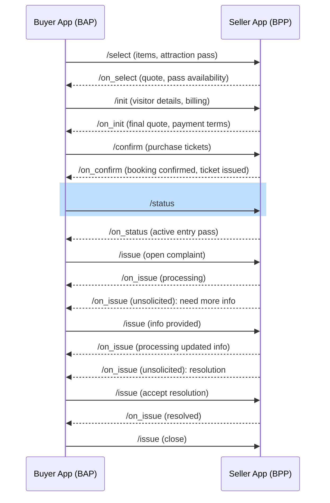
```mermaid
sequenceDiagram
  participant Buyer App (BAP)
  participant Seller App (BPP)
  Buyer App (BAP)->>Seller App (BPP): /select (items, attraction pass)
  Seller App (BPP)-->>Buyer App (BAP): /on_select (quote, pass availability)
  Buyer App (BAP)->>Seller App (BPP): /init (visitor details, billing)
  Seller App (BPP)-->>Buyer App (BAP): /on_init (final quote, payment terms)
  Buyer App (BAP)->>Seller App (BPP): /confirm (purchase tickets)
  Seller App (BPP)-->>Buyer App (BAP): /on_confirm (booking confirmed, ticket issued)
  rect rgb(191, 223, 255)
  Buyer App (BAP)->>Seller App (BPP): /status
  end
  Seller App (BPP)-->>Buyer App (BAP): /on_status (active entry pass)
  Buyer App (BAP)->>Seller App (BPP): /issue (open complaint)
  Seller App (BPP)-->>Buyer App (BAP): /on_issue (processing)
  Seller App (BPP)-->>Buyer App (BAP): /on_issue (unsolicited): need more info
  Buyer App (BAP)->>Seller App (BPP): /issue (info provided)
  Seller App (BPP)-->>Buyer App (BAP): /on_issue (processing updated info)
  Seller App (BPP)-->>Buyer App (BAP): /on_issue (unsolicited): resolution
  Buyer App (BAP)->>Seller App (BPP): /issue (accept resolution)
  Seller App (BPP)-->>Buyer App (BAP): /on_issue (resolved)
  Buyer App (BAP)->>Seller App (BPP): /issue (close)
```

## on_status

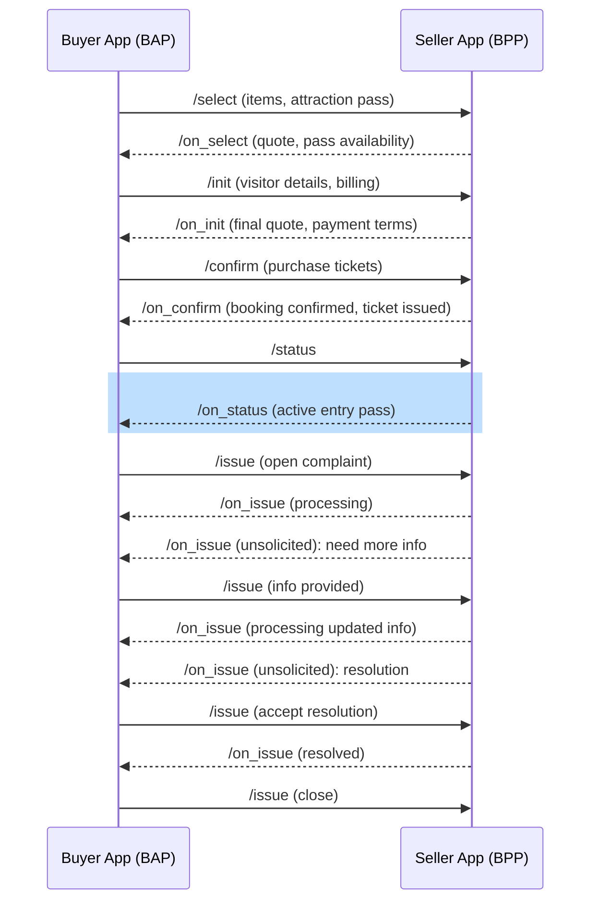
```mermaid
sequenceDiagram
  participant Buyer App (BAP)
  participant Seller App (BPP)
  Buyer App (BAP)->>Seller App (BPP): /select (items, attraction pass)
  Seller App (BPP)-->>Buyer App (BAP): /on_select (quote, pass availability)
  Buyer App (BAP)->>Seller App (BPP): /init (visitor details, billing)
  Seller App (BPP)-->>Buyer App (BAP): /on_init (final quote, payment terms)
  Buyer App (BAP)->>Seller App (BPP): /confirm (purchase tickets)
  Seller App (BPP)-->>Buyer App (BAP): /on_confirm (booking confirmed, ticket issued)
  Buyer App (BAP)->>Seller App (BPP): /status
  rect rgb(191, 223, 255)
  Seller App (BPP)-->>Buyer App (BAP): /on_status (active entry pass)
  end
  Buyer App (BAP)->>Seller App (BPP): /issue (open complaint)
  Seller App (BPP)-->>Buyer App (BAP): /on_issue (processing)
  Seller App (BPP)-->>Buyer App (BAP): /on_issue (unsolicited): need more info
  Buyer App (BAP)->>Seller App (BPP): /issue (info provided)
  Seller App (BPP)-->>Buyer App (BAP): /on_issue (processing updated info)
  Seller App (BPP)-->>Buyer App (BAP): /on_issue (unsolicited): resolution
  Buyer App (BAP)->>Seller App (BPP): /issue (accept resolution)
  Seller App (BPP)-->>Buyer App (BAP): /on_issue (resolved)
  Buyer App (BAP)->>Seller App (BPP): /issue (close)
```

## issue_open

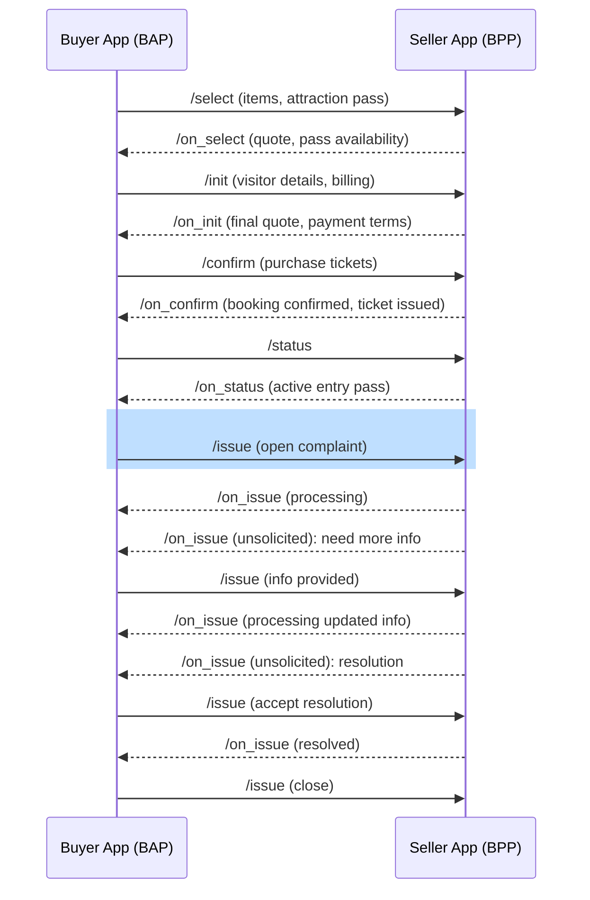
```mermaid
sequenceDiagram
  participant Buyer App (BAP)
  participant Seller App (BPP)
  Buyer App (BAP)->>Seller App (BPP): /select (items, attraction pass)
  Seller App (BPP)-->>Buyer App (BAP): /on_select (quote, pass availability)
  Buyer App (BAP)->>Seller App (BPP): /init (visitor details, billing)
  Seller App (BPP)-->>Buyer App (BAP): /on_init (final quote, payment terms)
  Buyer App (BAP)->>Seller App (BPP): /confirm (purchase tickets)
  Seller App (BPP)-->>Buyer App (BAP): /on_confirm (booking confirmed, ticket issued)
  Buyer App (BAP)->>Seller App (BPP): /status
  Seller App (BPP)-->>Buyer App (BAP): /on_status (active entry pass)
  rect rgb(191, 223, 255)
  Buyer App (BAP)->>Seller App (BPP): /issue (open complaint)
  end
  Seller App (BPP)-->>Buyer App (BAP): /on_issue (processing)
  Seller App (BPP)-->>Buyer App (BAP): /on_issue (unsolicited): need more info
  Buyer App (BAP)->>Seller App (BPP): /issue (info provided)
  Seller App (BPP)-->>Buyer App (BAP): /on_issue (processing updated info)
  Seller App (BPP)-->>Buyer App (BAP): /on_issue (unsolicited): resolution
  Buyer App (BAP)->>Seller App (BPP): /issue (accept resolution)
  Seller App (BPP)-->>Buyer App (BAP): /on_issue (resolved)
  Buyer App (BAP)->>Seller App (BPP): /issue (close)
```

## on_issue_processing

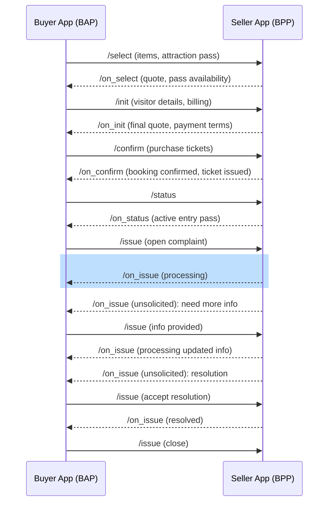
```mermaid
sequenceDiagram
  participant Buyer App (BAP)
  participant Seller App (BPP)
  Buyer App (BAP)->>Seller App (BPP): /select (items, attraction pass)
  Seller App (BPP)-->>Buyer App (BAP): /on_select (quote, pass availability)
  Buyer App (BAP)->>Seller App (BPP): /init (visitor details, billing)
  Seller App (BPP)-->>Buyer App (BAP): /on_init (final quote, payment terms)
  Buyer App (BAP)->>Seller App (BPP): /confirm (purchase tickets)
  Seller App (BPP)-->>Buyer App (BAP): /on_confirm (booking confirmed, ticket issued)
  Buyer App (BAP)->>Seller App (BPP): /status
  Seller App (BPP)-->>Buyer App (BAP): /on_status (active entry pass)
  Buyer App (BAP)->>Seller App (BPP): /issue (open complaint)
  rect rgb(191, 223, 255)
  Seller App (BPP)-->>Buyer App (BAP): /on_issue (processing)
  end
  Seller App (BPP)-->>Buyer App (BAP): /on_issue (unsolicited): need more info
  Buyer App (BAP)->>Seller App (BPP): /issue (info provided)
  Seller App (BPP)-->>Buyer App (BAP): /on_issue (processing updated info)
  Seller App (BPP)-->>Buyer App (BAP): /on_issue (unsolicited): resolution
  Buyer App (BAP)->>Seller App (BPP): /issue (accept resolution)
  Seller App (BPP)-->>Buyer App (BAP): /on_issue (resolved)
  Buyer App (BAP)->>Seller App (BPP): /issue (close)
```

## on_issue_need_more_info

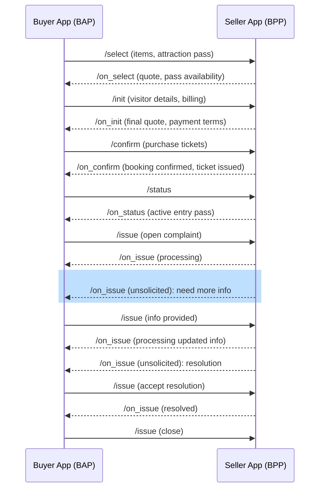
```mermaid
sequenceDiagram
  participant Buyer App (BAP)
  participant Seller App (BPP)
  Buyer App (BAP)->>Seller App (BPP): /select (items, attraction pass)
  Seller App (BPP)-->>Buyer App (BAP): /on_select (quote, pass availability)
  Buyer App (BAP)->>Seller App (BPP): /init (visitor details, billing)
  Seller App (BPP)-->>Buyer App (BAP): /on_init (final quote, payment terms)
  Buyer App (BAP)->>Seller App (BPP): /confirm (purchase tickets)
  Seller App (BPP)-->>Buyer App (BAP): /on_confirm (booking confirmed, ticket issued)
  Buyer App (BAP)->>Seller App (BPP): /status
  Seller App (BPP)-->>Buyer App (BAP): /on_status (active entry pass)
  Buyer App (BAP)->>Seller App (BPP): /issue (open complaint)
  Seller App (BPP)-->>Buyer App (BAP): /on_issue (processing)
  rect rgb(191, 223, 255)
  Seller App (BPP)-->>Buyer App (BAP): /on_issue (unsolicited): need more info
  end
  Buyer App (BAP)->>Seller App (BPP): /issue (info provided)
  Seller App (BPP)-->>Buyer App (BAP): /on_issue (processing updated info)
  Seller App (BPP)-->>Buyer App (BAP): /on_issue (unsolicited): resolution
  Buyer App (BAP)->>Seller App (BPP): /issue (accept resolution)
  Seller App (BPP)-->>Buyer App (BAP): /on_issue (resolved)
  Buyer App (BAP)->>Seller App (BPP): /issue (close)
```

## issue_info_provided

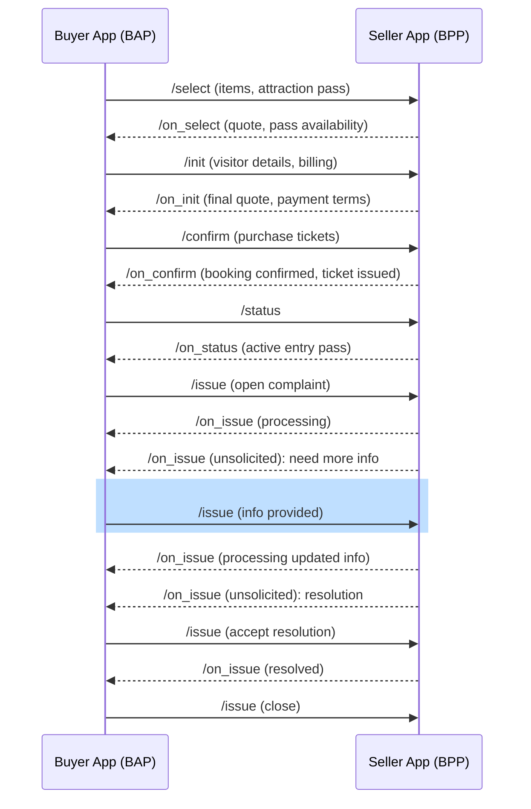
```mermaid
sequenceDiagram
  participant Buyer App (BAP)
  participant Seller App (BPP)
  Buyer App (BAP)->>Seller App (BPP): /select (items, attraction pass)
  Seller App (BPP)-->>Buyer App (BAP): /on_select (quote, pass availability)
  Buyer App (BAP)->>Seller App (BPP): /init (visitor details, billing)
  Seller App (BPP)-->>Buyer App (BAP): /on_init (final quote, payment terms)
  Buyer App (BAP)->>Seller App (BPP): /confirm (purchase tickets)
  Seller App (BPP)-->>Buyer App (BAP): /on_confirm (booking confirmed, ticket issued)
  Buyer App (BAP)->>Seller App (BPP): /status
  Seller App (BPP)-->>Buyer App (BAP): /on_status (active entry pass)
  Buyer App (BAP)->>Seller App (BPP): /issue (open complaint)
  Seller App (BPP)-->>Buyer App (BAP): /on_issue (processing)
  Seller App (BPP)-->>Buyer App (BAP): /on_issue (unsolicited): need more info
  rect rgb(191, 223, 255)
  Buyer App (BAP)->>Seller App (BPP): /issue (info provided)
  end
  Seller App (BPP)-->>Buyer App (BAP): /on_issue (processing updated info)
  Seller App (BPP)-->>Buyer App (BAP): /on_issue (unsolicited): resolution
  Buyer App (BAP)->>Seller App (BPP): /issue (accept resolution)
  Seller App (BPP)-->>Buyer App (BAP): /on_issue (resolved)
  Buyer App (BAP)->>Seller App (BPP): /issue (close)
```

## on_issue_provided

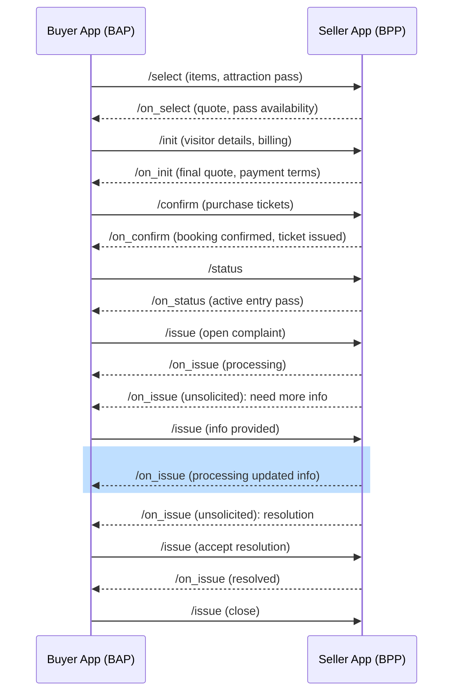
```mermaid
sequenceDiagram
  participant Buyer App (BAP)
  participant Seller App (BPP)
  Buyer App (BAP)->>Seller App (BPP): /select (items, attraction pass)
  Seller App (BPP)-->>Buyer App (BAP): /on_select (quote, pass availability)
  Buyer App (BAP)->>Seller App (BPP): /init (visitor details, billing)
  Seller App (BPP)-->>Buyer App (BAP): /on_init (final quote, payment terms)
  Buyer App (BAP)->>Seller App (BPP): /confirm (purchase tickets)
  Seller App (BPP)-->>Buyer App (BAP): /on_confirm (booking confirmed, ticket issued)
  Buyer App (BAP)->>Seller App (BPP): /status
  Seller App (BPP)-->>Buyer App (BAP): /on_status (active entry pass)
  Buyer App (BAP)->>Seller App (BPP): /issue (open complaint)
  Seller App (BPP)-->>Buyer App (BAP): /on_issue (processing)
  Seller App (BPP)-->>Buyer App (BAP): /on_issue (unsolicited): need more info
  Buyer App (BAP)->>Seller App (BPP): /issue (info provided)
  rect rgb(191, 223, 255)
  Seller App (BPP)-->>Buyer App (BAP): /on_issue (processing updated info)
  end
  Seller App (BPP)-->>Buyer App (BAP): /on_issue (unsolicited): resolution
  Buyer App (BAP)->>Seller App (BPP): /issue (accept resolution)
  Seller App (BPP)-->>Buyer App (BAP): /on_issue (resolved)
  Buyer App (BAP)->>Seller App (BPP): /issue (close)
```

## on_issue_resolution

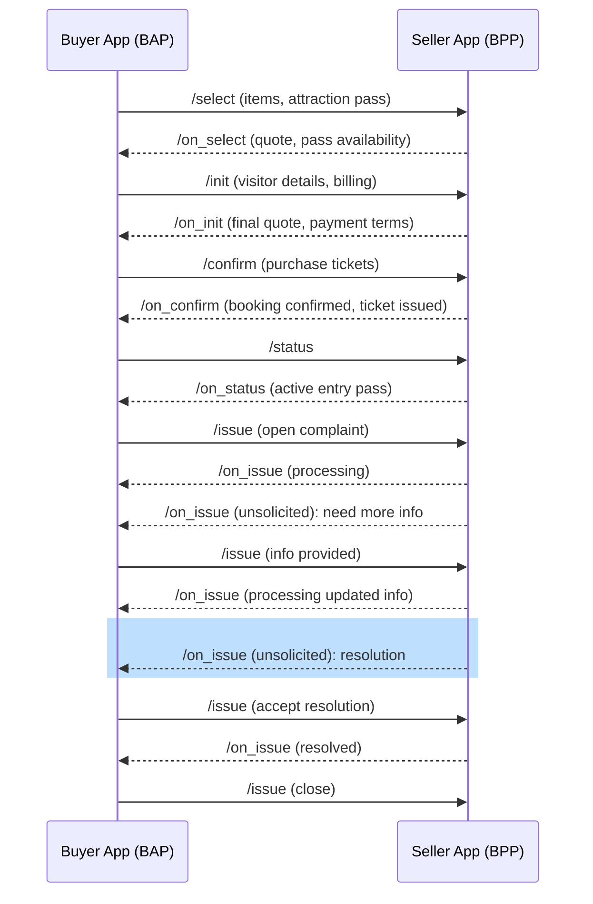
```mermaid
sequenceDiagram
  participant Buyer App (BAP)
  participant Seller App (BPP)
  Buyer App (BAP)->>Seller App (BPP): /select (items, attraction pass)
  Seller App (BPP)-->>Buyer App (BAP): /on_select (quote, pass availability)
  Buyer App (BAP)->>Seller App (BPP): /init (visitor details, billing)
  Seller App (BPP)-->>Buyer App (BAP): /on_init (final quote, payment terms)
  Buyer App (BAP)->>Seller App (BPP): /confirm (purchase tickets)
  Seller App (BPP)-->>Buyer App (BAP): /on_confirm (booking confirmed, ticket issued)
  Buyer App (BAP)->>Seller App (BPP): /status
  Seller App (BPP)-->>Buyer App (BAP): /on_status (active entry pass)
  Buyer App (BAP)->>Seller App (BPP): /issue (open complaint)
  Seller App (BPP)-->>Buyer App (BAP): /on_issue (processing)
  Seller App (BPP)-->>Buyer App (BAP): /on_issue (unsolicited): need more info
  Buyer App (BAP)->>Seller App (BPP): /issue (info provided)
  Seller App (BPP)-->>Buyer App (BAP): /on_issue (processing updated info)
  rect rgb(191, 223, 255)
  Seller App (BPP)-->>Buyer App (BAP): /on_issue (unsolicited): resolution
  end
  Buyer App (BAP)->>Seller App (BPP): /issue (accept resolution)
  Seller App (BPP)-->>Buyer App (BAP): /on_issue (resolved)
  Buyer App (BAP)->>Seller App (BPP): /issue (close)
```

## issue_resolution_accept

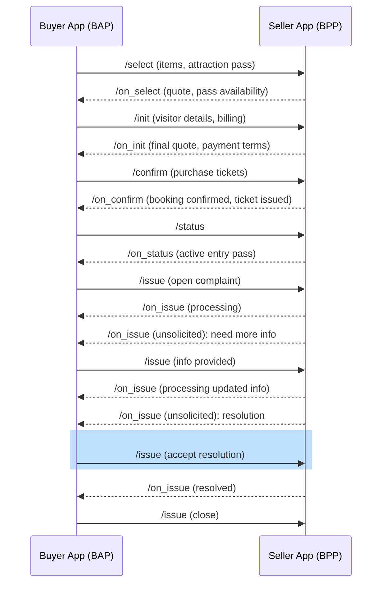
```mermaid
sequenceDiagram
  participant Buyer App (BAP)
  participant Seller App (BPP)
  Buyer App (BAP)->>Seller App (BPP): /select (items, attraction pass)
  Seller App (BPP)-->>Buyer App (BAP): /on_select (quote, pass availability)
  Buyer App (BAP)->>Seller App (BPP): /init (visitor details, billing)
  Seller App (BPP)-->>Buyer App (BAP): /on_init (final quote, payment terms)
  Buyer App (BAP)->>Seller App (BPP): /confirm (purchase tickets)
  Seller App (BPP)-->>Buyer App (BAP): /on_confirm (booking confirmed, ticket issued)
  Buyer App (BAP)->>Seller App (BPP): /status
  Seller App (BPP)-->>Buyer App (BAP): /on_status (active entry pass)
  Buyer App (BAP)->>Seller App (BPP): /issue (open complaint)
  Seller App (BPP)-->>Buyer App (BAP): /on_issue (processing)
  Seller App (BPP)-->>Buyer App (BAP): /on_issue (unsolicited): need more info
  Buyer App (BAP)->>Seller App (BPP): /issue (info provided)
  Seller App (BPP)-->>Buyer App (BAP): /on_issue (processing updated info)
  Seller App (BPP)-->>Buyer App (BAP): /on_issue (unsolicited): resolution
  rect rgb(191, 223, 255)
  Buyer App (BAP)->>Seller App (BPP): /issue (accept resolution)
  end
  Seller App (BPP)-->>Buyer App (BAP): /on_issue (resolved)
  Buyer App (BAP)->>Seller App (BPP): /issue (close)
```

## on_issue_resolved

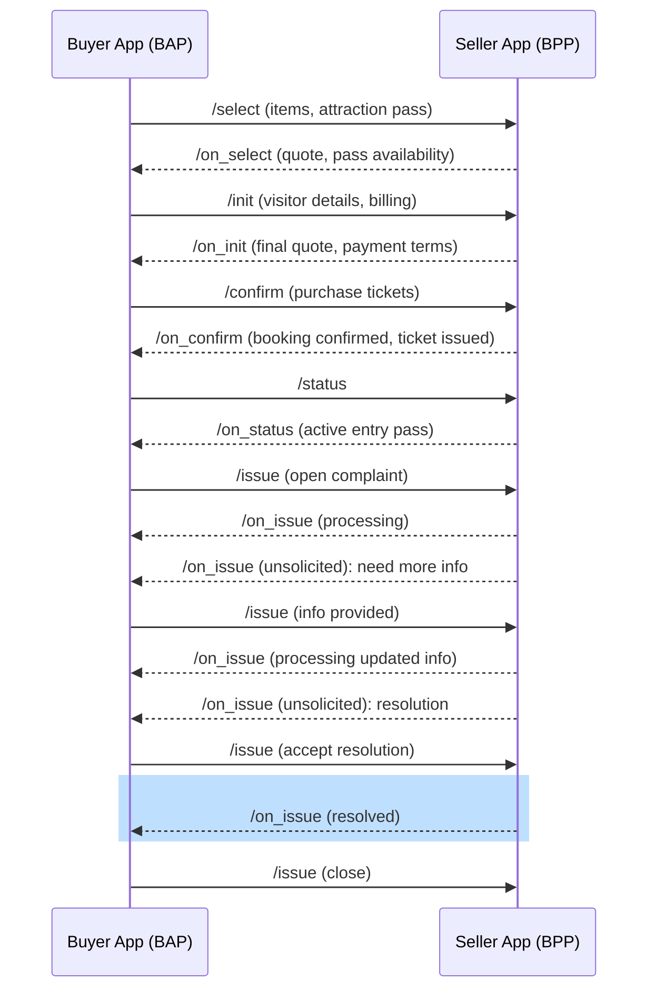
```mermaid
sequenceDiagram
  participant Buyer App (BAP)
  participant Seller App (BPP)
  Buyer App (BAP)->>Seller App (BPP): /select (items, attraction pass)
  Seller App (BPP)-->>Buyer App (BAP): /on_select (quote, pass availability)
  Buyer App (BAP)->>Seller App (BPP): /init (visitor details, billing)
  Seller App (BPP)-->>Buyer App (BAP): /on_init (final quote, payment terms)
  Buyer App (BAP)->>Seller App (BPP): /confirm (purchase tickets)
  Seller App (BPP)-->>Buyer App (BAP): /on_confirm (booking confirmed, ticket issued)
  Buyer App (BAP)->>Seller App (BPP): /status
  Seller App (BPP)-->>Buyer App (BAP): /on_status (active entry pass)
  Buyer App (BAP)->>Seller App (BPP): /issue (open complaint)
  Seller App (BPP)-->>Buyer App (BAP): /on_issue (processing)
  Seller App (BPP)-->>Buyer App (BAP): /on_issue (unsolicited): need more info
  Buyer App (BAP)->>Seller App (BPP): /issue (info provided)
  Seller App (BPP)-->>Buyer App (BAP): /on_issue (processing updated info)
  Seller App (BPP)-->>Buyer App (BAP): /on_issue (unsolicited): resolution
  Buyer App (BAP)->>Seller App (BPP): /issue (accept resolution)
  rect rgb(191, 223, 255)
  Seller App (BPP)-->>Buyer App (BAP): /on_issue (resolved)
  end
  Buyer App (BAP)->>Seller App (BPP): /issue (close)
```

## issue_close

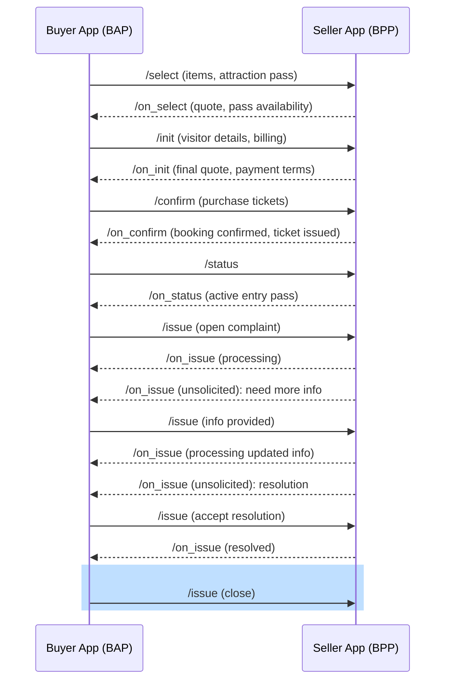
```mermaid
sequenceDiagram
  participant Buyer App (BAP)
  participant Seller App (BPP)
  Buyer App (BAP)->>Seller App (BPP): /select (items, attraction pass)
  Seller App (BPP)-->>Buyer App (BAP): /on_select (quote, pass availability)
  Buyer App (BAP)->>Seller App (BPP): /init (visitor details, billing)
  Seller App (BPP)-->>Buyer App (BAP): /on_init (final quote, payment terms)
  Buyer App (BAP)->>Seller App (BPP): /confirm (purchase tickets)
  Seller App (BPP)-->>Buyer App (BAP): /on_confirm (booking confirmed, ticket issued)
  Buyer App (BAP)->>Seller App (BPP): /status
  Seller App (BPP)-->>Buyer App (BAP): /on_status (active entry pass)
  Buyer App (BAP)->>Seller App (BPP): /issue (open complaint)
  Seller App (BPP)-->>Buyer App (BAP): /on_issue (processing)
  Seller App (BPP)-->>Buyer App (BAP): /on_issue (unsolicited): need more info
  Buyer App (BAP)->>Seller App (BPP): /issue (info provided)
  Seller App (BPP)-->>Buyer App (BAP): /on_issue (processing updated info)
  Seller App (BPP)-->>Buyer App (BAP): /on_issue (unsolicited): resolution
  Buyer App (BAP)->>Seller App (BPP): /issue (accept resolution)
  Seller App (BPP)-->>Buyer App (BAP): /on_issue (resolved)
  rect rgb(191, 223, 255)
  Buyer App (BAP)->>Seller App (BPP): /issue (close)
  end
```
