# reverse qc — Sequence Diagrams

Internal data file consumed by the Developer Guide's "Sequence Diagram" tab (API Walkthrough).
Not meant to be shown as its own docs page — the frontend filters this slug out of the Use Case
Brief / Additional Resources / Changelog tab lists and instead looks up the section matching the
selected API call's `action_id` (the `##` heading below) to render that step's diagram.

One `## <action_id>` heading per step of `REVERSE_QC.yaml`, in that flow's own step order, each followed by its Mermaid `sequenceDiagram`: the whole flow, with that call's own message(s) highlighted — same convention as the other domains' per-step sequence-diagram docs.

## search_REVERSE_QC_LOGISTICS

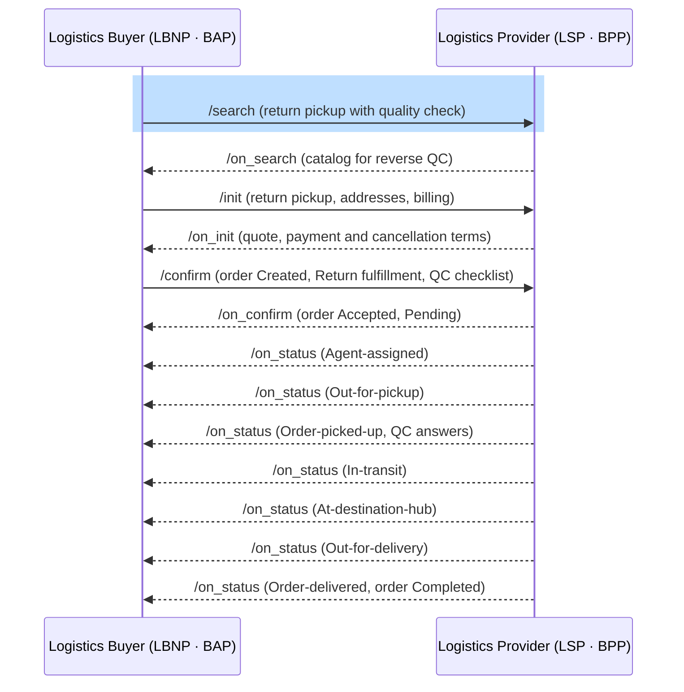
```mermaid
sequenceDiagram
  participant LBNP as Logistics Buyer (LBNP · BAP)
  participant LSP as Logistics Provider (LSP · BPP)
  rect rgb(191, 223, 255)
  LBNP->>LSP: /search (return pickup with quality check)
  end
  LSP-->>LBNP: /on_search (catalog for reverse QC)
  LBNP->>LSP: /init (return pickup, addresses, billing)
  LSP-->>LBNP: /on_init (quote, payment and cancellation terms)
  LBNP->>LSP: /confirm (order Created, Return fulfillment, QC checklist)
  LSP-->>LBNP: /on_confirm (order Accepted, Pending)
  LSP-->>LBNP: /on_status (Agent-assigned)
  LSP-->>LBNP: /on_status (Out-for-pickup)
  LSP-->>LBNP: /on_status (Order-picked-up, QC answers)
  LSP-->>LBNP: /on_status (In-transit)
  LSP-->>LBNP: /on_status (At-destination-hub)
  LSP-->>LBNP: /on_status (Out-for-delivery)
  LSP-->>LBNP: /on_status (Order-delivered, order Completed)
```

## on_search_REVERSE_QC_LOGISTICS

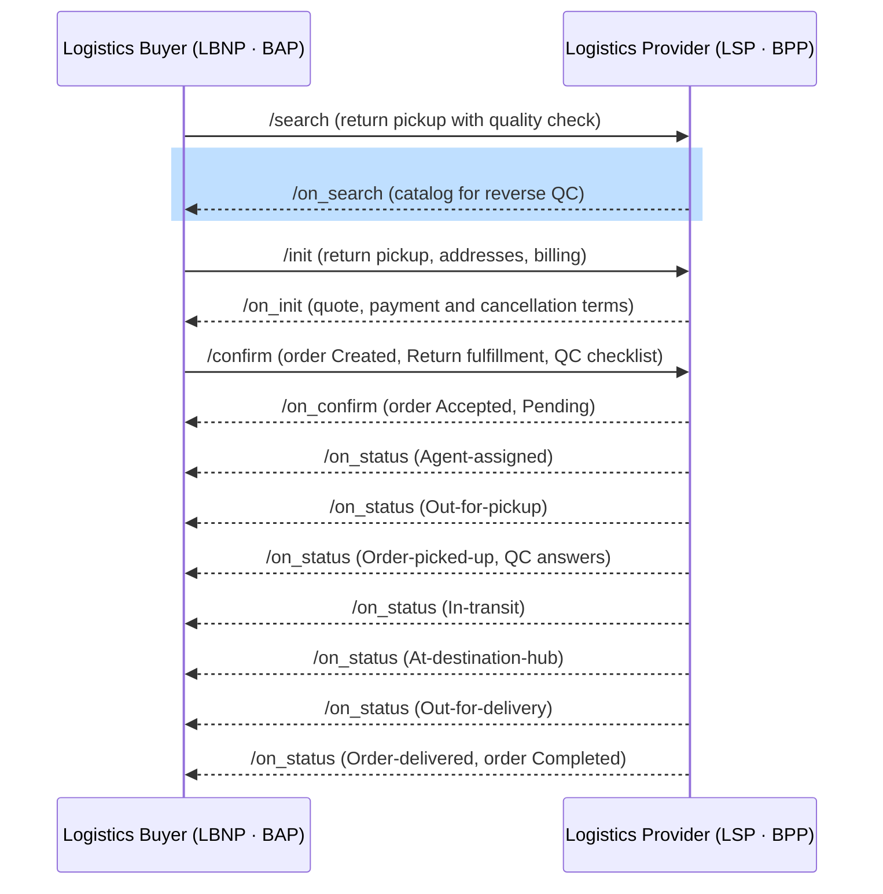
```mermaid
sequenceDiagram
  participant LBNP as Logistics Buyer (LBNP · BAP)
  participant LSP as Logistics Provider (LSP · BPP)
  LBNP->>LSP: /search (return pickup with quality check)
  rect rgb(191, 223, 255)
  LSP-->>LBNP: /on_search (catalog for reverse QC)
  end
  LBNP->>LSP: /init (return pickup, addresses, billing)
  LSP-->>LBNP: /on_init (quote, payment and cancellation terms)
  LBNP->>LSP: /confirm (order Created, Return fulfillment, QC checklist)
  LSP-->>LBNP: /on_confirm (order Accepted, Pending)
  LSP-->>LBNP: /on_status (Agent-assigned)
  LSP-->>LBNP: /on_status (Out-for-pickup)
  LSP-->>LBNP: /on_status (Order-picked-up, QC answers)
  LSP-->>LBNP: /on_status (In-transit)
  LSP-->>LBNP: /on_status (At-destination-hub)
  LSP-->>LBNP: /on_status (Out-for-delivery)
  LSP-->>LBNP: /on_status (Order-delivered, order Completed)
```

## init_REVERSE_QC_LOGISTICS

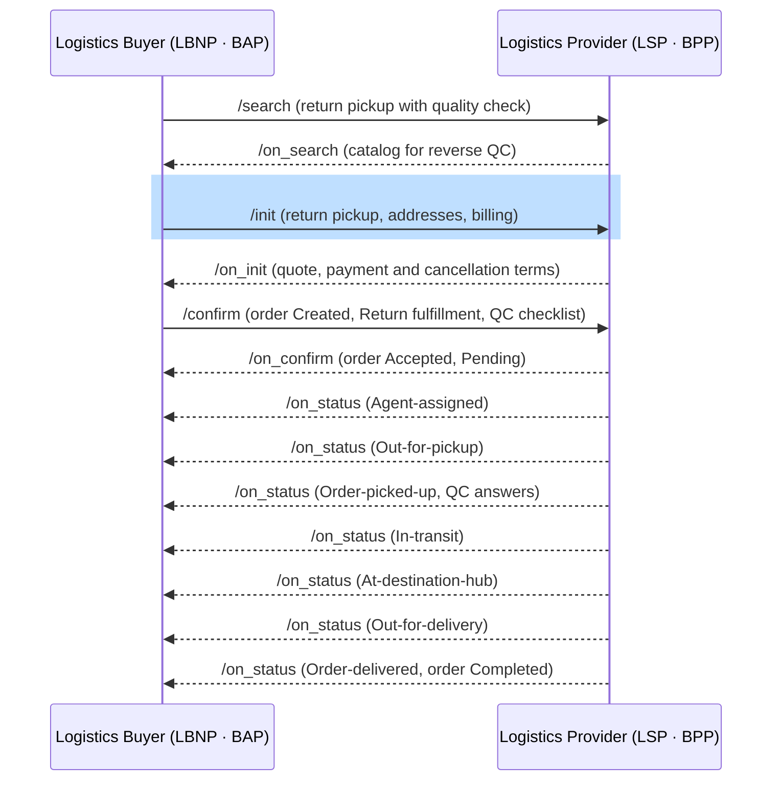
```mermaid
sequenceDiagram
  participant LBNP as Logistics Buyer (LBNP · BAP)
  participant LSP as Logistics Provider (LSP · BPP)
  LBNP->>LSP: /search (return pickup with quality check)
  LSP-->>LBNP: /on_search (catalog for reverse QC)
  rect rgb(191, 223, 255)
  LBNP->>LSP: /init (return pickup, addresses, billing)
  end
  LSP-->>LBNP: /on_init (quote, payment and cancellation terms)
  LBNP->>LSP: /confirm (order Created, Return fulfillment, QC checklist)
  LSP-->>LBNP: /on_confirm (order Accepted, Pending)
  LSP-->>LBNP: /on_status (Agent-assigned)
  LSP-->>LBNP: /on_status (Out-for-pickup)
  LSP-->>LBNP: /on_status (Order-picked-up, QC answers)
  LSP-->>LBNP: /on_status (In-transit)
  LSP-->>LBNP: /on_status (At-destination-hub)
  LSP-->>LBNP: /on_status (Out-for-delivery)
  LSP-->>LBNP: /on_status (Order-delivered, order Completed)
```

## on_init_REVERSE_QC_LOGISTICS

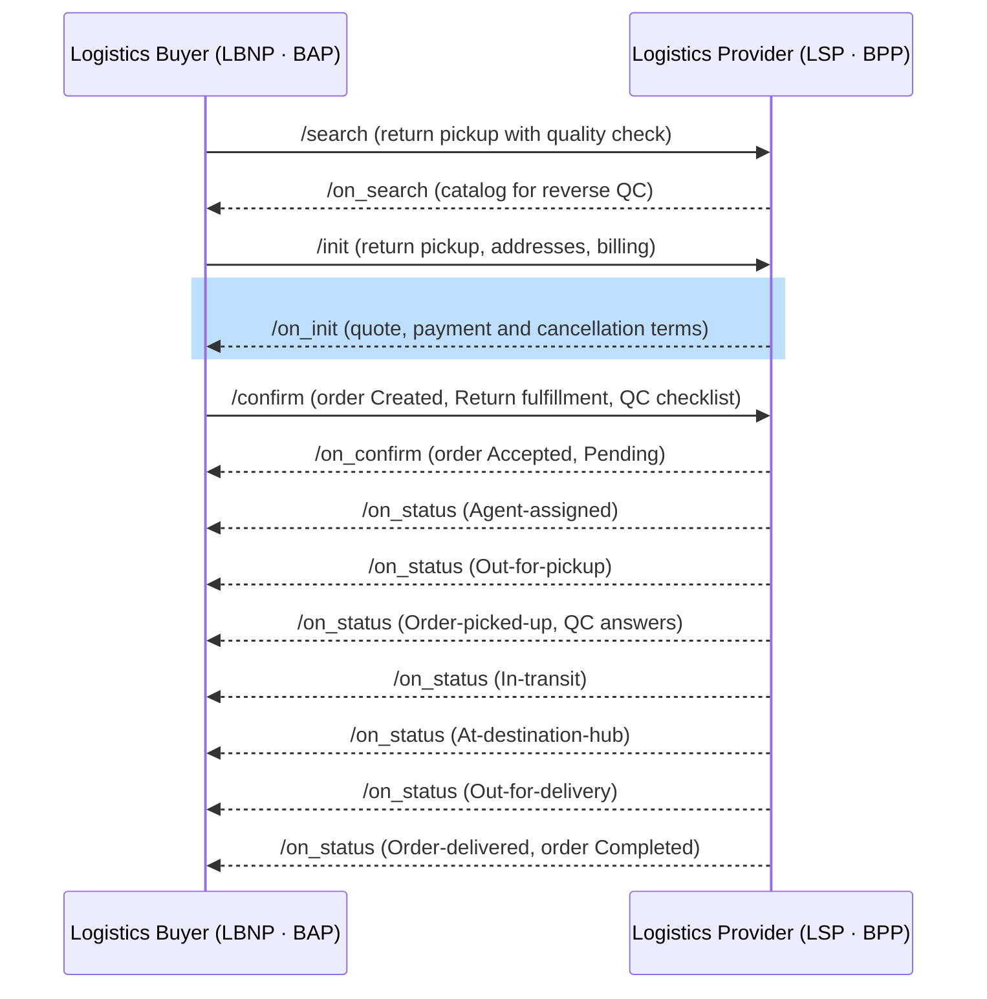
```mermaid
sequenceDiagram
  participant LBNP as Logistics Buyer (LBNP · BAP)
  participant LSP as Logistics Provider (LSP · BPP)
  LBNP->>LSP: /search (return pickup with quality check)
  LSP-->>LBNP: /on_search (catalog for reverse QC)
  LBNP->>LSP: /init (return pickup, addresses, billing)
  rect rgb(191, 223, 255)
  LSP-->>LBNP: /on_init (quote, payment and cancellation terms)
  end
  LBNP->>LSP: /confirm (order Created, Return fulfillment, QC checklist)
  LSP-->>LBNP: /on_confirm (order Accepted, Pending)
  LSP-->>LBNP: /on_status (Agent-assigned)
  LSP-->>LBNP: /on_status (Out-for-pickup)
  LSP-->>LBNP: /on_status (Order-picked-up, QC answers)
  LSP-->>LBNP: /on_status (In-transit)
  LSP-->>LBNP: /on_status (At-destination-hub)
  LSP-->>LBNP: /on_status (Out-for-delivery)
  LSP-->>LBNP: /on_status (Order-delivered, order Completed)
```

## confirm_REVERSE_QC_LOGISTICS

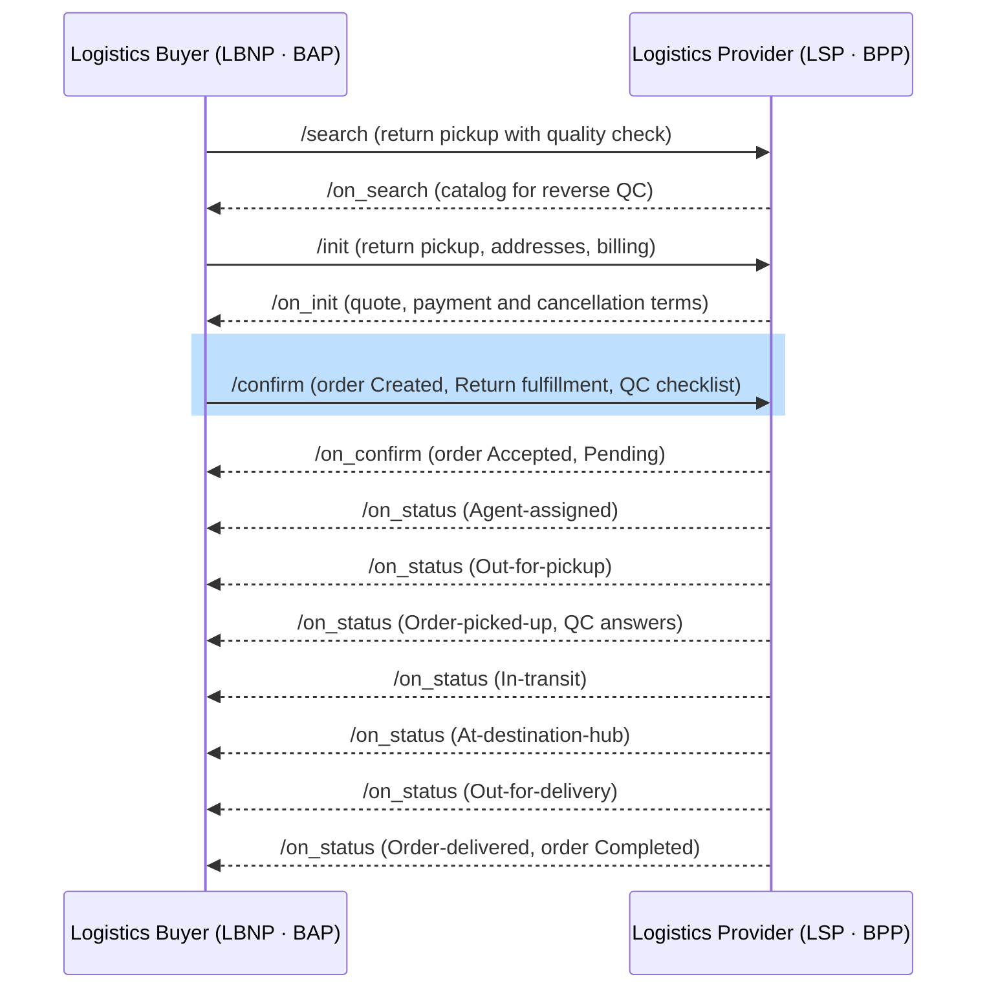
```mermaid
sequenceDiagram
  participant LBNP as Logistics Buyer (LBNP · BAP)
  participant LSP as Logistics Provider (LSP · BPP)
  LBNP->>LSP: /search (return pickup with quality check)
  LSP-->>LBNP: /on_search (catalog for reverse QC)
  LBNP->>LSP: /init (return pickup, addresses, billing)
  LSP-->>LBNP: /on_init (quote, payment and cancellation terms)
  rect rgb(191, 223, 255)
  LBNP->>LSP: /confirm (order Created, Return fulfillment, QC checklist)
  end
  LSP-->>LBNP: /on_confirm (order Accepted, Pending)
  LSP-->>LBNP: /on_status (Agent-assigned)
  LSP-->>LBNP: /on_status (Out-for-pickup)
  LSP-->>LBNP: /on_status (Order-picked-up, QC answers)
  LSP-->>LBNP: /on_status (In-transit)
  LSP-->>LBNP: /on_status (At-destination-hub)
  LSP-->>LBNP: /on_status (Out-for-delivery)
  LSP-->>LBNP: /on_status (Order-delivered, order Completed)
```

## on_confirm_REVERSE_QC_LOGISTICS

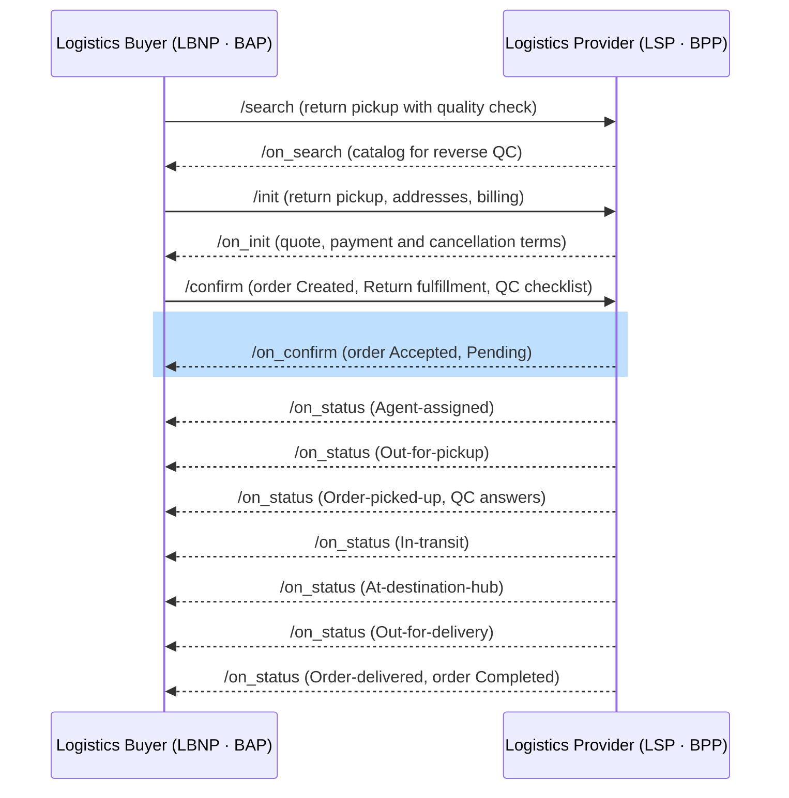
```mermaid
sequenceDiagram
  participant LBNP as Logistics Buyer (LBNP · BAP)
  participant LSP as Logistics Provider (LSP · BPP)
  LBNP->>LSP: /search (return pickup with quality check)
  LSP-->>LBNP: /on_search (catalog for reverse QC)
  LBNP->>LSP: /init (return pickup, addresses, billing)
  LSP-->>LBNP: /on_init (quote, payment and cancellation terms)
  LBNP->>LSP: /confirm (order Created, Return fulfillment, QC checklist)
  rect rgb(191, 223, 255)
  LSP-->>LBNP: /on_confirm (order Accepted, Pending)
  end
  LSP-->>LBNP: /on_status (Agent-assigned)
  LSP-->>LBNP: /on_status (Out-for-pickup)
  LSP-->>LBNP: /on_status (Order-picked-up, QC answers)
  LSP-->>LBNP: /on_status (In-transit)
  LSP-->>LBNP: /on_status (At-destination-hub)
  LSP-->>LBNP: /on_status (Out-for-delivery)
  LSP-->>LBNP: /on_status (Order-delivered, order Completed)
```

## on_status_13_LOGISTICS

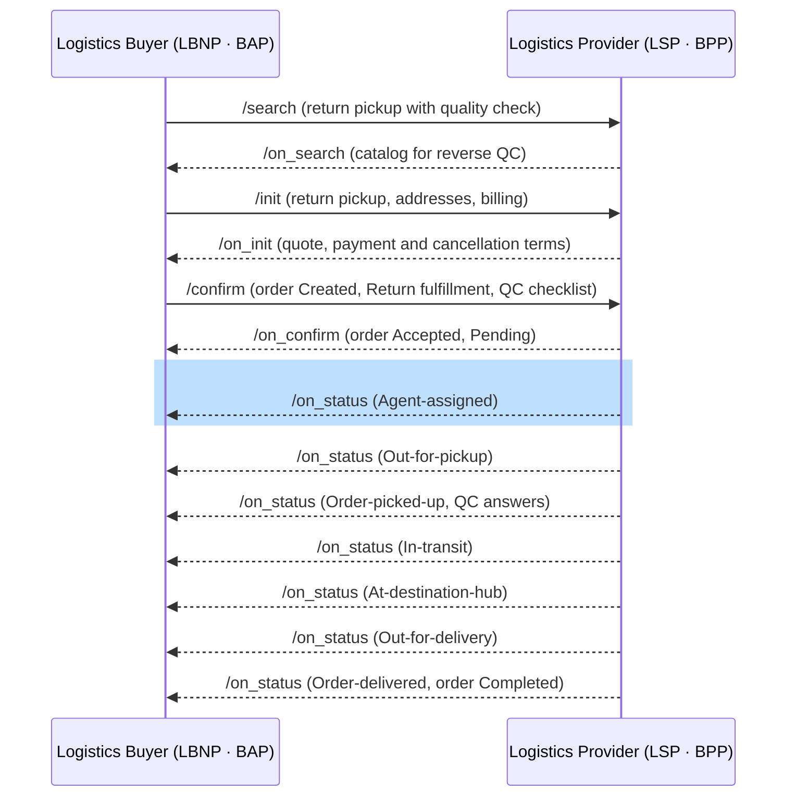
```mermaid
sequenceDiagram
  participant LBNP as Logistics Buyer (LBNP · BAP)
  participant LSP as Logistics Provider (LSP · BPP)
  LBNP->>LSP: /search (return pickup with quality check)
  LSP-->>LBNP: /on_search (catalog for reverse QC)
  LBNP->>LSP: /init (return pickup, addresses, billing)
  LSP-->>LBNP: /on_init (quote, payment and cancellation terms)
  LBNP->>LSP: /confirm (order Created, Return fulfillment, QC checklist)
  LSP-->>LBNP: /on_confirm (order Accepted, Pending)
  rect rgb(191, 223, 255)
  LSP-->>LBNP: /on_status (Agent-assigned)
  end
  LSP-->>LBNP: /on_status (Out-for-pickup)
  LSP-->>LBNP: /on_status (Order-picked-up, QC answers)
  LSP-->>LBNP: /on_status (In-transit)
  LSP-->>LBNP: /on_status (At-destination-hub)
  LSP-->>LBNP: /on_status (Out-for-delivery)
  LSP-->>LBNP: /on_status (Order-delivered, order Completed)
```

## on_status_9_LOGISTICS

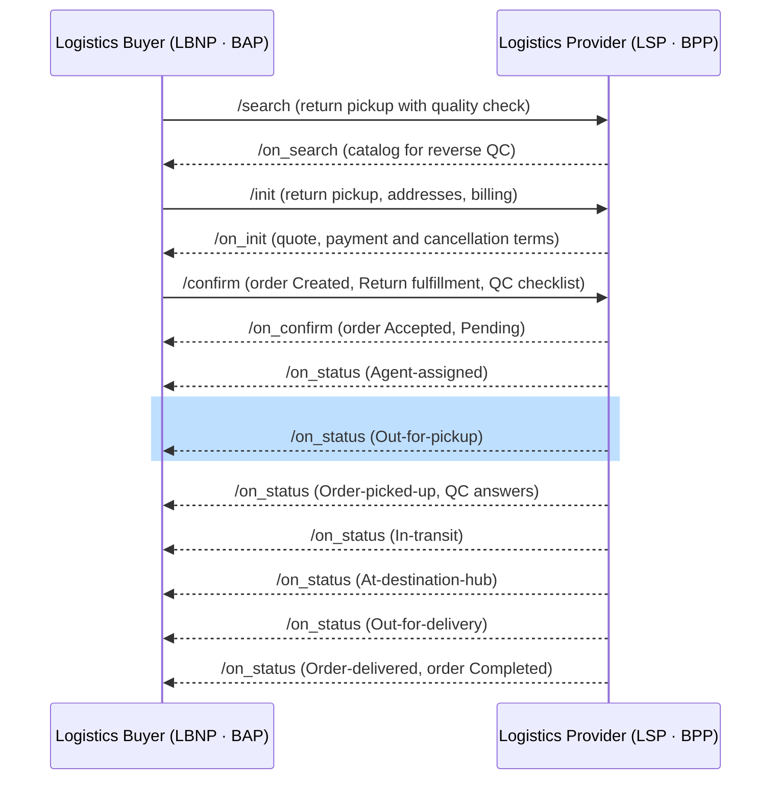
```mermaid
sequenceDiagram
  participant LBNP as Logistics Buyer (LBNP · BAP)
  participant LSP as Logistics Provider (LSP · BPP)
  LBNP->>LSP: /search (return pickup with quality check)
  LSP-->>LBNP: /on_search (catalog for reverse QC)
  LBNP->>LSP: /init (return pickup, addresses, billing)
  LSP-->>LBNP: /on_init (quote, payment and cancellation terms)
  LBNP->>LSP: /confirm (order Created, Return fulfillment, QC checklist)
  LSP-->>LBNP: /on_confirm (order Accepted, Pending)
  LSP-->>LBNP: /on_status (Agent-assigned)
  rect rgb(191, 223, 255)
  LSP-->>LBNP: /on_status (Out-for-pickup)
  end
  LSP-->>LBNP: /on_status (Order-picked-up, QC answers)
  LSP-->>LBNP: /on_status (In-transit)
  LSP-->>LBNP: /on_status (At-destination-hub)
  LSP-->>LBNP: /on_status (Out-for-delivery)
  LSP-->>LBNP: /on_status (Order-delivered, order Completed)
```

## on_status_REVERSE_QC_LOGISTICS

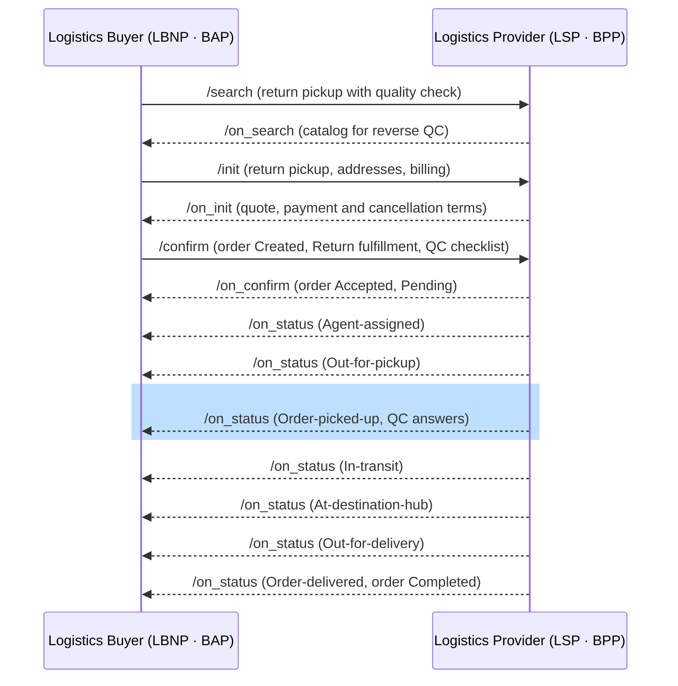
```mermaid
sequenceDiagram
  participant LBNP as Logistics Buyer (LBNP · BAP)
  participant LSP as Logistics Provider (LSP · BPP)
  LBNP->>LSP: /search (return pickup with quality check)
  LSP-->>LBNP: /on_search (catalog for reverse QC)
  LBNP->>LSP: /init (return pickup, addresses, billing)
  LSP-->>LBNP: /on_init (quote, payment and cancellation terms)
  LBNP->>LSP: /confirm (order Created, Return fulfillment, QC checklist)
  LSP-->>LBNP: /on_confirm (order Accepted, Pending)
  LSP-->>LBNP: /on_status (Agent-assigned)
  LSP-->>LBNP: /on_status (Out-for-pickup)
  rect rgb(191, 223, 255)
  LSP-->>LBNP: /on_status (Order-picked-up, QC answers)
  end
  LSP-->>LBNP: /on_status (In-transit)
  LSP-->>LBNP: /on_status (At-destination-hub)
  LSP-->>LBNP: /on_status (Out-for-delivery)
  LSP-->>LBNP: /on_status (Order-delivered, order Completed)
```

## on_status_7_LOGISTICS

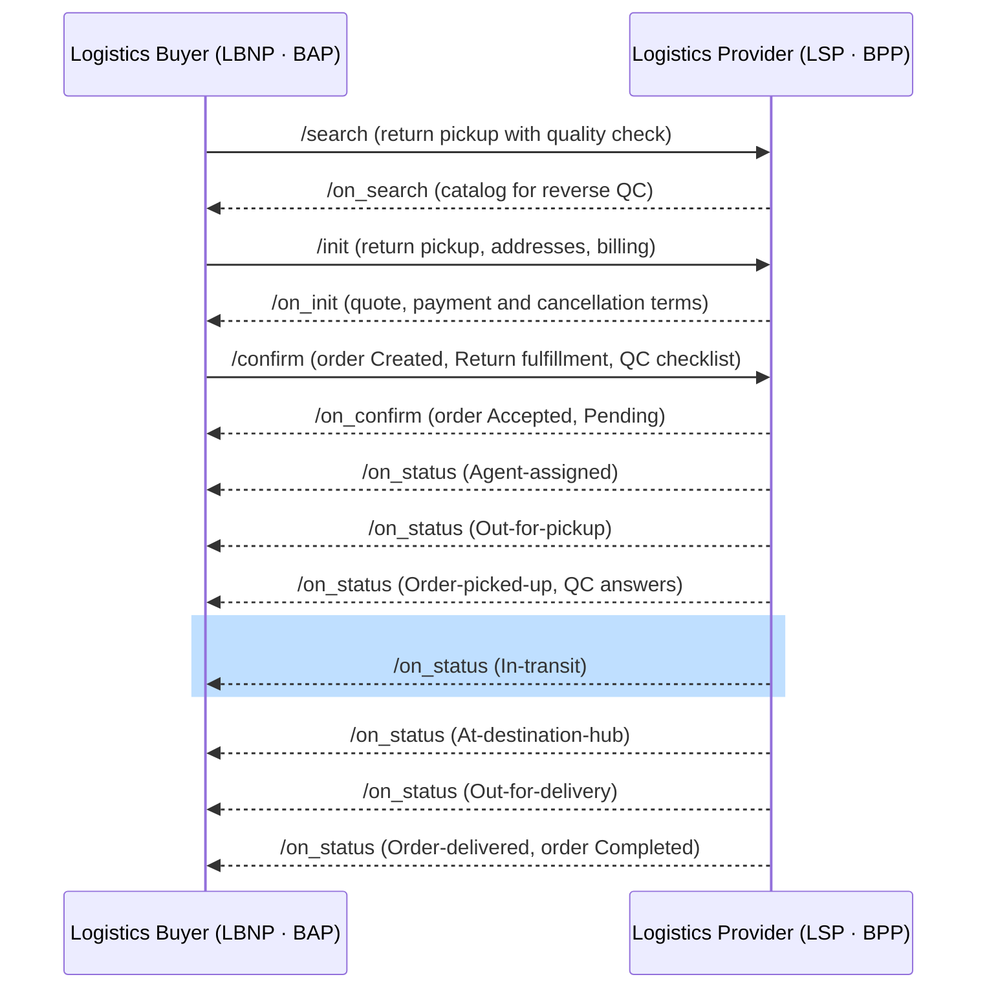
```mermaid
sequenceDiagram
  participant LBNP as Logistics Buyer (LBNP · BAP)
  participant LSP as Logistics Provider (LSP · BPP)
  LBNP->>LSP: /search (return pickup with quality check)
  LSP-->>LBNP: /on_search (catalog for reverse QC)
  LBNP->>LSP: /init (return pickup, addresses, billing)
  LSP-->>LBNP: /on_init (quote, payment and cancellation terms)
  LBNP->>LSP: /confirm (order Created, Return fulfillment, QC checklist)
  LSP-->>LBNP: /on_confirm (order Accepted, Pending)
  LSP-->>LBNP: /on_status (Agent-assigned)
  LSP-->>LBNP: /on_status (Out-for-pickup)
  LSP-->>LBNP: /on_status (Order-picked-up, QC answers)
  rect rgb(191, 223, 255)
  LSP-->>LBNP: /on_status (In-transit)
  end
  LSP-->>LBNP: /on_status (At-destination-hub)
  LSP-->>LBNP: /on_status (Out-for-delivery)
  LSP-->>LBNP: /on_status (Order-delivered, order Completed)
```

## on_status_6_LOGISTICS

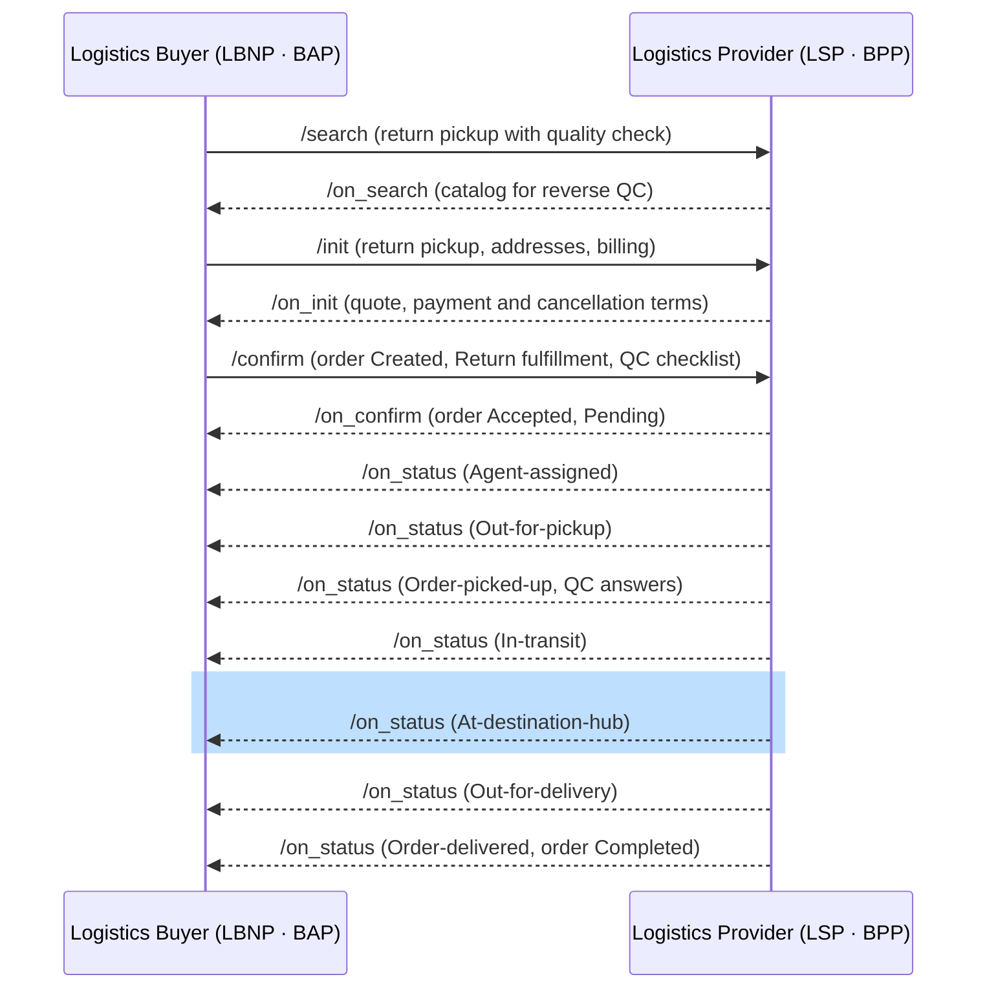
```mermaid
sequenceDiagram
  participant LBNP as Logistics Buyer (LBNP · BAP)
  participant LSP as Logistics Provider (LSP · BPP)
  LBNP->>LSP: /search (return pickup with quality check)
  LSP-->>LBNP: /on_search (catalog for reverse QC)
  LBNP->>LSP: /init (return pickup, addresses, billing)
  LSP-->>LBNP: /on_init (quote, payment and cancellation terms)
  LBNP->>LSP: /confirm (order Created, Return fulfillment, QC checklist)
  LSP-->>LBNP: /on_confirm (order Accepted, Pending)
  LSP-->>LBNP: /on_status (Agent-assigned)
  LSP-->>LBNP: /on_status (Out-for-pickup)
  LSP-->>LBNP: /on_status (Order-picked-up, QC answers)
  LSP-->>LBNP: /on_status (In-transit)
  rect rgb(191, 223, 255)
  LSP-->>LBNP: /on_status (At-destination-hub)
  end
  LSP-->>LBNP: /on_status (Out-for-delivery)
  LSP-->>LBNP: /on_status (Order-delivered, order Completed)
```

## on_status_2_LOGISTICS

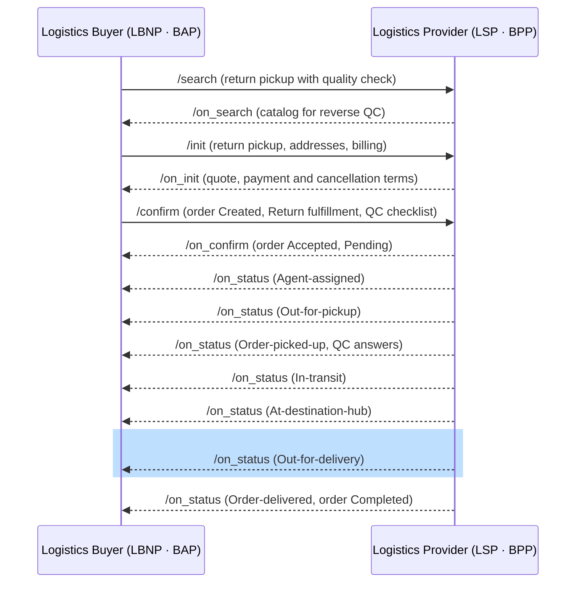
```mermaid
sequenceDiagram
  participant LBNP as Logistics Buyer (LBNP · BAP)
  participant LSP as Logistics Provider (LSP · BPP)
  LBNP->>LSP: /search (return pickup with quality check)
  LSP-->>LBNP: /on_search (catalog for reverse QC)
  LBNP->>LSP: /init (return pickup, addresses, billing)
  LSP-->>LBNP: /on_init (quote, payment and cancellation terms)
  LBNP->>LSP: /confirm (order Created, Return fulfillment, QC checklist)
  LSP-->>LBNP: /on_confirm (order Accepted, Pending)
  LSP-->>LBNP: /on_status (Agent-assigned)
  LSP-->>LBNP: /on_status (Out-for-pickup)
  LSP-->>LBNP: /on_status (Order-picked-up, QC answers)
  LSP-->>LBNP: /on_status (In-transit)
  LSP-->>LBNP: /on_status (At-destination-hub)
  rect rgb(191, 223, 255)
  LSP-->>LBNP: /on_status (Out-for-delivery)
  end
  LSP-->>LBNP: /on_status (Order-delivered, order Completed)
```

## on_status_3_LOGISTICS

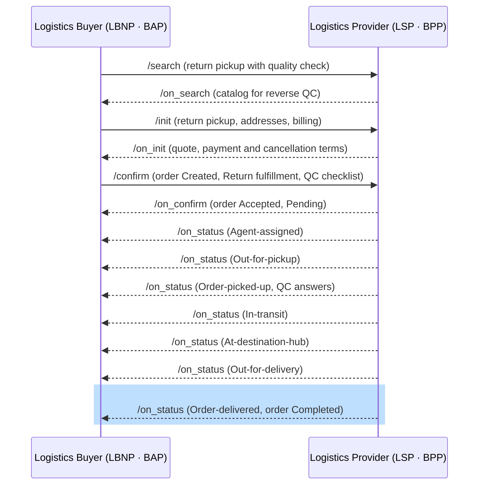
```mermaid
sequenceDiagram
  participant LBNP as Logistics Buyer (LBNP · BAP)
  participant LSP as Logistics Provider (LSP · BPP)
  LBNP->>LSP: /search (return pickup with quality check)
  LSP-->>LBNP: /on_search (catalog for reverse QC)
  LBNP->>LSP: /init (return pickup, addresses, billing)
  LSP-->>LBNP: /on_init (quote, payment and cancellation terms)
  LBNP->>LSP: /confirm (order Created, Return fulfillment, QC checklist)
  LSP-->>LBNP: /on_confirm (order Accepted, Pending)
  LSP-->>LBNP: /on_status (Agent-assigned)
  LSP-->>LBNP: /on_status (Out-for-pickup)
  LSP-->>LBNP: /on_status (Order-picked-up, QC answers)
  LSP-->>LBNP: /on_status (In-transit)
  LSP-->>LBNP: /on_status (At-destination-hub)
  LSP-->>LBNP: /on_status (Out-for-delivery)
  rect rgb(191, 223, 255)
  LSP-->>LBNP: /on_status (Order-delivered, order Completed)
  end
```
