# STATION_CODE_FLOW_ORDER_IGM_(v-1.0.0) — Sequence Diagrams

Internal data file consumed by the Developer Guide's "Sequence Diagram" tab (API Walkthrough).
Not meant to be shown as its own docs page — the frontend filters this slug out of the Use Case
Brief / Additional Resources / Changelog tab lists and instead looks up the section matching the
selected API call's `action_id` (the `##` heading below) to render that step's diagram.

One `## <action_id>` heading per step of `STATION_CODE_FLOW_ORDER_IGM_v-1_0_0_.yaml` (Metro), in that flow's own step order, each followed by its Mermaid `sequenceDiagram`: the whole flow, with that call's own message(s) highlighted — same convention as the other domains' per-step sequence-diagram docs.

## search1_METRO_201

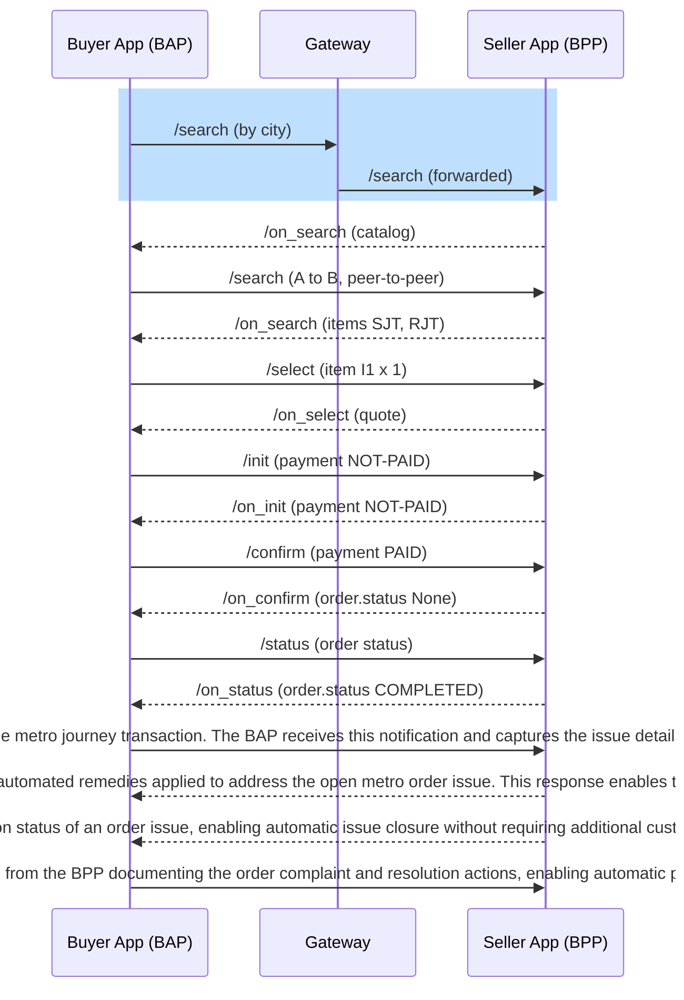
```mermaid
sequenceDiagram
  participant Buyer App (BAP)
  participant Gateway
  participant Seller App (BPP)
  rect rgb(191, 223, 255)
  Buyer App (BAP)->>Gateway: /search (by city)
  Gateway->>Seller App (BPP): /search (forwarded)
  end
  Seller App (BPP)-->>Buyer App (BAP): /on_search (catalog)
  Buyer App (BAP)->>Seller App (BPP): /search (A to B, peer-to-peer)
  Seller App (BPP)-->>Buyer App (BAP): /on_search (items SJT, RJT)
  Buyer App (BAP)->>Seller App (BPP): /select (item I1 x 1)
  Seller App (BPP)-->>Buyer App (BAP): /on_select (quote)
  Buyer App (BAP)->>Seller App (BPP): /init (payment NOT-PAID)
  Seller App (BPP)-->>Buyer App (BAP): /on_init (payment NOT-PAID)
  Buyer App (BAP)->>Seller App (BPP): /confirm (payment PAID)
  Seller App (BPP)-->>Buyer App (BAP): /on_confirm (order.status None)
  Buyer App (BAP)->>Seller App (BPP): /status (order status)
  Seller App (BPP)-->>Buyer App (BAP): /on_status (order.status COMPLETED)
  Buyer App (BAP)->>Seller App (BPP): /issue (The BPP notifies the BAP of an order issue encountered during the metro journey transaction. The BAP receives this notification and captures the issue details to enable automatic resolution without requiring customer intervention.)
  Seller App (BPP)-->>Buyer App (BAP): /on_issue (The BPP sends its issue resolution details to the BAP, specifying the automated remedies applied to address the open metro order issue. This response enables the BAP to process and close the issue without requiring further customer action.)
  Seller App (BPP)-->>Buyer App (BAP): /on_issue_status (unsolicited): The BPP sends an unsolicited on issue status callback to the BAP to communicate the resolution status of an order issue, enabling automatic issue closure without requiring additional customer intervention. This completes the issue management workflow by confirming that the reported problem has been resolved.
  Buyer App (BAP)->>Seller App (BPP): /issue (The BAP receives the issue notification from the BPP documenting the order complaint and resolution actions, enabling automatic processing to resolve the customer's problem.)
```

## on_search1_METRO_201

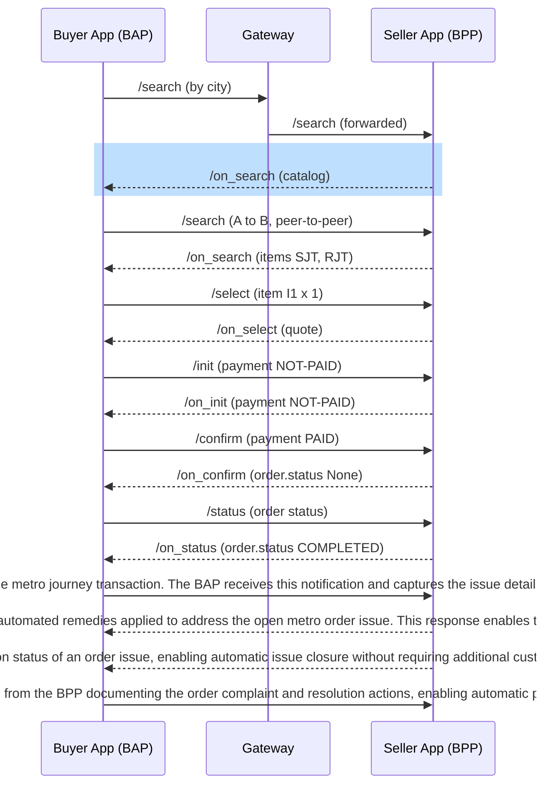
```mermaid
sequenceDiagram
  participant Buyer App (BAP)
  participant Gateway
  participant Seller App (BPP)
  Buyer App (BAP)->>Gateway: /search (by city)
  Gateway->>Seller App (BPP): /search (forwarded)
  rect rgb(191, 223, 255)
  Seller App (BPP)-->>Buyer App (BAP): /on_search (catalog)
  end
  Buyer App (BAP)->>Seller App (BPP): /search (A to B, peer-to-peer)
  Seller App (BPP)-->>Buyer App (BAP): /on_search (items SJT, RJT)
  Buyer App (BAP)->>Seller App (BPP): /select (item I1 x 1)
  Seller App (BPP)-->>Buyer App (BAP): /on_select (quote)
  Buyer App (BAP)->>Seller App (BPP): /init (payment NOT-PAID)
  Seller App (BPP)-->>Buyer App (BAP): /on_init (payment NOT-PAID)
  Buyer App (BAP)->>Seller App (BPP): /confirm (payment PAID)
  Seller App (BPP)-->>Buyer App (BAP): /on_confirm (order.status None)
  Buyer App (BAP)->>Seller App (BPP): /status (order status)
  Seller App (BPP)-->>Buyer App (BAP): /on_status (order.status COMPLETED)
  Buyer App (BAP)->>Seller App (BPP): /issue (The BPP notifies the BAP of an order issue encountered during the metro journey transaction. The BAP receives this notification and captures the issue details to enable automatic resolution without requiring customer intervention.)
  Seller App (BPP)-->>Buyer App (BAP): /on_issue (The BPP sends its issue resolution details to the BAP, specifying the automated remedies applied to address the open metro order issue. This response enables the BAP to process and close the issue without requiring further customer action.)
  Seller App (BPP)-->>Buyer App (BAP): /on_issue_status (unsolicited): The BPP sends an unsolicited on issue status callback to the BAP to communicate the resolution status of an order issue, enabling automatic issue closure without requiring additional customer intervention. This completes the issue management workflow by confirming that the reported problem has been resolved.
  Buyer App (BAP)->>Seller App (BPP): /issue (The BAP receives the issue notification from the BPP documenting the order complaint and resolution actions, enabling automatic processing to resolve the customer's problem.)
```

## search2_METRO_201

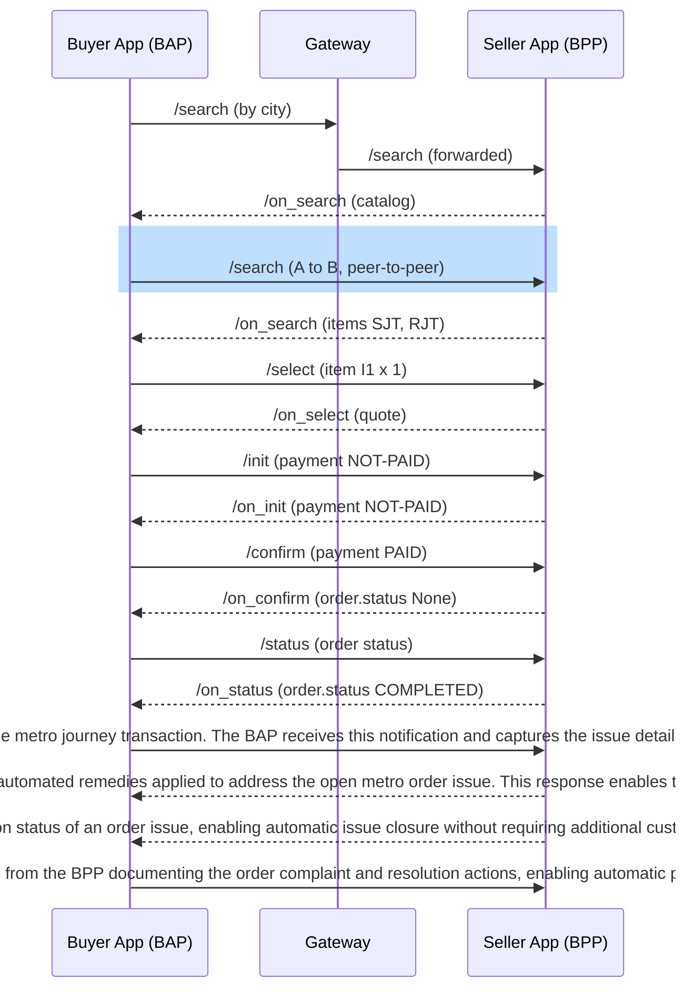
```mermaid
sequenceDiagram
  participant Buyer App (BAP)
  participant Gateway
  participant Seller App (BPP)
  Buyer App (BAP)->>Gateway: /search (by city)
  Gateway->>Seller App (BPP): /search (forwarded)
  Seller App (BPP)-->>Buyer App (BAP): /on_search (catalog)
  rect rgb(191, 223, 255)
  Buyer App (BAP)->>Seller App (BPP): /search (A to B, peer-to-peer)
  end
  Seller App (BPP)-->>Buyer App (BAP): /on_search (items SJT, RJT)
  Buyer App (BAP)->>Seller App (BPP): /select (item I1 x 1)
  Seller App (BPP)-->>Buyer App (BAP): /on_select (quote)
  Buyer App (BAP)->>Seller App (BPP): /init (payment NOT-PAID)
  Seller App (BPP)-->>Buyer App (BAP): /on_init (payment NOT-PAID)
  Buyer App (BAP)->>Seller App (BPP): /confirm (payment PAID)
  Seller App (BPP)-->>Buyer App (BAP): /on_confirm (order.status None)
  Buyer App (BAP)->>Seller App (BPP): /status (order status)
  Seller App (BPP)-->>Buyer App (BAP): /on_status (order.status COMPLETED)
  Buyer App (BAP)->>Seller App (BPP): /issue (The BPP notifies the BAP of an order issue encountered during the metro journey transaction. The BAP receives this notification and captures the issue details to enable automatic resolution without requiring customer intervention.)
  Seller App (BPP)-->>Buyer App (BAP): /on_issue (The BPP sends its issue resolution details to the BAP, specifying the automated remedies applied to address the open metro order issue. This response enables the BAP to process and close the issue without requiring further customer action.)
  Seller App (BPP)-->>Buyer App (BAP): /on_issue_status (unsolicited): The BPP sends an unsolicited on issue status callback to the BAP to communicate the resolution status of an order issue, enabling automatic issue closure without requiring additional customer intervention. This completes the issue management workflow by confirming that the reported problem has been resolved.
  Buyer App (BAP)->>Seller App (BPP): /issue (The BAP receives the issue notification from the BPP documenting the order complaint and resolution actions, enabling automatic processing to resolve the customer's problem.)
```

## on_search2_METRO_201

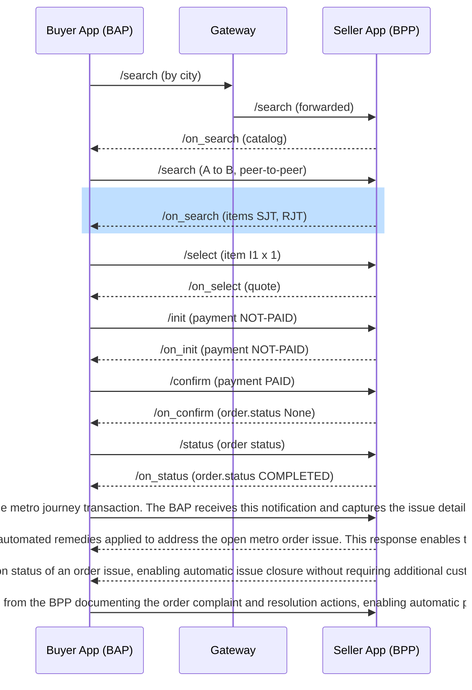
```mermaid
sequenceDiagram
  participant Buyer App (BAP)
  participant Gateway
  participant Seller App (BPP)
  Buyer App (BAP)->>Gateway: /search (by city)
  Gateway->>Seller App (BPP): /search (forwarded)
  Seller App (BPP)-->>Buyer App (BAP): /on_search (catalog)
  Buyer App (BAP)->>Seller App (BPP): /search (A to B, peer-to-peer)
  rect rgb(191, 223, 255)
  Seller App (BPP)-->>Buyer App (BAP): /on_search (items SJT, RJT)
  end
  Buyer App (BAP)->>Seller App (BPP): /select (item I1 x 1)
  Seller App (BPP)-->>Buyer App (BAP): /on_select (quote)
  Buyer App (BAP)->>Seller App (BPP): /init (payment NOT-PAID)
  Seller App (BPP)-->>Buyer App (BAP): /on_init (payment NOT-PAID)
  Buyer App (BAP)->>Seller App (BPP): /confirm (payment PAID)
  Seller App (BPP)-->>Buyer App (BAP): /on_confirm (order.status None)
  Buyer App (BAP)->>Seller App (BPP): /status (order status)
  Seller App (BPP)-->>Buyer App (BAP): /on_status (order.status COMPLETED)
  Buyer App (BAP)->>Seller App (BPP): /issue (The BPP notifies the BAP of an order issue encountered during the metro journey transaction. The BAP receives this notification and captures the issue details to enable automatic resolution without requiring customer intervention.)
  Seller App (BPP)-->>Buyer App (BAP): /on_issue (The BPP sends its issue resolution details to the BAP, specifying the automated remedies applied to address the open metro order issue. This response enables the BAP to process and close the issue without requiring further customer action.)
  Seller App (BPP)-->>Buyer App (BAP): /on_issue_status (unsolicited): The BPP sends an unsolicited on issue status callback to the BAP to communicate the resolution status of an order issue, enabling automatic issue closure without requiring additional customer intervention. This completes the issue management workflow by confirming that the reported problem has been resolved.
  Buyer App (BAP)->>Seller App (BPP): /issue (The BAP receives the issue notification from the BPP documenting the order complaint and resolution actions, enabling automatic processing to resolve the customer's problem.)
```

## select_METRO_201

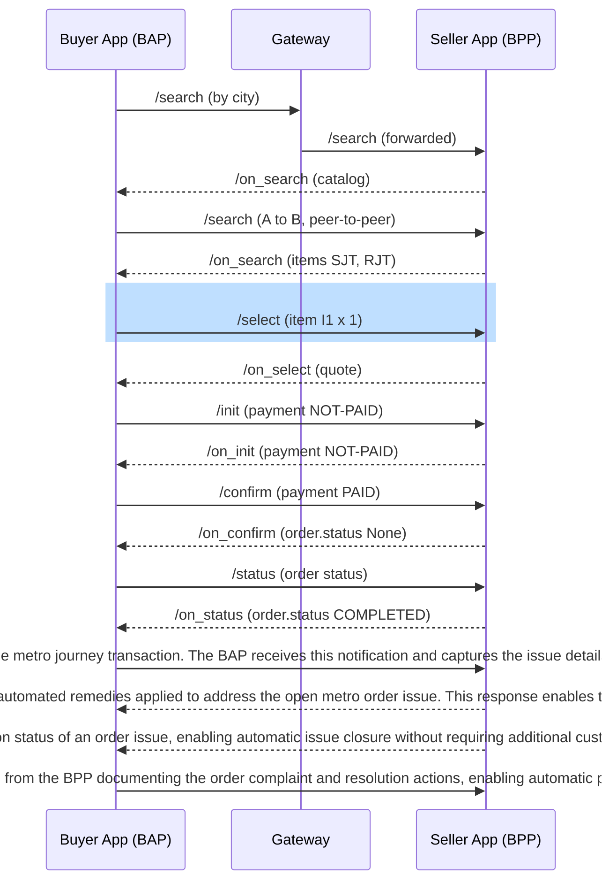
```mermaid
sequenceDiagram
  participant Buyer App (BAP)
  participant Gateway
  participant Seller App (BPP)
  Buyer App (BAP)->>Gateway: /search (by city)
  Gateway->>Seller App (BPP): /search (forwarded)
  Seller App (BPP)-->>Buyer App (BAP): /on_search (catalog)
  Buyer App (BAP)->>Seller App (BPP): /search (A to B, peer-to-peer)
  Seller App (BPP)-->>Buyer App (BAP): /on_search (items SJT, RJT)
  rect rgb(191, 223, 255)
  Buyer App (BAP)->>Seller App (BPP): /select (item I1 x 1)
  end
  Seller App (BPP)-->>Buyer App (BAP): /on_select (quote)
  Buyer App (BAP)->>Seller App (BPP): /init (payment NOT-PAID)
  Seller App (BPP)-->>Buyer App (BAP): /on_init (payment NOT-PAID)
  Buyer App (BAP)->>Seller App (BPP): /confirm (payment PAID)
  Seller App (BPP)-->>Buyer App (BAP): /on_confirm (order.status None)
  Buyer App (BAP)->>Seller App (BPP): /status (order status)
  Seller App (BPP)-->>Buyer App (BAP): /on_status (order.status COMPLETED)
  Buyer App (BAP)->>Seller App (BPP): /issue (The BPP notifies the BAP of an order issue encountered during the metro journey transaction. The BAP receives this notification and captures the issue details to enable automatic resolution without requiring customer intervention.)
  Seller App (BPP)-->>Buyer App (BAP): /on_issue (The BPP sends its issue resolution details to the BAP, specifying the automated remedies applied to address the open metro order issue. This response enables the BAP to process and close the issue without requiring further customer action.)
  Seller App (BPP)-->>Buyer App (BAP): /on_issue_status (unsolicited): The BPP sends an unsolicited on issue status callback to the BAP to communicate the resolution status of an order issue, enabling automatic issue closure without requiring additional customer intervention. This completes the issue management workflow by confirming that the reported problem has been resolved.
  Buyer App (BAP)->>Seller App (BPP): /issue (The BAP receives the issue notification from the BPP documenting the order complaint and resolution actions, enabling automatic processing to resolve the customer's problem.)
```

## on_select_METRO_201

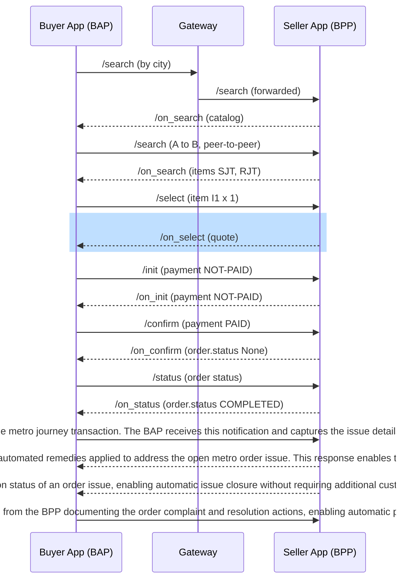
```mermaid
sequenceDiagram
  participant Buyer App (BAP)
  participant Gateway
  participant Seller App (BPP)
  Buyer App (BAP)->>Gateway: /search (by city)
  Gateway->>Seller App (BPP): /search (forwarded)
  Seller App (BPP)-->>Buyer App (BAP): /on_search (catalog)
  Buyer App (BAP)->>Seller App (BPP): /search (A to B, peer-to-peer)
  Seller App (BPP)-->>Buyer App (BAP): /on_search (items SJT, RJT)
  Buyer App (BAP)->>Seller App (BPP): /select (item I1 x 1)
  rect rgb(191, 223, 255)
  Seller App (BPP)-->>Buyer App (BAP): /on_select (quote)
  end
  Buyer App (BAP)->>Seller App (BPP): /init (payment NOT-PAID)
  Seller App (BPP)-->>Buyer App (BAP): /on_init (payment NOT-PAID)
  Buyer App (BAP)->>Seller App (BPP): /confirm (payment PAID)
  Seller App (BPP)-->>Buyer App (BAP): /on_confirm (order.status None)
  Buyer App (BAP)->>Seller App (BPP): /status (order status)
  Seller App (BPP)-->>Buyer App (BAP): /on_status (order.status COMPLETED)
  Buyer App (BAP)->>Seller App (BPP): /issue (The BPP notifies the BAP of an order issue encountered during the metro journey transaction. The BAP receives this notification and captures the issue details to enable automatic resolution without requiring customer intervention.)
  Seller App (BPP)-->>Buyer App (BAP): /on_issue (The BPP sends its issue resolution details to the BAP, specifying the automated remedies applied to address the open metro order issue. This response enables the BAP to process and close the issue without requiring further customer action.)
  Seller App (BPP)-->>Buyer App (BAP): /on_issue_status (unsolicited): The BPP sends an unsolicited on issue status callback to the BAP to communicate the resolution status of an order issue, enabling automatic issue closure without requiring additional customer intervention. This completes the issue management workflow by confirming that the reported problem has been resolved.
  Buyer App (BAP)->>Seller App (BPP): /issue (The BAP receives the issue notification from the BPP documenting the order complaint and resolution actions, enabling automatic processing to resolve the customer's problem.)
```

## init_METRO_201

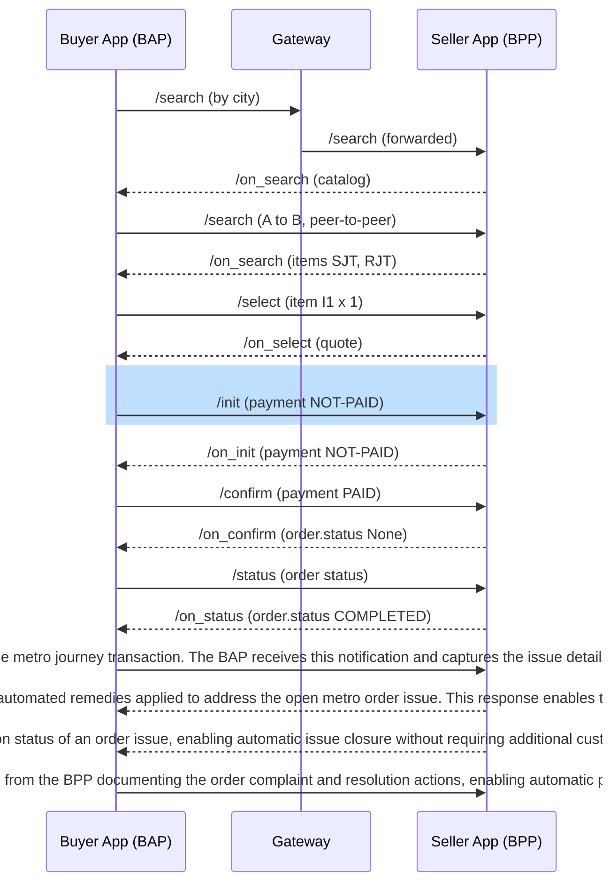
```mermaid
sequenceDiagram
  participant Buyer App (BAP)
  participant Gateway
  participant Seller App (BPP)
  Buyer App (BAP)->>Gateway: /search (by city)
  Gateway->>Seller App (BPP): /search (forwarded)
  Seller App (BPP)-->>Buyer App (BAP): /on_search (catalog)
  Buyer App (BAP)->>Seller App (BPP): /search (A to B, peer-to-peer)
  Seller App (BPP)-->>Buyer App (BAP): /on_search (items SJT, RJT)
  Buyer App (BAP)->>Seller App (BPP): /select (item I1 x 1)
  Seller App (BPP)-->>Buyer App (BAP): /on_select (quote)
  rect rgb(191, 223, 255)
  Buyer App (BAP)->>Seller App (BPP): /init (payment NOT-PAID)
  end
  Seller App (BPP)-->>Buyer App (BAP): /on_init (payment NOT-PAID)
  Buyer App (BAP)->>Seller App (BPP): /confirm (payment PAID)
  Seller App (BPP)-->>Buyer App (BAP): /on_confirm (order.status None)
  Buyer App (BAP)->>Seller App (BPP): /status (order status)
  Seller App (BPP)-->>Buyer App (BAP): /on_status (order.status COMPLETED)
  Buyer App (BAP)->>Seller App (BPP): /issue (The BPP notifies the BAP of an order issue encountered during the metro journey transaction. The BAP receives this notification and captures the issue details to enable automatic resolution without requiring customer intervention.)
  Seller App (BPP)-->>Buyer App (BAP): /on_issue (The BPP sends its issue resolution details to the BAP, specifying the automated remedies applied to address the open metro order issue. This response enables the BAP to process and close the issue without requiring further customer action.)
  Seller App (BPP)-->>Buyer App (BAP): /on_issue_status (unsolicited): The BPP sends an unsolicited on issue status callback to the BAP to communicate the resolution status of an order issue, enabling automatic issue closure without requiring additional customer intervention. This completes the issue management workflow by confirming that the reported problem has been resolved.
  Buyer App (BAP)->>Seller App (BPP): /issue (The BAP receives the issue notification from the BPP documenting the order complaint and resolution actions, enabling automatic processing to resolve the customer's problem.)
```

## on_init_METRO_201

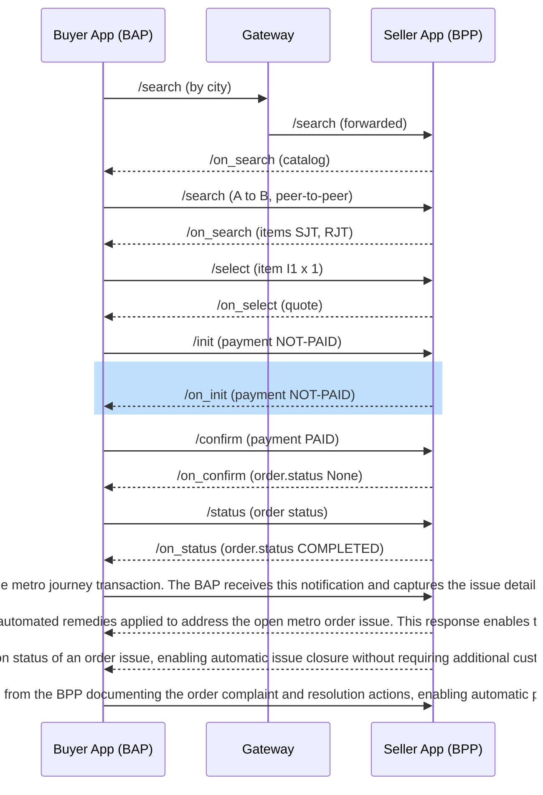
```mermaid
sequenceDiagram
  participant Buyer App (BAP)
  participant Gateway
  participant Seller App (BPP)
  Buyer App (BAP)->>Gateway: /search (by city)
  Gateway->>Seller App (BPP): /search (forwarded)
  Seller App (BPP)-->>Buyer App (BAP): /on_search (catalog)
  Buyer App (BAP)->>Seller App (BPP): /search (A to B, peer-to-peer)
  Seller App (BPP)-->>Buyer App (BAP): /on_search (items SJT, RJT)
  Buyer App (BAP)->>Seller App (BPP): /select (item I1 x 1)
  Seller App (BPP)-->>Buyer App (BAP): /on_select (quote)
  Buyer App (BAP)->>Seller App (BPP): /init (payment NOT-PAID)
  rect rgb(191, 223, 255)
  Seller App (BPP)-->>Buyer App (BAP): /on_init (payment NOT-PAID)
  end
  Buyer App (BAP)->>Seller App (BPP): /confirm (payment PAID)
  Seller App (BPP)-->>Buyer App (BAP): /on_confirm (order.status None)
  Buyer App (BAP)->>Seller App (BPP): /status (order status)
  Seller App (BPP)-->>Buyer App (BAP): /on_status (order.status COMPLETED)
  Buyer App (BAP)->>Seller App (BPP): /issue (The BPP notifies the BAP of an order issue encountered during the metro journey transaction. The BAP receives this notification and captures the issue details to enable automatic resolution without requiring customer intervention.)
  Seller App (BPP)-->>Buyer App (BAP): /on_issue (The BPP sends its issue resolution details to the BAP, specifying the automated remedies applied to address the open metro order issue. This response enables the BAP to process and close the issue without requiring further customer action.)
  Seller App (BPP)-->>Buyer App (BAP): /on_issue_status (unsolicited): The BPP sends an unsolicited on issue status callback to the BAP to communicate the resolution status of an order issue, enabling automatic issue closure without requiring additional customer intervention. This completes the issue management workflow by confirming that the reported problem has been resolved.
  Buyer App (BAP)->>Seller App (BPP): /issue (The BAP receives the issue notification from the BPP documenting the order complaint and resolution actions, enabling automatic processing to resolve the customer's problem.)
```

## confirm_METRO_201

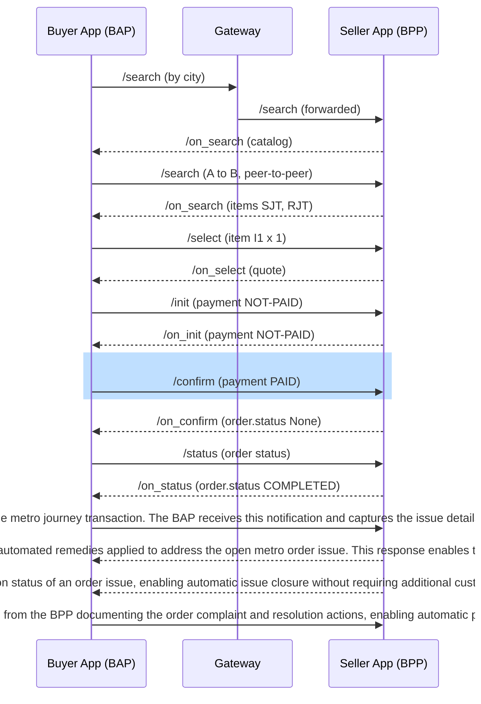
```mermaid
sequenceDiagram
  participant Buyer App (BAP)
  participant Gateway
  participant Seller App (BPP)
  Buyer App (BAP)->>Gateway: /search (by city)
  Gateway->>Seller App (BPP): /search (forwarded)
  Seller App (BPP)-->>Buyer App (BAP): /on_search (catalog)
  Buyer App (BAP)->>Seller App (BPP): /search (A to B, peer-to-peer)
  Seller App (BPP)-->>Buyer App (BAP): /on_search (items SJT, RJT)
  Buyer App (BAP)->>Seller App (BPP): /select (item I1 x 1)
  Seller App (BPP)-->>Buyer App (BAP): /on_select (quote)
  Buyer App (BAP)->>Seller App (BPP): /init (payment NOT-PAID)
  Seller App (BPP)-->>Buyer App (BAP): /on_init (payment NOT-PAID)
  rect rgb(191, 223, 255)
  Buyer App (BAP)->>Seller App (BPP): /confirm (payment PAID)
  end
  Seller App (BPP)-->>Buyer App (BAP): /on_confirm (order.status None)
  Buyer App (BAP)->>Seller App (BPP): /status (order status)
  Seller App (BPP)-->>Buyer App (BAP): /on_status (order.status COMPLETED)
  Buyer App (BAP)->>Seller App (BPP): /issue (The BPP notifies the BAP of an order issue encountered during the metro journey transaction. The BAP receives this notification and captures the issue details to enable automatic resolution without requiring customer intervention.)
  Seller App (BPP)-->>Buyer App (BAP): /on_issue (The BPP sends its issue resolution details to the BAP, specifying the automated remedies applied to address the open metro order issue. This response enables the BAP to process and close the issue without requiring further customer action.)
  Seller App (BPP)-->>Buyer App (BAP): /on_issue_status (unsolicited): The BPP sends an unsolicited on issue status callback to the BAP to communicate the resolution status of an order issue, enabling automatic issue closure without requiring additional customer intervention. This completes the issue management workflow by confirming that the reported problem has been resolved.
  Buyer App (BAP)->>Seller App (BPP): /issue (The BAP receives the issue notification from the BPP documenting the order complaint and resolution actions, enabling automatic processing to resolve the customer's problem.)
```

## on_confirm_METRO_201

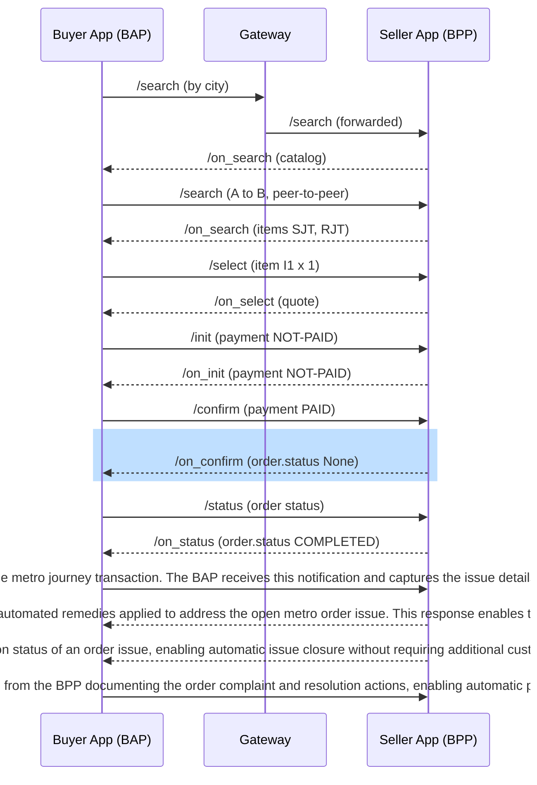
```mermaid
sequenceDiagram
  participant Buyer App (BAP)
  participant Gateway
  participant Seller App (BPP)
  Buyer App (BAP)->>Gateway: /search (by city)
  Gateway->>Seller App (BPP): /search (forwarded)
  Seller App (BPP)-->>Buyer App (BAP): /on_search (catalog)
  Buyer App (BAP)->>Seller App (BPP): /search (A to B, peer-to-peer)
  Seller App (BPP)-->>Buyer App (BAP): /on_search (items SJT, RJT)
  Buyer App (BAP)->>Seller App (BPP): /select (item I1 x 1)
  Seller App (BPP)-->>Buyer App (BAP): /on_select (quote)
  Buyer App (BAP)->>Seller App (BPP): /init (payment NOT-PAID)
  Seller App (BPP)-->>Buyer App (BAP): /on_init (payment NOT-PAID)
  Buyer App (BAP)->>Seller App (BPP): /confirm (payment PAID)
  rect rgb(191, 223, 255)
  Seller App (BPP)-->>Buyer App (BAP): /on_confirm (order.status None)
  end
  Buyer App (BAP)->>Seller App (BPP): /status (order status)
  Seller App (BPP)-->>Buyer App (BAP): /on_status (order.status COMPLETED)
  Buyer App (BAP)->>Seller App (BPP): /issue (The BPP notifies the BAP of an order issue encountered during the metro journey transaction. The BAP receives this notification and captures the issue details to enable automatic resolution without requiring customer intervention.)
  Seller App (BPP)-->>Buyer App (BAP): /on_issue (The BPP sends its issue resolution details to the BAP, specifying the automated remedies applied to address the open metro order issue. This response enables the BAP to process and close the issue without requiring further customer action.)
  Seller App (BPP)-->>Buyer App (BAP): /on_issue_status (unsolicited): The BPP sends an unsolicited on issue status callback to the BAP to communicate the resolution status of an order issue, enabling automatic issue closure without requiring additional customer intervention. This completes the issue management workflow by confirming that the reported problem has been resolved.
  Buyer App (BAP)->>Seller App (BPP): /issue (The BAP receives the issue notification from the BPP documenting the order complaint and resolution actions, enabling automatic processing to resolve the customer's problem.)
```

## status_METRO_201

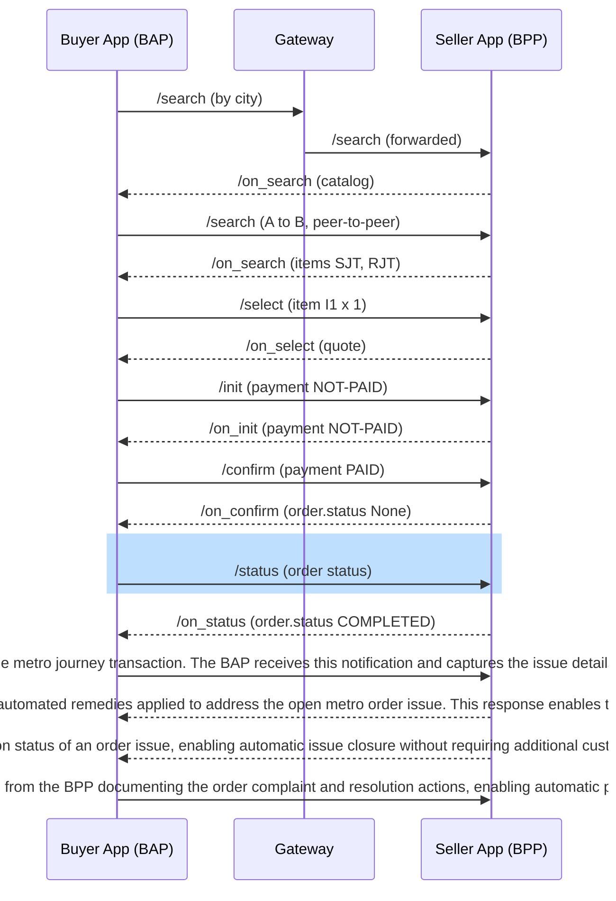
```mermaid
sequenceDiagram
  participant Buyer App (BAP)
  participant Gateway
  participant Seller App (BPP)
  Buyer App (BAP)->>Gateway: /search (by city)
  Gateway->>Seller App (BPP): /search (forwarded)
  Seller App (BPP)-->>Buyer App (BAP): /on_search (catalog)
  Buyer App (BAP)->>Seller App (BPP): /search (A to B, peer-to-peer)
  Seller App (BPP)-->>Buyer App (BAP): /on_search (items SJT, RJT)
  Buyer App (BAP)->>Seller App (BPP): /select (item I1 x 1)
  Seller App (BPP)-->>Buyer App (BAP): /on_select (quote)
  Buyer App (BAP)->>Seller App (BPP): /init (payment NOT-PAID)
  Seller App (BPP)-->>Buyer App (BAP): /on_init (payment NOT-PAID)
  Buyer App (BAP)->>Seller App (BPP): /confirm (payment PAID)
  Seller App (BPP)-->>Buyer App (BAP): /on_confirm (order.status None)
  rect rgb(191, 223, 255)
  Buyer App (BAP)->>Seller App (BPP): /status (order status)
  end
  Seller App (BPP)-->>Buyer App (BAP): /on_status (order.status COMPLETED)
  Buyer App (BAP)->>Seller App (BPP): /issue (The BPP notifies the BAP of an order issue encountered during the metro journey transaction. The BAP receives this notification and captures the issue details to enable automatic resolution without requiring customer intervention.)
  Seller App (BPP)-->>Buyer App (BAP): /on_issue (The BPP sends its issue resolution details to the BAP, specifying the automated remedies applied to address the open metro order issue. This response enables the BAP to process and close the issue without requiring further customer action.)
  Seller App (BPP)-->>Buyer App (BAP): /on_issue_status (unsolicited): The BPP sends an unsolicited on issue status callback to the BAP to communicate the resolution status of an order issue, enabling automatic issue closure without requiring additional customer intervention. This completes the issue management workflow by confirming that the reported problem has been resolved.
  Buyer App (BAP)->>Seller App (BPP): /issue (The BAP receives the issue notification from the BPP documenting the order complaint and resolution actions, enabling automatic processing to resolve the customer's problem.)
```

## on_status_complete_METRO_201

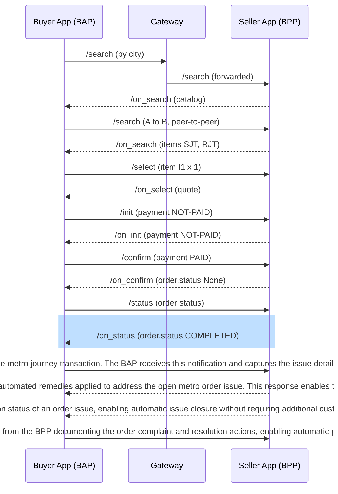
```mermaid
sequenceDiagram
  participant Buyer App (BAP)
  participant Gateway
  participant Seller App (BPP)
  Buyer App (BAP)->>Gateway: /search (by city)
  Gateway->>Seller App (BPP): /search (forwarded)
  Seller App (BPP)-->>Buyer App (BAP): /on_search (catalog)
  Buyer App (BAP)->>Seller App (BPP): /search (A to B, peer-to-peer)
  Seller App (BPP)-->>Buyer App (BAP): /on_search (items SJT, RJT)
  Buyer App (BAP)->>Seller App (BPP): /select (item I1 x 1)
  Seller App (BPP)-->>Buyer App (BAP): /on_select (quote)
  Buyer App (BAP)->>Seller App (BPP): /init (payment NOT-PAID)
  Seller App (BPP)-->>Buyer App (BAP): /on_init (payment NOT-PAID)
  Buyer App (BAP)->>Seller App (BPP): /confirm (payment PAID)
  Seller App (BPP)-->>Buyer App (BAP): /on_confirm (order.status None)
  Buyer App (BAP)->>Seller App (BPP): /status (order status)
  rect rgb(191, 223, 255)
  Seller App (BPP)-->>Buyer App (BAP): /on_status (order.status COMPLETED)
  end
  Buyer App (BAP)->>Seller App (BPP): /issue (The BPP notifies the BAP of an order issue encountered during the metro journey transaction. The BAP receives this notification and captures the issue details to enable automatic resolution without requiring customer intervention.)
  Seller App (BPP)-->>Buyer App (BAP): /on_issue (The BPP sends its issue resolution details to the BAP, specifying the automated remedies applied to address the open metro order issue. This response enables the BAP to process and close the issue without requiring further customer action.)
  Seller App (BPP)-->>Buyer App (BAP): /on_issue_status (unsolicited): The BPP sends an unsolicited on issue status callback to the BAP to communicate the resolution status of an order issue, enabling automatic issue closure without requiring additional customer intervention. This completes the issue management workflow by confirming that the reported problem has been resolved.
  Buyer App (BAP)->>Seller App (BPP): /issue (The BAP receives the issue notification from the BPP documenting the order complaint and resolution actions, enabling automatic processing to resolve the customer's problem.)
```

## issue_open_metro_100

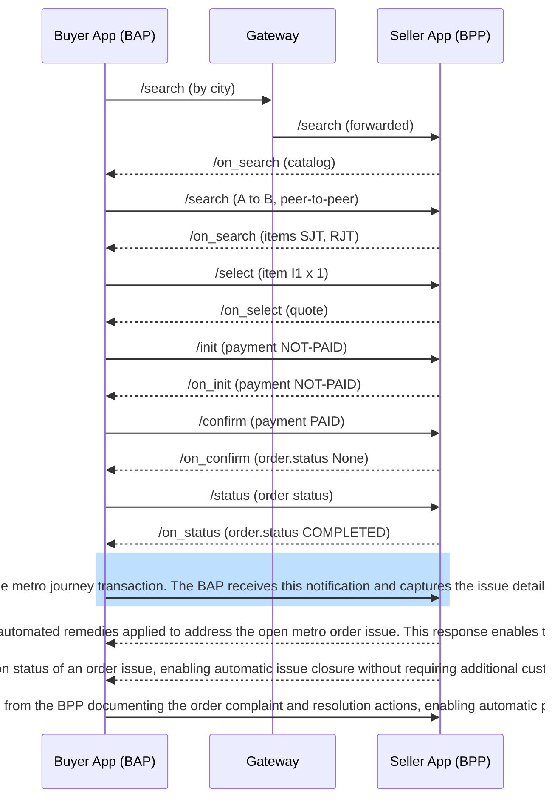
```mermaid
sequenceDiagram
  participant Buyer App (BAP)
  participant Gateway
  participant Seller App (BPP)
  Buyer App (BAP)->>Gateway: /search (by city)
  Gateway->>Seller App (BPP): /search (forwarded)
  Seller App (BPP)-->>Buyer App (BAP): /on_search (catalog)
  Buyer App (BAP)->>Seller App (BPP): /search (A to B, peer-to-peer)
  Seller App (BPP)-->>Buyer App (BAP): /on_search (items SJT, RJT)
  Buyer App (BAP)->>Seller App (BPP): /select (item I1 x 1)
  Seller App (BPP)-->>Buyer App (BAP): /on_select (quote)
  Buyer App (BAP)->>Seller App (BPP): /init (payment NOT-PAID)
  Seller App (BPP)-->>Buyer App (BAP): /on_init (payment NOT-PAID)
  Buyer App (BAP)->>Seller App (BPP): /confirm (payment PAID)
  Seller App (BPP)-->>Buyer App (BAP): /on_confirm (order.status None)
  Buyer App (BAP)->>Seller App (BPP): /status (order status)
  Seller App (BPP)-->>Buyer App (BAP): /on_status (order.status COMPLETED)
  rect rgb(191, 223, 255)
  Buyer App (BAP)->>Seller App (BPP): /issue (The BPP notifies the BAP of an order issue encountered during the metro journey transaction. The BAP receives this notification and captures the issue details to enable automatic resolution without requiring customer intervention.)
  end
  Seller App (BPP)-->>Buyer App (BAP): /on_issue (The BPP sends its issue resolution details to the BAP, specifying the automated remedies applied to address the open metro order issue. This response enables the BAP to process and close the issue without requiring further customer action.)
  Seller App (BPP)-->>Buyer App (BAP): /on_issue_status (unsolicited): The BPP sends an unsolicited on issue status callback to the BAP to communicate the resolution status of an order issue, enabling automatic issue closure without requiring additional customer intervention. This completes the issue management workflow by confirming that the reported problem has been resolved.
  Buyer App (BAP)->>Seller App (BPP): /issue (The BAP receives the issue notification from the BPP documenting the order complaint and resolution actions, enabling automatic processing to resolve the customer's problem.)
```

## on_issue_processing_metro_100

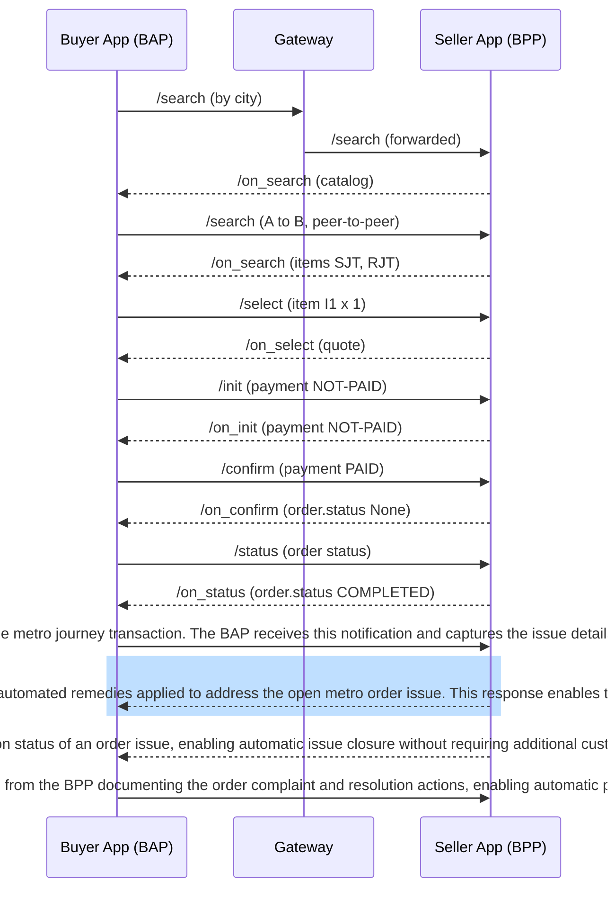
```mermaid
sequenceDiagram
  participant Buyer App (BAP)
  participant Gateway
  participant Seller App (BPP)
  Buyer App (BAP)->>Gateway: /search (by city)
  Gateway->>Seller App (BPP): /search (forwarded)
  Seller App (BPP)-->>Buyer App (BAP): /on_search (catalog)
  Buyer App (BAP)->>Seller App (BPP): /search (A to B, peer-to-peer)
  Seller App (BPP)-->>Buyer App (BAP): /on_search (items SJT, RJT)
  Buyer App (BAP)->>Seller App (BPP): /select (item I1 x 1)
  Seller App (BPP)-->>Buyer App (BAP): /on_select (quote)
  Buyer App (BAP)->>Seller App (BPP): /init (payment NOT-PAID)
  Seller App (BPP)-->>Buyer App (BAP): /on_init (payment NOT-PAID)
  Buyer App (BAP)->>Seller App (BPP): /confirm (payment PAID)
  Seller App (BPP)-->>Buyer App (BAP): /on_confirm (order.status None)
  Buyer App (BAP)->>Seller App (BPP): /status (order status)
  Seller App (BPP)-->>Buyer App (BAP): /on_status (order.status COMPLETED)
  Buyer App (BAP)->>Seller App (BPP): /issue (The BPP notifies the BAP of an order issue encountered during the metro journey transaction. The BAP receives this notification and captures the issue details to enable automatic resolution without requiring customer intervention.)
  rect rgb(191, 223, 255)
  Seller App (BPP)-->>Buyer App (BAP): /on_issue (The BPP sends its issue resolution details to the BAP, specifying the automated remedies applied to address the open metro order issue. This response enables the BAP to process and close the issue without requiring further customer action.)
  end
  Seller App (BPP)-->>Buyer App (BAP): /on_issue_status (unsolicited): The BPP sends an unsolicited on issue status callback to the BAP to communicate the resolution status of an order issue, enabling automatic issue closure without requiring additional customer intervention. This completes the issue management workflow by confirming that the reported problem has been resolved.
  Buyer App (BAP)->>Seller App (BPP): /issue (The BAP receives the issue notification from the BPP documenting the order complaint and resolution actions, enabling automatic processing to resolve the customer's problem.)
```

## on_issue_resolved_metro_100

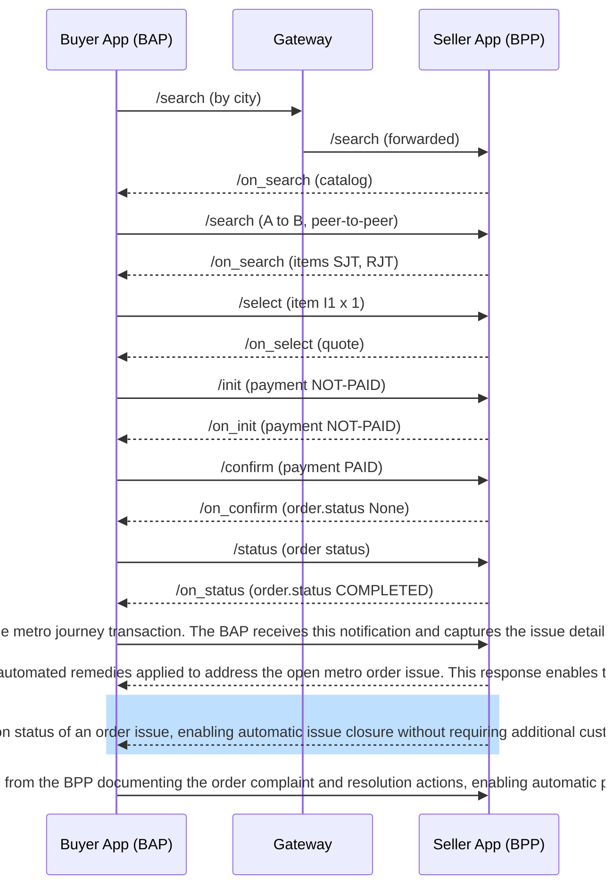
```mermaid
sequenceDiagram
  participant Buyer App (BAP)
  participant Gateway
  participant Seller App (BPP)
  Buyer App (BAP)->>Gateway: /search (by city)
  Gateway->>Seller App (BPP): /search (forwarded)
  Seller App (BPP)-->>Buyer App (BAP): /on_search (catalog)
  Buyer App (BAP)->>Seller App (BPP): /search (A to B, peer-to-peer)
  Seller App (BPP)-->>Buyer App (BAP): /on_search (items SJT, RJT)
  Buyer App (BAP)->>Seller App (BPP): /select (item I1 x 1)
  Seller App (BPP)-->>Buyer App (BAP): /on_select (quote)
  Buyer App (BAP)->>Seller App (BPP): /init (payment NOT-PAID)
  Seller App (BPP)-->>Buyer App (BAP): /on_init (payment NOT-PAID)
  Buyer App (BAP)->>Seller App (BPP): /confirm (payment PAID)
  Seller App (BPP)-->>Buyer App (BAP): /on_confirm (order.status None)
  Buyer App (BAP)->>Seller App (BPP): /status (order status)
  Seller App (BPP)-->>Buyer App (BAP): /on_status (order.status COMPLETED)
  Buyer App (BAP)->>Seller App (BPP): /issue (The BPP notifies the BAP of an order issue encountered during the metro journey transaction. The BAP receives this notification and captures the issue details to enable automatic resolution without requiring customer intervention.)
  Seller App (BPP)-->>Buyer App (BAP): /on_issue (The BPP sends its issue resolution details to the BAP, specifying the automated remedies applied to address the open metro order issue. This response enables the BAP to process and close the issue without requiring further customer action.)
  rect rgb(191, 223, 255)
  Seller App (BPP)-->>Buyer App (BAP): /on_issue_status (unsolicited): The BPP sends an unsolicited on issue status callback to the BAP to communicate the resolution status of an order issue, enabling automatic issue closure without requiring additional customer intervention. This completes the issue management workflow by confirming that the reported problem has been resolved.
  end
  Buyer App (BAP)->>Seller App (BPP): /issue (The BAP receives the issue notification from the BPP documenting the order complaint and resolution actions, enabling automatic processing to resolve the customer's problem.)
```

## issue_close_metro_100

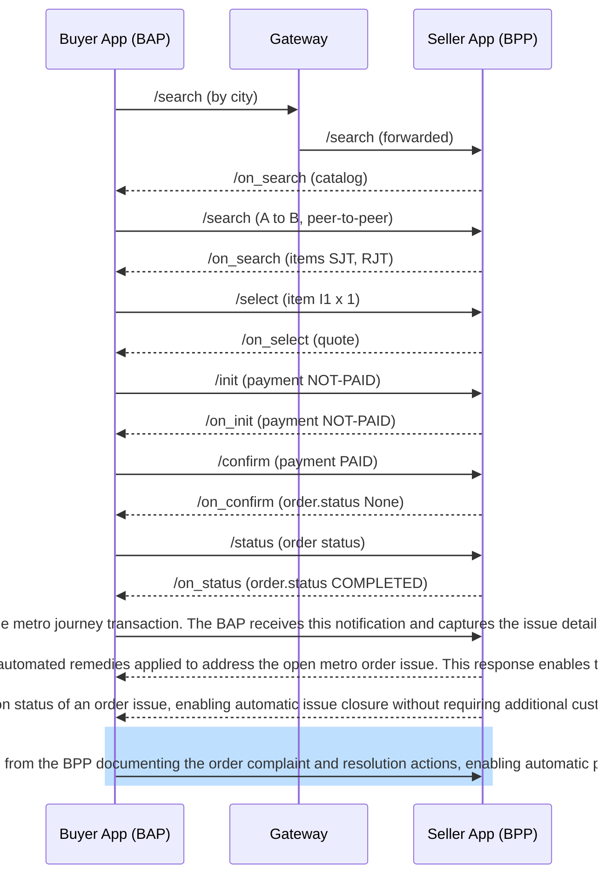
```mermaid
sequenceDiagram
  participant Buyer App (BAP)
  participant Gateway
  participant Seller App (BPP)
  Buyer App (BAP)->>Gateway: /search (by city)
  Gateway->>Seller App (BPP): /search (forwarded)
  Seller App (BPP)-->>Buyer App (BAP): /on_search (catalog)
  Buyer App (BAP)->>Seller App (BPP): /search (A to B, peer-to-peer)
  Seller App (BPP)-->>Buyer App (BAP): /on_search (items SJT, RJT)
  Buyer App (BAP)->>Seller App (BPP): /select (item I1 x 1)
  Seller App (BPP)-->>Buyer App (BAP): /on_select (quote)
  Buyer App (BAP)->>Seller App (BPP): /init (payment NOT-PAID)
  Seller App (BPP)-->>Buyer App (BAP): /on_init (payment NOT-PAID)
  Buyer App (BAP)->>Seller App (BPP): /confirm (payment PAID)
  Seller App (BPP)-->>Buyer App (BAP): /on_confirm (order.status None)
  Buyer App (BAP)->>Seller App (BPP): /status (order status)
  Seller App (BPP)-->>Buyer App (BAP): /on_status (order.status COMPLETED)
  Buyer App (BAP)->>Seller App (BPP): /issue (The BPP notifies the BAP of an order issue encountered during the metro journey transaction. The BAP receives this notification and captures the issue details to enable automatic resolution without requiring customer intervention.)
  Seller App (BPP)-->>Buyer App (BAP): /on_issue (The BPP sends its issue resolution details to the BAP, specifying the automated remedies applied to address the open metro order issue. This response enables the BAP to process and close the issue without requiring further customer action.)
  Seller App (BPP)-->>Buyer App (BAP): /on_issue_status (unsolicited): The BPP sends an unsolicited on issue status callback to the BAP to communicate the resolution status of an order issue, enabling automatic issue closure without requiring additional customer intervention. This completes the issue management workflow by confirming that the reported problem has been resolved.
  rect rgb(191, 223, 255)
  Buyer App (BAP)->>Seller App (BPP): /issue (The BAP receives the issue notification from the BPP documenting the order complaint and resolution actions, enabling automatic processing to resolve the customer's problem.)
  end
```
